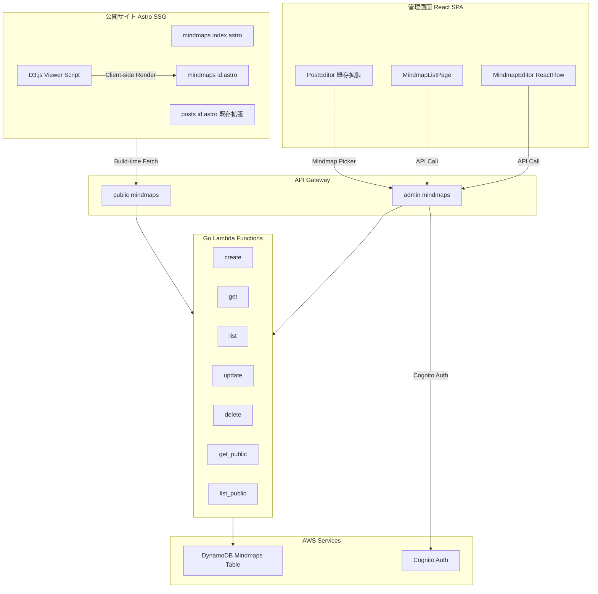
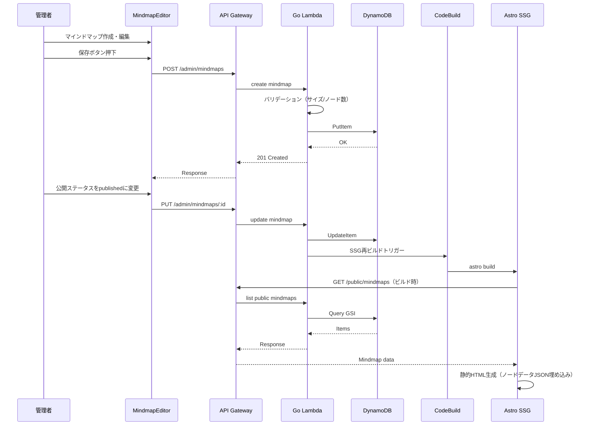
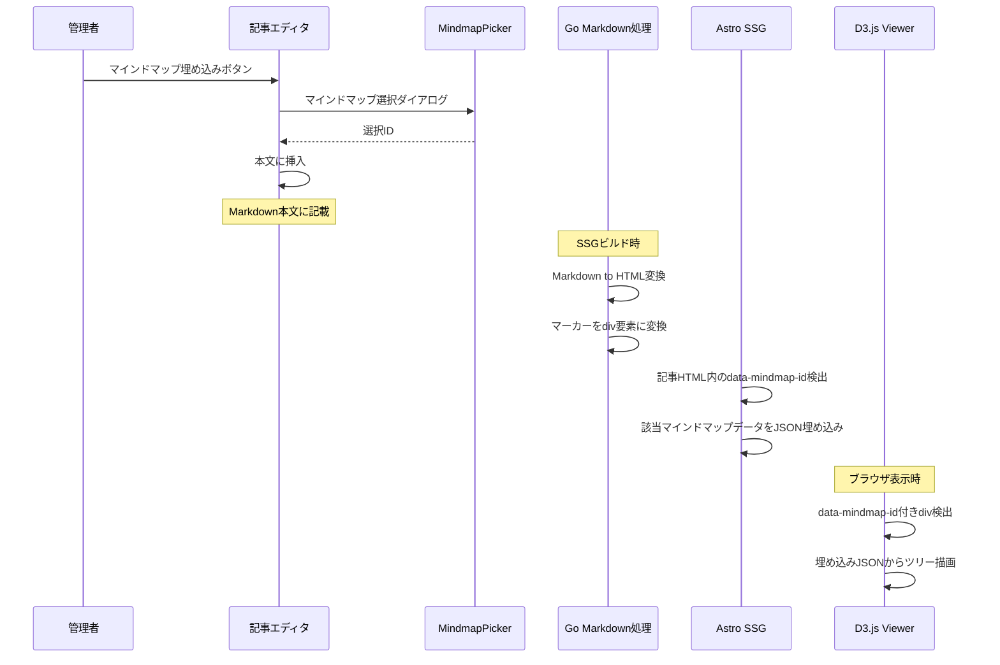
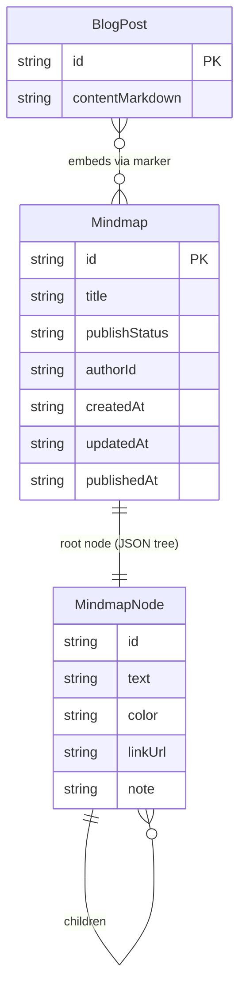

# Design Document: add-mindmap

## Overview

**Purpose**: サーバーレスブログプラットフォームにマインドマップの作成・公開機能を追加する。管理者がReactベースのビジュアルエディタでマインドマップを作成・編集し、公開サイトでD3.jsベースの軽量ビューアにより閲覧者がインタラクティブに閲覧できるようにする。

**Users**: 管理者（マインドマップ作成・編集・公開）、ブログ読者（閲覧・ナビゲーション）

**Impact**: 既存のブログ記事管理システムに並列する新しいコンテンツタイプ「マインドマップ」を追加。DynamoDBテーブル、Go Lambda関数群、API Gatewayルート、管理画面ページ、公開サイトページを新設。既存の記事エディタにマインドマップ埋め込み機能を追加。

### Goals
- マインドマップのCRUD管理と公開ワークフロー
- 直感的なビジュアルエディタ（ノード操作、メタデータ編集、D&D）
- 公開サイトでの軽量・インタラクティブなマインドマップ閲覧
- 記事へのマインドマップ埋め込み
- Markdownエクスポート

### Non-Goals
- リアルタイム共同編集（将来検討）
- マインドマップのインポート（XMind, FreeMind等からの変換）
- マインドマップのテンプレート機能
- SVG/PNG画像エクスポート（初期スコープ外）

## Architecture

### Existing Architecture Analysis
- **バックエンド**: Go Lambda関数（`cmd/{domain}/{operation}/main.go`パターン）、DynamoDBシングルテーブル設計（Posts, Categories）
- **API**: API Gateway REST API、`/admin/*`（Cognito認証）と `/posts/*`（公開）のルート分離
- **管理画面**: React SPA（Vite）、ページ単位のルーティング、axios APIクライアント
- **公開サイト**: Astro SSG、ビルド時API取得、静的HTML生成
- **インフラ**: Terraform モジュール構成（api, auth, cdn, database, lambda, monitoring, storage）

### Architecture Pattern & Boundary Map



**Architecture Integration**:
- **Selected pattern**: 既存ドメイン分離パターンの踏襲（Posts/Categories/Imagesと並列にMindmapsドメイン新設）
- **Domain boundaries**: Mindmapsは独立ドメイン。記事との関連はマーカー（`{{mindmap:ID}}`）による疎結合
- **Existing patterns preserved**: Go Lambda handler構造、DynamoDB GSIパターン、Terraform モジュール構成、React SPA ページ・APIクライアント構成、Astro SSGビルド時データ取得
- **New components rationale**: マインドマップはツリー構造のデータモデルと専用エディタUIを持つ独立コンテンツタイプ
- **Steering compliance**: サーバーレスファースト、IaC（Terraform）、Go単一言語、ARM64、TDD

### Technology Stack

| Layer | Choice / Version | Role in Feature | Notes |
|-------|------------------|-----------------|-------|
| Frontend Editor | ReactFlow @xyflow/react ^12.x | マインドマップエディタ（管理画面） | dagre でツリーレイアウト |
| Frontend Viewer | D3.js d3-hierarchy ^3.x, d3-zoom ^3.x, d3-selection ^3.x | マインドマップビューア（公開サイト） | ~21KB gzipped、vanilla JS |
| Frontend Admin | React 18, Vite 6.x, TypeScript | 管理画面SPA | 既存スタック |
| Frontend Public | Astro 5.x, Tailwind CSS 4.x | 公開サイトSSG | 既存スタック |
| Backend | Go 1.25.x, aws-lambda-go | Lambda関数 | 既存スタック |
| Data | DynamoDB PAY_PER_REQUEST | Mindmapsテーブル | 新規テーブル |
| Infrastructure | Terraform | Lambda, API Gateway, DynamoDB | 既存モジュール拡張 |
| Auth | Amazon Cognito | 管理API認証 | 既存 |

## System Flows

### マインドマップ作成・公開フロー



### 記事へのマインドマップ埋め込みフロー



## Requirements Traceability

| Requirement | Summary | Components | Interfaces | Flows |
|-------------|---------|------------|------------|-------|
| 1.1-1.5 | マインドマップCRUD | GoLambda (7関数), DynamoDB | API Contract | 作成・公開フロー |
| 1.6 | Cognito認証 | API Gateway Authorizer | — | — |
| 2.1-2.5 | エディタ操作 | MindmapEditor (ReactFlow) | State Management | — |
| 2.6 | 保存 | MindmapEditor, API Client | API Contract | 作成・公開フロー |
| 2.7 | 公開切替 | MindmapEditor, API Client | API Contract | 作成・公開フロー |
| 3.1 | 公開一覧 | MindmapIndexPage (Astro) | Build-time API | — |
| 3.2 | SSGデータ埋め込み | Astro Build, API Client | Build-time API | — |
| 3.3-3.5 | インタラクティブ表示 | MindmapViewer (D3.js) | — | — |
| 3.6 | OGP/JSON-LD | MindmapDetailPage (Astro) | — | — |
| 4.1-4.4 | データモデル | DynamoDB Table, Go domain types | — | — |
| 4.5-4.6 | バリデーション | Go Lambda (create/update) | API Error Contract | — |
| 5.1-5.2 | 記事埋め込みUI | MindmapPicker, PostEditor拡張 | — | 埋め込みフロー |
| 5.3-5.4 | 埋め込み表示 | Go Markdown処理, Astro Build | — | 埋め込みフロー |
| 5.5 | フォールバック | Astro Build, D3.js Viewer | — | — |
| 6.1-6.3 | Markdownエクスポート | MindmapExport (React) | — | — |
| 7.1-7.4 | ノードメタデータ編集 | MindmapEditor, NodePropertyPanel | State Management | — |
| 7.5-7.6 | ノードメタデータ表示 | MindmapViewer (D3.js) | — | — |
| 8.1-8.9 | API定義 | API Gateway, Go Lambda | API Contract | 作成・公開フロー |
| 9.1-9.7 | 非機能要件 | 全コンポーネント | — | — |

## Components and Interfaces

| Component | Domain/Layer | Intent | Req Coverage | Key Dependencies | Contracts |
|-----------|-------------|--------|--------------|------------------|-----------|
| Go Mindmap Lambda群 | Backend | マインドマップCRUD API | 1.1-1.6, 4.1-4.6, 8.1-8.9 | DynamoDB, Cognito (P0) | API |
| Go Markdown拡張 | Backend | マーカーHTML変換 | 5.3-5.4 | goldmark (P0) | — |
| DynamoDB Mindmapsテーブル | Data | マインドマップ永続化 | 4.1-4.4 | — | — |
| Terraform Mindmap定義 | Infra | Lambda/API/DB定義 | 9.4-9.5 | 既存モジュール (P0) | — |
| MindmapEditor | Admin UI | ビジュアルエディタ | 2.1-2.7, 7.1-7.4 | ReactFlow (P0), dagre (P1) | State |
| NodePropertyPanel | Admin UI | ノードメタデータ編集 | 7.1-7.4 | MindmapEditor (P0) | — |
| MindmapPicker | Admin UI | 記事埋め込み選択 | 5.1-5.2 | PostEditor (P0), API Client (P0) | — |
| MindmapExport | Admin UI | Markdownエクスポート | 6.1-6.3 | — | — |
| MindmapListPage | Admin UI | 管理画面一覧 | 1.2, 8.2 | API Client (P0) | — |
| MindmapCreatePage | Admin UI | 管理画面作成 | 1.1, 2.1-2.7 | MindmapEditor (P0) | — |
| MindmapEditPage | Admin UI | 管理画面編集 | 1.3-1.4, 2.1-2.7 | MindmapEditor (P0) | — |
| API Client (mindmaps) | Admin UI | API通信 | 8.1-8.9 | axios (P0) | API |
| MindmapIndexPage | Public UI | 公開一覧ページ | 3.1 | Astro Build API (P0) | — |
| MindmapDetailPage | Public UI | 公開詳細ページ | 3.2, 3.6 | Astro Build API (P0) | — |
| MindmapViewer | Public UI | D3.jsインタラクティブ描画 | 3.3-3.5, 7.5-7.6 | d3-hierarchy (P0), d3-zoom (P0) | — |
| MindmapEmbedViewer | Public UI | 記事埋め込み描画 | 5.3-5.5 | D3.js (P0) | — |

### Backend

#### Go Mindmap Lambda群

| Field | Detail |
|-------|--------|
| Intent | マインドマップのCRUD操作と公開データ配信 |
| Requirements | 1.1-1.6, 4.1-4.6, 8.1-8.9, 9.4, 9.6 |

**Responsibilities & Constraints**
- 7つのLambda関数: create, get, list, update, delete, get_public, list_public
- 既存Posts Lambdaと同一パターン（`cmd/mindmaps/{operation}/main.go`）
- バリデーション: JSONシリアライズサイズ ≤ 350KB、ノード数 ≤ 500、ノートテキスト ≤ 1000文字
- 公開時にCodeBuild SSG再ビルドをトリガー

**Dependencies**
- Outbound: DynamoDB — データ永続化 (P0)
- Outbound: CodeBuild — SSG再ビルドトリガー (P1)
- External: Cognito — JWT認証検証 (P0)

**Contracts**: API [x]

##### API Contract

| Method | Endpoint | Request | Response | Errors |
|--------|----------|---------|----------|--------|
| POST | /admin/mindmaps | CreateMindmapRequest | Mindmap | 400, 401, 500 |
| GET | /admin/mindmaps | ?limit, ?nextToken | ListMindmapsResponse | 401, 500 |
| GET | /admin/mindmaps/:id | — | Mindmap | 401, 404, 500 |
| PUT | /admin/mindmaps/:id | UpdateMindmapRequest | Mindmap | 400, 401, 404, 500 |
| DELETE | /admin/mindmaps/:id | — | — | 401, 404, 500 |
| GET | /public/mindmaps | ?limit, ?nextToken | ListMindmapsResponse | 500 |
| GET | /public/mindmaps/:id | — | Mindmap (published only) | 404, 500 |

**Implementation Notes**
- 既存 `cmd/posts/` の handler パターンを踏襲
- `internal/domain/types.go` に Mindmap, MindmapNode, CreateMindmapRequest, UpdateMindmapRequest を追加
- `internal/buildtrigger/` を利用して公開時にSSG再ビルド

#### Go Markdown拡張

| Field | Detail |
|-------|--------|
| Intent | 記事Markdown内の `{{mindmap:ID}}` マーカーをHTML div要素に変換 |
| Requirements | 5.3-5.4 |

**Responsibilities & Constraints**
- `internal/markdown/` の `ConvertToHTML` 処理に正規表現ベースのマーカー変換を追加
- 変換結果: `<div class="mindmap-embed" data-mindmap-id="ID"></div>`
- goldmarkのパイプライン後処理として実装（HTML文字列に対する正規表現置換）

**Implementation Notes**
- 入力: Markdown文字列内の `{{mindmap:xxxx-xxxx}}` パターン
- 出力: HTML内の `<div class="mindmap-embed" data-mindmap-id="xxxx-xxxx"></div>`
- 不正IDの場合はマーカーをそのまま残す（安全側に倒す）

### Data

#### DynamoDB Mindmapsテーブル

| Field | Detail |
|-------|--------|
| Intent | マインドマップデータの永続化 |
| Requirements | 4.1-4.4 |

**テーブル定義**:
- テーブル名: `{env}-mindmaps`（例: `dev-mindmaps`）
- Partition Key: `id` (String, UUID)
- Billing Mode: PAY_PER_REQUEST
- PITR: 有効
- SSE: 有効

**GSI: PublishStatusIndex**:
- Partition Key: `publishStatus` (String)
- Sort Key: `createdAt` (String)
- Projection: ALL
- 用途: 公開済みマインドマップの一覧取得

### Infrastructure

#### Terraform定義

| Field | Detail |
|-------|--------|
| Intent | マインドマップ関連AWSリソースの定義 |
| Requirements | 9.4-9.5 |

**Responsibilities & Constraints**
- `terraform/modules/database/main.tf` に Mindmapsテーブル追加
- `terraform/modules/lambda/main.tf` に 7 Lambda関数定義追加
- `terraform/modules/api/main.tf` に `/admin/mindmaps` と `/public/mindmaps` ルート追加
- `terraform/environments/dev/main.tf` に変数追加
- 既存モジュールのvariables.tf / outputs.tf を拡張

### Admin UI

#### MindmapEditor

| Field | Detail |
|-------|--------|
| Intent | ReactFlowベースのマインドマップビジュアルエディタ |
| Requirements | 2.1-2.7, 7.1-7.4 |

**Responsibilities & Constraints**
- ReactFlowのカスタムノード（MindmapNode）でノード描画
- dagre レイアウトエンジンでツリー自動配置
- ノードCRUD: 追加（子ノード）、テキスト編集（ダブルクリック→インライン編集）、削除（子孫含む）
- ドラッグ&ドロップでノード移動（親子関係変更→レイアウト再計算）
- ズーム/パン: ReactFlow内蔵
- 状態管理: React useState/useReducer でノードツリー管理

**Dependencies**
- External: @xyflow/react ^12.x — グラフエディタフレームワーク (P0)
- External: dagre — ツリーレイアウトアルゴリズム (P1)

**Contracts**: State [x]

##### State Management

```typescript
interface MindmapNode {
  id: string;
  text: string;
  color?: string;
  linkUrl?: string;
  note?: string;
  children: MindmapNode[];
}

interface MindmapEditorState {
  title: string;
  publishStatus: 'draft' | 'published';
  rootNode: MindmapNode;
  selectedNodeId: string | null;
}

interface MindmapEditorActions {
  addChildNode(parentId: string): void;
  updateNodeText(nodeId: string, text: string): void;
  updateNodeMetadata(nodeId: string, metadata: Partial<Pick<MindmapNode, 'color' | 'linkUrl' | 'note'>>): void;
  deleteNode(nodeId: string): void;
  moveNode(nodeId: string, newParentId: string): void;
  setTitle(title: string): void;
  setPublishStatus(status: 'draft' | 'published'): void;
}
```

- ReactFlowの `nodes/edges` 配列は `MindmapNode` ツリーから変換関数で生成
- ツリー→フラットノード/エッジ変換: `convertTreeToReactFlow(root: MindmapNode)`
- フラットノード→ツリー変換: `convertReactFlowToTree(nodes, edges)`
- dagreレイアウト適用: `applyDagreLayout(nodes, edges)`

**Implementation Notes**
- ReactFlowのカスタムノードコンポーネントで色、リンクアイコン、ノートアイコンを描画
- ダブルクリックでインライン編集モードに切り替え（contentEditable）
- ルートノードは削除不可（バリデーション）

#### NodePropertyPanel

| Field | Detail |
|-------|--------|
| Intent | 選択ノードのメタデータ（色、リンクURL、ノート）編集パネル |
| Requirements | 7.1-7.4 |

- 選択ノードがある場合にサイドパネルとして表示
- カラーピッカー、URLテキスト入力、ノートテキストエリアのフォーム
- 入力変更は `updateNodeMetadata` で即座にエディタに反映

#### MindmapPicker

| Field | Detail |
|-------|--------|
| Intent | 記事エディタから公開済みマインドマップを選択するモーダル |
| Requirements | 5.1-5.2 |

- 管理画面のPostEditorに「マインドマップ挿入」ボタンを追加
- ボタン押下でモーダル表示 → 公開済みマインドマップ一覧をAPI取得
- 選択時に記事本文に `{{mindmap:ID}}` マーカーを挿入

#### MindmapExport

| Field | Detail |
|-------|--------|
| Intent | マインドマップをMarkdownネストリスト形式でエクスポート |
| Requirements | 6.1-6.3 |

- ノードツリーを再帰的にMarkdownリスト変換
- 出力形式:
  ```
  - ノードテキスト
    - 子ノードテキスト [リンク](URL)
      > ノート内容
  ```
- クリップボードコピー（navigator.clipboard API）とダウンロード（Blob + a要素）の2方式

#### Admin Pages (MindmapListPage, MindmapCreatePage, MindmapEditPage)

既存の PostListPage / PostCreatePage / PostEditPage と同一パターン。Summary-onlyで十分。

- **MindmapListPage**: 一覧表示、公開/下書きフィルタ、削除（確認ダイアログ）
- **MindmapCreatePage**: MindmapEditor + タイトル入力 + 保存/公開ボタン
- **MindmapEditPage**: URL `/:id` からデータ取得 → MindmapEditor にロード

#### API Client (mindmaps)

| Field | Detail |
|-------|--------|
| Intent | マインドマップAPI通信 |
| Requirements | 8.1-8.9 |

**Contracts**: API [x]

```typescript
interface Mindmap {
  id: string;
  title: string;
  nodes: MindmapNode;
  publishStatus: 'draft' | 'published';
  authorId: string;
  createdAt: string;
  updatedAt: string;
  publishedAt?: string;
}

interface CreateMindmapRequest {
  title: string;
  nodes: MindmapNode;
  publishStatus: 'draft' | 'published';
}

interface UpdateMindmapRequest {
  title?: string;
  nodes?: MindmapNode;
  publishStatus?: 'draft' | 'published';
}

interface ListMindmapsResponse {
  items: Mindmap[];
  count: number;
  nextToken?: string;
}
```

- 既存 `api/posts.ts` と同パターン: axios + Bearer token
- ファイル: `frontend/admin/src/api/mindmaps.ts`

### Public UI

#### MindmapViewer (D3.js)

| Field | Detail |
|-------|--------|
| Intent | 公開サイトでマインドマップをインタラクティブに描画 |
| Requirements | 3.3-3.5, 7.5-7.6 |

**Responsibilities & Constraints**
- D3.js (d3-hierarchy, d3-zoom, d3-selection) によるSVGツリー描画
- Astroの `<script>` タグ内でvanilla JSとして実行（Reactランタイム不要）
- HTMLに埋め込まれた `<script type="application/json">` からノードデータを読み取り
- ズーム/パン: d3-zoom
- ノードクリック: ハイライト（CSSクラス切替）+ ツールチップ（ノート表示）
- リンク付きノードクリック: 新しいタブでURL表示
- レスポンシブ: SVGの viewBox + コンテナ幅100%

**Dependencies**
- External: d3-hierarchy ^3.x — ツリーレイアウト (P0)
- External: d3-zoom ^3.x — ズーム/パン (P0)
- External: d3-selection ^3.x — DOM操作 (P0)

**Implementation Notes**
- `frontend/public-astro/src/scripts/mindmap-viewer.ts` として実装
- ノード色は `fill` 属性で反映、リンクアイコン・ノートアイコンはSVG symbol
- モバイル対応: タッチイベントによるズーム/パン（d3-zoomがネイティブ対応）

#### MindmapEmbedViewer

| Field | Detail |
|-------|--------|
| Intent | 記事内埋め込みマインドマップの描画 |
| Requirements | 5.3-5.5 |

- MindmapViewerと同一描画ロジックを共有
- `<div class="mindmap-embed" data-mindmap-id="ID">` を検出し、隣接する `<script type="application/json">` からデータ取得して描画
- フォールバック: データが存在しない場合（削除/非公開）は「このマインドマップは利用できません」メッセージ表示
- サイズ: 記事カラム幅に収まるコンパクト表示（高さ固定、スクロール/ズーム可能）

#### Astro Pages (MindmapIndexPage, MindmapDetailPage)

- **MindmapIndexPage** (`pages/mindmaps/index.astro`): ビルド時に `fetchAllPublicMindmaps()` → PostCardと同パターンのMindmapCard表示
- **MindmapDetailPage** (`pages/mindmaps/[id].astro`): ビルド時に `fetchPublicMindmap(id)` → ノードデータJSON埋め込み → MindmapViewer script → SEO/JsonLd

## Data Models

### Domain Model



**Aggregates**: Mindmap（ルートノード含むツリー全体が1つの集約）
**Invariants**:
- ノードツリーは必ず1つのルートノードを持つ
- ノードIDはツリー内で一意
- シリアライズサイズ ≤ 350KB
- ノード数 ≤ 500
- ノートテキスト ≤ 1000文字

### Physical Data Model (DynamoDB)

**Mindmapsテーブル**:

| Attribute | Type | Description |
|-----------|------|-------------|
| `id` | String (PK) | UUID |
| `title` | String | マインドマップタイトル |
| `nodes` | String (JSON) | ノードツリーのJSONシリアライズ |
| `publishStatus` | String | `draft` or `published` |
| `authorId` | String | 作成者のCognito User ID |
| `createdAt` | String | ISO 8601 |
| `updatedAt` | String | ISO 8601 |
| `publishedAt` | String (optional) | ISO 8601 |

**GSI: PublishStatusIndex**:
- PK: `publishStatus`, SK: `createdAt`
- Projection: ALL

### Data Contracts & Integration

**ノードツリーJSON構造**（DynamoDBの `nodes` 属性に格納）:

```typescript
interface MindmapNode {
  id: string;        // UUID、ツリー内一意
  text: string;      // ノードテキスト（必須）
  color?: string;    // HEX色コード（例: "#FF5733"）
  linkUrl?: string;  // URL文字列
  note?: string;     // 補足テキスト（最大1000文字）
  children: MindmapNode[];  // 子ノード配列（葉ノードは空配列）
}
```

**Go側型定義** (`internal/domain/types.go` に追加):

```go
type Mindmap struct {
    ID            string  `json:"id" dynamodbav:"id"`
    Title         string  `json:"title" dynamodbav:"title"`
    Nodes         string  `json:"nodes" dynamodbav:"nodes"`
    PublishStatus string  `json:"publishStatus" dynamodbav:"publishStatus"`
    AuthorID      string  `json:"authorId" dynamodbav:"authorId"`
    CreatedAt     string  `json:"createdAt" dynamodbav:"createdAt"`
    UpdatedAt     string  `json:"updatedAt" dynamodbav:"updatedAt"`
    PublishedAt   *string `json:"publishedAt,omitempty" dynamodbav:"publishedAt,omitempty"`
}

type MindmapNode struct {
    ID       string        `json:"id"`
    Text     string        `json:"text"`
    Color    *string       `json:"color,omitempty"`
    LinkURL  *string       `json:"linkUrl,omitempty"`
    Note     *string       `json:"note,omitempty"`
    Children []MindmapNode `json:"children"`
}
```

## Error Handling

### Error Categories and Responses

| Category | Trigger | HTTP Status | Response |
|----------|---------|-------------|----------|
| バリデーション | サイズ超過（>350KB） | 400 | `{"message": "Mindmap data exceeds maximum size of 350KB"}` |
| バリデーション | ノード数超過（>500） | 400 | `{"message": "Mindmap exceeds maximum node count of 500"}` |
| バリデーション | タイトル未入力 | 400 | `{"message": "Title is required"}` |
| バリデーション | ノートテキスト超過 | 400 | `{"message": "Note text exceeds maximum length of 1000 characters"}` |
| 認証 | トークン不正/期限切れ | 401 | `{"message": "Unauthorized"}` |
| Not Found | 存在しないID | 404 | `{"message": "Mindmap not found"}` |
| Not Found | 非公開マインドマップへの公開API | 404 | `{"message": "Mindmap not found"}` |
| サーバー | DynamoDB障害 | 500 | `{"message": "Internal server error"}` |

既存 `apierrors` パッケージの `ValidationError`, `NotFoundError` を使用。

### Monitoring
- 既存パターン踏襲: Go `log/slog` 構造化ログ、CloudWatch メトリクス
- バリデーションエラー発生時に `ValidationError` メトリクスをカウント

## Testing Strategy

### Unit Tests
- Go: Mindmap型バリデーション（サイズ/ノード数/テキスト長）、ノードツリーJSON変換、Markdownマーカー変換
- React: MindmapEditorコンポーネント（ノードCRUD操作）、NodePropertyPanel、MindmapExport（ツリー→Markdownリスト変換）、MindmapPicker
- Astro: MindmapViewer描画ロジック（D3.js）、API fetchユーティリティ

### Integration Tests
- Go Lambda: DynamoDB CRUD操作（create → get → update → list → delete）
- Go Lambda: 公開API（publishStatus=publishedのみ返却確認）
- Go Lambda: バリデーションエラー（サイズ超過、ノード数超過）

### E2E Tests
- 管理画面: マインドマップ作成 → 保存 → 一覧表示（ハッピーパスのみ）
- 公開サイト: マインドマップ一覧 → 詳細表示（ハッピーパスのみ）

## Security Considerations
- 管理API全エンドポイントにCognito認証必須（既存パターン踏襲）
- 公開APIは認証不要だがpublishStatus=publishedのみ返却
- ノードのlinkUrlはフロントエンドで `rel="noopener noreferrer"` 付きで開く
- ノードのnoteテキストはXSSサニタイゼーション済みで表示（D3.jsのtext()メソッドはデフォルトでエスケープ）

## Performance & Scalability
- **API**: DynamoDB PAY_PER_REQUEST で自動スケール。GSIクエリでO(1)アクセス
- **公開ビューア**: D3.js ~21KB gzipped。SSGで静的HTMLにデータ埋め込みのためAPI呼び出しなし
- **エディタ**: ReactFlowは仮想化対応。500ノード以下であればスムーズな操作
- **ビルド時間**: マインドマップ数が増加してもSSGビルド時のAPI呼び出しは1回（一覧取得 + 個別取得）
