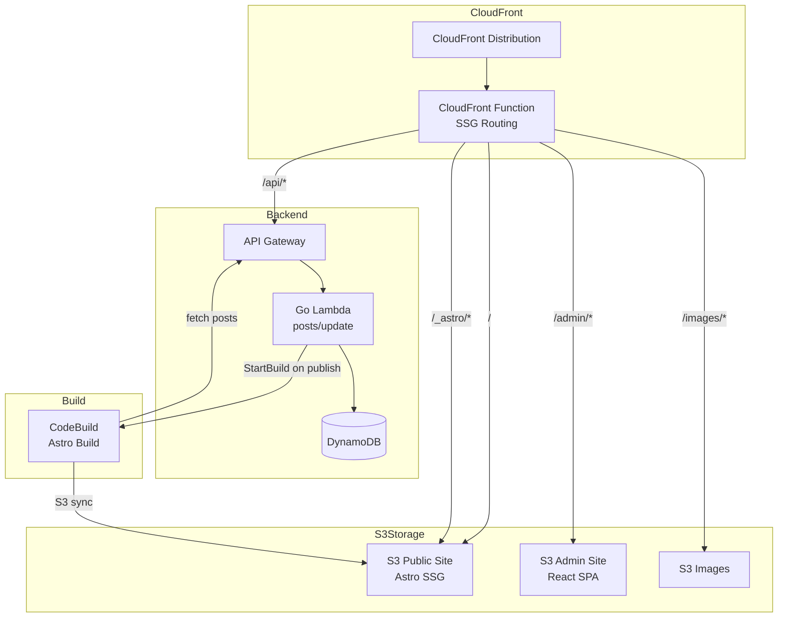
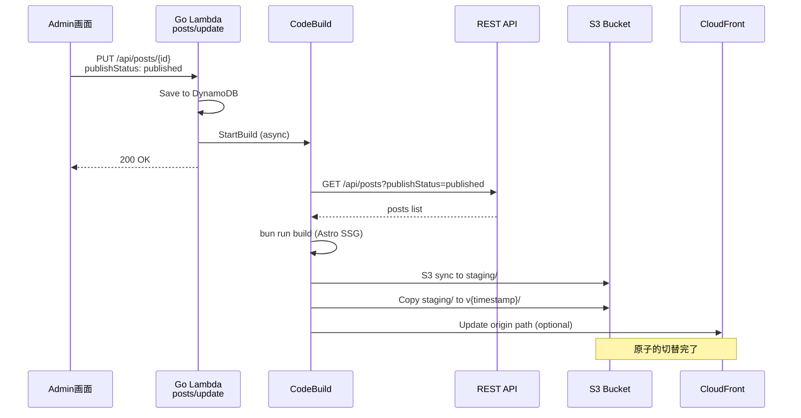
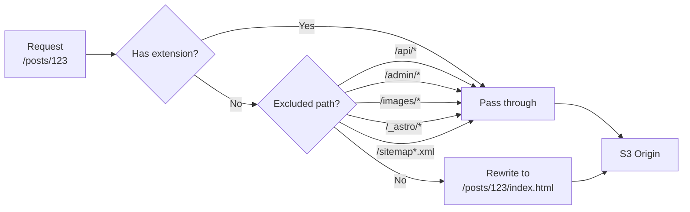

# Technical Design: Astro SSG Migration

## Overview

**Purpose**: 公開ブログサイトをReact SPAからAstro SSG (Static Site Generation) に移行し、SEOとパフォーマンスを向上させる。

**Users**:
- ブログ読者: 高速なページ読み込みと検索エンジンでの適切な表示
- ブログ管理者: 記事公開時の自動サイト再ビルド
- 開発者: シンプルなインフラとTerraformによるIaC管理

**Impact**: 公開サイト (`frontend/public/`) のみを移行。Admin画面、REST API、画像配信システムは変更なし。

### Goals
- SEO改善: OGP、JSON-LD、サイトマップ、RSSフィードによる適切なインデックス化
- パフォーマンス: Lighthouse 95+、TTFB < 100ms、FCP < 1秒
- シンプル化: Lambda不要のS3静的配信、原子的デプロイ
- 自動化: 記事公開時のCodeBuildトリガーによる自動再ビルド

### Non-Goals
- Admin画面の変更（React SPAのまま維持）
- REST APIの変更（既存Go Lambda維持）
- リアルタイムプレビュー機能
- ISR (Incremental Static Regeneration)

## Architecture

### Existing Architecture Analysis

現在のCloudFront構成:
- `/` → S3 (React SPA) with CloudFront Function (SPA routing)
- `/admin/*` → S3 (React SPA) with CloudFront Function
- `/api/*` → API Gateway → Go Lambda
- `/images/*` → S3 with CloudFront Function (path rewrite)

既存パターン:
- CloudFront Functions による viewer-request 処理
- S3 OAC (Origin Access Control) による安全なS3アクセス
- Terraform modules による環境別デプロイ (dev/prd)

### Architecture Pattern & Boundary Map



**Architecture Integration**:
- Selected pattern: SSG with S3 + CloudFront (Lambda不要)
- Domain boundaries: Astro SSGは公開サイトのみ、既存バックエンドと疎結合
- Existing patterns preserved: CloudFront Functions、S3 OAC、Terraform modules
- New components: CodeBuild project、CloudFront Function更新

### Technology Stack

| Layer | Choice / Version | Role in Feature | Notes |
|-------|------------------|-----------------|-------|
| Frontend | Astro 5.x + React 19 | SSG生成、Reactコンポーネント再利用 | `@astrojs/react` 統合 |
| Build Tool | Bun 1.x | 高速パッケージ管理・ビルド | 既存パターン準拠 |
| Styling | Tailwind CSS 4.x | スタイリング | `@tailwindcss/vite` |
| Infrastructure | Terraform | IaC管理 | 既存 modules 拡張 |
| CDN | CloudFront | 静的配信、URL書き換え | CloudFront Functions |
| Storage | S3 | 静的ファイルホスティング | バージョン付きプレフィックス |
| Build Pipeline | AWS CodeBuild | Astro ビルド・デプロイ | 新規追加 |
| Backend | Go Lambda | ビルドトリガー | 既存 posts/update 拡張 |

## System Flows

### Build & Deploy Flow



**Key Decisions**:
- ビルドは非同期（Lambdaはビルド完了を待たない）
- 冪等性: 進行中ビルドがあれば新規ビルドをスキップ
- 失敗時: 前バージョンが維持される（原子的デプロイ）

### CloudFront Request Flow



## Requirements Traceability

| Requirement | Summary | Components | Interfaces | Flows |
|-------------|---------|------------|------------|-------|
| 1.1-1.6 | Astroプロジェクト基盤 | AstroProject | - | - |
| 2.1-2.10 | 静的サイト生成 | AstroProject, PostFetcher | API Contract | Build Flow |
| 3.1-3.7 | SEOメタタグ | SEOComponent | - | - |
| 4.1-4.4 | 構造化データ | JsonLdComponent | - | - |
| 5.1-5.6 | サイトマップ/RSS | SitemapIntegration, RssEndpoint | - | - |
| 6.1-6.8 | S3原子的デプロイ | DeployScript, S3Bucket | - | Deploy Flow |
| 7.1-7.10 | CloudFrontルーティング | CloudFrontFunction, CDNModule | - | Request Flow |
| 8.1-8.5 | Terraform | CDNModule, LambdaModule | - | - |
| 9.1-9.11 | ビルドパイプライン | CodeBuildProject, DeployScript | - | Build Flow |
| 10.1-10.10 | コンテンツ更新トリガー | PostUpdateLambda, BuildTrigger | CodeBuild API | Build Flow |
| 11.1-11.6 | パフォーマンス | AstroConfig, CDNModule | - | - |
| 12.1-12.6 | 後方互換性 | All | - | - |
| 13.1-13.6 | テスト | TestSuite | - | - |
| 14.1-14.5 | 日本語対応 | AstroConfig, SEOComponent | - | - |
| 15.1-15.5 | エラーページ | 404Page, CDNModule | - | - |
| 16.1-16.7 | HTMLサニタイズ | PostHandler, Sanitizer | - | - |

## Components and Interfaces

### Component Summary

| Component | Domain/Layer | Intent | Req Coverage | Key Dependencies | Contracts |
|-----------|--------------|--------|--------------|------------------|-----------|
| AstroProject | Frontend | Astro SSGプロジェクト全体 | 1, 2, 11, 14 | React, Tailwind (P0) | - |
| PostFetcher | Frontend/Data | API経由で記事取得 | 2.1, 2.8-2.10 | REST API (P0) | Service |
| SEOComponent | Frontend/UI | メタタグ生成 | 3.1-3.7, 14 | - | - |
| JsonLdComponent | Frontend/UI | 構造化データ生成 | 4.1-4.4 | - | - |
| CloudFrontFunction | Infrastructure | URLリライト | 7.8-7.10 | CloudFront (P0) | - |
| CodeBuildProject | Infrastructure | Astroビルド・デプロイ | 9, 10.5 | S3, API (P0) | Batch |
| BuildTrigger | Backend | CodeBuild起動 | 10.1-10.10 | CodeBuild API (P0) | Service |
| Sanitizer | Backend | HTMLサニタイズ | 16.1-16.7 | bluemonday (P0) | Service |
| DeployScript | DevOps | 原子的デプロイ | 6.2-6.7 | S3, CloudFront (P0) | - |
| CDNModule | Infrastructure | Terraform CDN設定 | 7, 8 | - | - |

### Frontend / Astro

#### AstroProject

| Field | Detail |
|-------|--------|
| Intent | Astro SSGプロジェクトの構成と設定 |
| Requirements | 1.1-1.6, 2.1-2.7, 11.4-11.5, 14.1-14.2 |

**Responsibilities & Constraints**
- Astro 5.x + TypeScript によるSSGプロジェクト
- `output: 'static'` モードで完全静的生成
- `@astrojs/react` でReactコンポーネント再利用
- `@tailwindcss/vite` でTailwind CSS統合
- `@astrojs/sitemap` でサイトマップ自動生成

**Dependencies**
- Outbound: REST API — 記事データ取得 (P0)
- External: Bun — パッケージ管理・ビルド (P0)

**Project Structure**
```
frontend/public-astro/
├── src/
│   ├── pages/
│   │   ├── index.astro           # 記事一覧 (/)
│   │   ├── posts/[id].astro      # 記事詳細 (/posts/{id})
│   │   ├── about.astro           # About (/about)
│   │   ├── 404.astro             # 404エラー
│   │   └── rss.xml.ts            # RSSフィード
│   ├── layouts/
│   │   └── Layout.astro          # 共通レイアウト
│   ├── components/
│   │   ├── Header.astro          # ヘッダー
│   │   ├── PostCard.astro        # 記事カード
│   │   ├── SEO.astro             # SEOメタタグ
│   │   └── JsonLd.astro          # 構造化データ
│   └── lib/
│       └── api.ts                # API呼び出し
├── astro.config.mjs
├── tailwind.config.js
├── tsconfig.json
└── package.json
```

**Implementation Notes**
- Integration: 既存API (`/api/posts`) からデータ取得
- Validation: ビルド時のAPI不可時は明確なエラーメッセージ
- Risks: 記事数増加時のビルド時間（1000件で5分以内目標）

#### PostFetcher

| Field | Detail |
|-------|--------|
| Intent | REST APIから記事を取得しページネーション処理 |
| Requirements | 2.1, 2.8-2.10 |

**Contracts**: Service [ ✓ ]

##### Service Interface
```typescript
interface PostFetcherService {
  fetchAllPosts(apiUrl: string): Promise<Post[]>;
  fetchPost(apiUrl: string, id: string): Promise<Post>;
}

interface Post {
  id: string;
  title: string;
  contentHtml: string;
  contentMarkdown: string;
  category: string;
  tags: string[];
  imageUrls: string[];
  publishStatus: 'draft' | 'published';
  authorId: string;
  createdAt: string;
  updatedAt: string;
  publishedAt?: string;
}

interface PostListResponse {
  items: Post[];
  nextToken?: string;
}
```
- Preconditions: `API_URL` 環境変数が設定されている
- Postconditions: 全公開記事のリストを返す
- Invariants: ページネーション完了まで再帰的に取得

**Implementation Notes**
- Integration: `GET /api/posts?publishStatus=published&nextToken={token}`
- Validation: 3回リトライ with exponential backoff
- Risks: 記事数1000件超でのメモリ使用量

#### SEOComponent

| Field | Detail |
|-------|--------|
| Intent | ページごとのSEOメタタグ生成 |
| Requirements | 3.1-3.7, 14.3 |

**Interface**
```typescript
interface SEOProps {
  title: string;
  description: string;
  canonicalUrl: string;
  ogImage?: string;
  ogType?: 'website' | 'article';
  publishedAt?: string;  // article only
}
```

**Generated Tags**
```html
<!-- Primary -->
<title>{title}</title>
<meta name="description" content="{description}" />
<link rel="canonical" href="{canonicalUrl}" />

<!-- Open Graph -->
<meta property="og:title" content="{title}" />
<meta property="og:description" content="{description}" />
<meta property="og:type" content="{ogType}" />
<meta property="og:url" content="{canonicalUrl}" />
<meta property="og:image" content="{ogImage}" />

<!-- Twitter Card -->
<meta name="twitter:card" content="summary_large_image" />
<meta name="twitter:title" content="{title}" />
<meta name="twitter:description" content="{description}" />
<meta name="twitter:image" content="{ogImage}" />
```

#### JsonLdComponent

| Field | Detail |
|-------|--------|
| Intent | BlogPosting/WebSite構造化データ生成 |
| Requirements | 4.1-4.4 |

**BlogPosting Schema**
```typescript
interface BlogPostingSchema {
  "@context": "https://schema.org";
  "@type": "BlogPosting";
  headline: string;
  description: string;
  image?: string;
  datePublished: string;
  dateModified: string;
  author: {
    "@type": "Person";
    name: string;
  };
  mainEntityOfPage: {
    "@type": "WebPage";
    "@id": string;
  };
}
```

### Infrastructure

#### CloudFrontFunction

| Field | Detail |
|-------|--------|
| Intent | Astro SSGのURLリライト処理 |
| Requirements | 7.8-7.10 |

**Function Code (ECMAScript 5.1)**
```javascript
function handler(event) {
  var request = event.request;
  var uri = request.uri;

  // 拡張子チェック (ファイル名に . が含まれる)
  var lastSegment = uri.split('/').pop();
  var hasExtension = lastSegment.indexOf('.') > -1;

  if (hasExtension) {
    return request;
  }

  // 除外パターン
  if (uri.indexOf('/_astro/') === 0 ||
      uri.indexOf('/api/') === 0 ||
      uri.indexOf('/admin/') === 0 ||
      uri.indexOf('/images/') === 0 ||
      uri.indexOf('/sitemap') === 0 ||
      uri === '/rss.xml' ||
      uri === '/robots.txt') {
    return request;
  }

  // URLリライト: /posts/123 → /posts/123/index.html
  if (uri.charAt(uri.length - 1) === '/') {
    request.uri = uri + 'index.html';
  } else {
    request.uri = uri + '/index.html';
  }

  return request;
}
```

**Implementation Notes**
- Integration: viewer-request イベントに関連付け
- Validation: 除外パターンのテスト必須
- Risks: ECMAScript 5.1の制限（let/const/arrow関数不可）

#### CodeBuildProject

| Field | Detail |
|-------|--------|
| Intent | Astroビルドと原子的S3デプロイ |
| Requirements | 9.1-9.11, 10.5 |

**Contracts**: Batch [ ✓ ]

##### Batch / Job Contract
- Trigger: Go Lambda (posts/update) からの StartBuild API呼び出し
- Input: 環境変数 `API_URL`, `DEPLOYMENT_BUCKET`, `CLOUDFRONT_DIST_ID`
- Output: S3へのデプロイ、デプロイバージョン出力
- Idempotency: 進行中ビルドチェック（ListBuildsForProject）

**buildspec.yml**
```yaml
version: 0.2

env:
  variables:
    PUBLIC_API_URL: "https://api.example.com"
  parameter-store:
    DEPLOYMENT_BUCKET: "/blog/${ENV}/deployment-bucket"

phases:
  install:
    runtime-versions:
      nodejs: 20
    commands:
      - curl -fsSL https://bun.sh/install | bash
      - export PATH="$HOME/.bun/bin:$PATH"
  pre_build:
    commands:
      - cd frontend/public-astro
      - bun install --frozen-lockfile
  build:
    commands:
      - bun run build
  post_build:
    commands:
      - DEPLOY_VERSION="v$(date +%s)"
      - aws s3 sync ./dist "s3://${DEPLOYMENT_BUCKET}/${DEPLOY_VERSION}/" --delete \
          --cache-control "public,max-age=31536000,immutable" \
          --exclude "*.html" --exclude "sitemap*.xml" --exclude "rss.xml"
      - aws s3 sync ./dist "s3://${DEPLOYMENT_BUCKET}/${DEPLOY_VERSION}/" \
          --cache-control "public,max-age=0,must-revalidate" \
          --include "*.html" --include "sitemap*.xml" --include "rss.xml"

cache:
  paths:
    - 'frontend/public-astro/node_modules/**/*'
    - 'frontend/public-astro/.astro/**/*'
```

### Backend

#### BuildTrigger

| Field | Detail |
|-------|--------|
| Intent | 記事公開時にCodeBuildを起動 |
| Requirements | 10.1-10.4, 10.8-10.10 |

**Contracts**: Service [ ✓ ]

##### Service Interface
```go
type BuildTrigger interface {
    TriggerBuild(ctx context.Context) error
    IsBuildInProgress(ctx context.Context) (bool, error)
}

// Implementation in posts/update Lambda
type CodeBuildTrigger struct {
    client        *codebuild.Client
    projectName   string
    lastBuildTime time.Time
    minInterval   time.Duration // 1 minute
}
```
- Preconditions: publishStatus が "published" に変更された
- Postconditions: CodeBuild StartBuild API が呼び出される（非同期）
- Invariants: 最大1分間隔でのビルド集約

**Implementation Notes**
- Integration: posts/update Lambda の `buildUpdatedPost` 後に呼び出し
- Validation: publishStatus変更のみでトリガー、エラー時は警告ログのみ
- Risks: CodeBuild API障害時もポスト更新は成功させる

#### Sanitizer

| Field | Detail |
|-------|--------|
| Intent | HTMLコンテンツのXSSサニタイズ |
| Requirements | 16.1-16.7 |

**Contracts**: Service [ ✓ ]

##### Service Interface
```go
type HTMLSanitizer interface {
    Sanitize(html string) string
}

// Allowed tags and attributes
var AllowedTags = []string{
    "p", "br", "strong", "em", "a", "ul", "ol", "li",
    "h1", "h2", "h3", "h4", "h5", "h6",
    "blockquote", "code", "pre", "img",
}

var AllowedAttributes = map[string][]string{
    "a":   {"href"},
    "img": {"src", "alt", "width", "height"},
}

var AllowedURLSchemes = []string{"http", "https"}
```
- Preconditions: HTMLコンテンツが入力される
- Postconditions: 危険なタグ・属性が除去されたHTMLを返す
- Invariants: 許可リスト以外のタグ・属性は削除

**Implementation Notes**
- Integration: posts/create, posts/update の contentMarkdown → contentHtml 変換前に適用
- Validation: スクリプトタグ、イベントハンドラ、javascript: URL の除去確認
- Risks: 既存データのマイグレーション（段階的に実施）

## Data Models

### Domain Model

既存の `BlogPost` エンティティを使用（変更なし）:

```go
type BlogPost struct {
    ID              string   `json:"id" dynamodbav:"id"`
    Title           string   `json:"title" dynamodbav:"title"`
    ContentMarkdown string   `json:"contentMarkdown" dynamodbav:"contentMarkdown"`
    ContentHTML     string   `json:"contentHtml" dynamodbav:"contentHtml"`
    Category        string   `json:"category" dynamodbav:"category"`
    Tags            []string `json:"tags" dynamodbav:"tags"`
    ImageURLs       []string `json:"imageUrls" dynamodbav:"imageUrls"`
    PublishStatus   string   `json:"publishStatus" dynamodbav:"publishStatus"`
    AuthorID        string   `json:"authorId" dynamodbav:"authorId"`
    CreatedAt       string   `json:"createdAt" dynamodbav:"createdAt"`
    UpdatedAt       string   `json:"updatedAt" dynamodbav:"updatedAt"`
    PublishedAt     *string  `json:"publishedAt,omitempty" dynamodbav:"publishedAt,omitempty"`
}
```

### Physical Data Model

**S3 Storage Structure (Versioned Prefix)**
```
s3://public-site-bucket/
├── v1705123456/          # 前回デプロイ
│   ├── index.html
│   ├── _astro/
│   │   ├── index.abc123.js
│   │   └── styles.def456.css
│   ├── posts/
│   │   └── {id}/index.html
│   ├── about/index.html
│   ├── 404.html
│   ├── sitemap-index.xml
│   ├── rss.xml
│   └── robots.txt
├── v1705234567/          # 現在のデプロイ (CloudFront origin path)
│   └── ...
└── staging/              # 次回デプロイ準備中
    └── ...
```

## Error Handling

### Error Strategy

| Error Type | Response | Recovery |
|------------|----------|----------|
| API不可（ビルド時） | ビルド失敗、3回リトライ | 前バージョン維持 |
| S3アップロード失敗 | ビルド失敗 | 前バージョン維持 |
| CodeBuild起動失敗 | 警告ログ、ポスト更新は成功 | 手動再トリガー |
| CloudFront更新失敗 | 警告ログ | 手動対応 |
| サニタイズエラー | 400 Bad Request | 入力修正 |

### Monitoring

- **CloudWatch Logs**: CodeBuildログ、Lambda関数ログ
- **CloudWatch Metrics**: ビルド成功率、ビルド時間
- **CloudWatch Alarms**: ビルド失敗時のSNS通知

## Testing Strategy

### Unit Tests
- PostFetcher: ページネーション処理、エラーリトライ
- SEOComponent: メタタグ生成（全パターン）
- JsonLdComponent: スキーマ生成（BlogPosting, WebSite）
- Sanitizer: 許可タグ通過、禁止タグ除去、イベントハンドラ除去

### Integration Tests
- Astro Build: 全ページ生成確認、リンク検証
- S3 Deploy: 原子的切替、ロールバック
- CodeBuild Trigger: Lambda→CodeBuild連携

### E2E Tests
- 記事一覧表示、記事詳細表示
- SEOメタタグ・OGP確認（curl）
- サイトマップ・RSSフィード検証

### Performance Tests
- Lighthouse CI: Performance 95+ 確認
- 1000記事ビルドテスト: 5分以内完了確認

## Security Considerations

### Build Pipeline Security
- OIDC認証によるAWS一時クレデンシャル
- 最小権限IAM（S3特定バケット、CloudFront特定ディストリビューション）
- KMS暗号化（ビルドアーティファクト、ログ）
- 依存関係ピン留め（bun.lock）

### Content Security
- HTMLサニタイズ（保存時）
- XSS防止（許可タグ/属性のホワイトリスト）
- CSPヘッダー（CloudFrontレスポンスヘッダー）

## Performance & Scalability

### Target Metrics
| Metric | Target | Measurement |
|--------|--------|-------------|
| Lighthouse Performance | ≥ 95 | Lighthouse CI |
| TTFB | < 100ms | CloudWatch RUM |
| FCP | < 1s | Lighthouse CI |
| JS Bundle Size | < 50KB gzipped | build output |
| Build Time | < 5min | CodeBuild metrics |

### Caching Strategy
| Resource | Cache-Control | TTL |
|----------|---------------|-----|
| `/_astro/*` | `max-age=31536000,immutable` | 1年 |
| `*.html` | `max-age=0,must-revalidate` | 0 |
| `sitemap*.xml`, `rss.xml` | `max-age=0,must-revalidate` | 0 |
| CloudFront HTML | default_ttl=3600, max_ttl=86400 | 1-24時間 |
| CloudFront `/_astro/*` | default_ttl=31536000 | 1年 |

## Migration Strategy

### Phase 1: Infrastructure準備
1. CodeBuildプロジェクト作成（Terraform）
2. CloudFront Function更新（SSGルーティング）
3. S3バケット設定（バージョニング有効化）

### Phase 2: Astroプロジェクト実装
1. Astroプロジェクト初期化
2. ページコンポーネント実装（index, posts/[id], about, 404）
3. SEO・JSON-LDコンポーネント実装
4. サイトマップ・RSSフィード設定

### Phase 3: バックエンド統合
1. HTMLサニタイザー実装（Go Lambda）
2. ビルドトリガー実装（posts/update Lambda）
3. 統合テスト

### Phase 4: デプロイ・検証
1. dev環境デプロイ
2. パフォーマンス検証（Lighthouse）
3. SEO検証（OGP Debugger）
4. prd環境デプロイ

### Rollback Trigger
- Lighthouse Performance < 90
- ビルド失敗率 > 10%
- 主要ページ404発生

### Rollback Procedure
1. CloudFront origin pathを前バージョンに変更
2. キャッシュ無効化（必要に応じて）
3. 原因調査・修正
