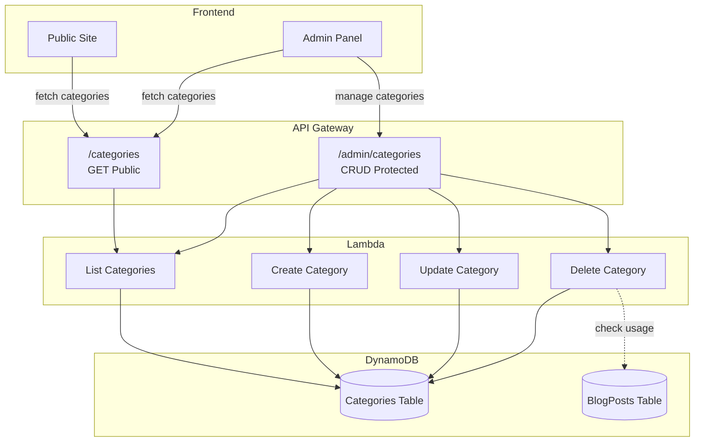
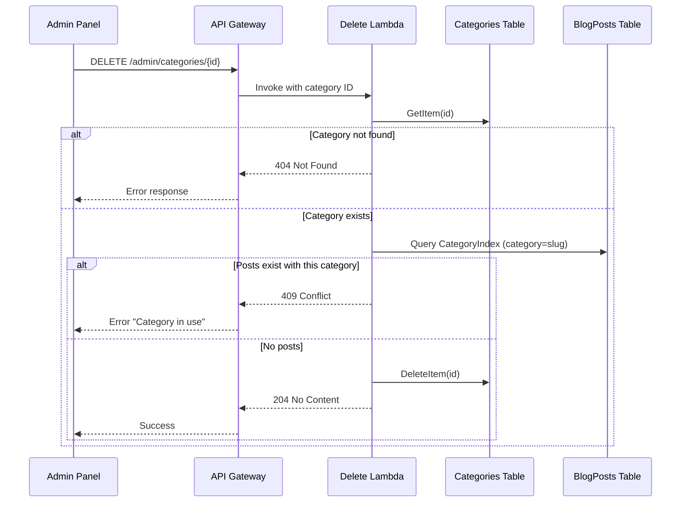
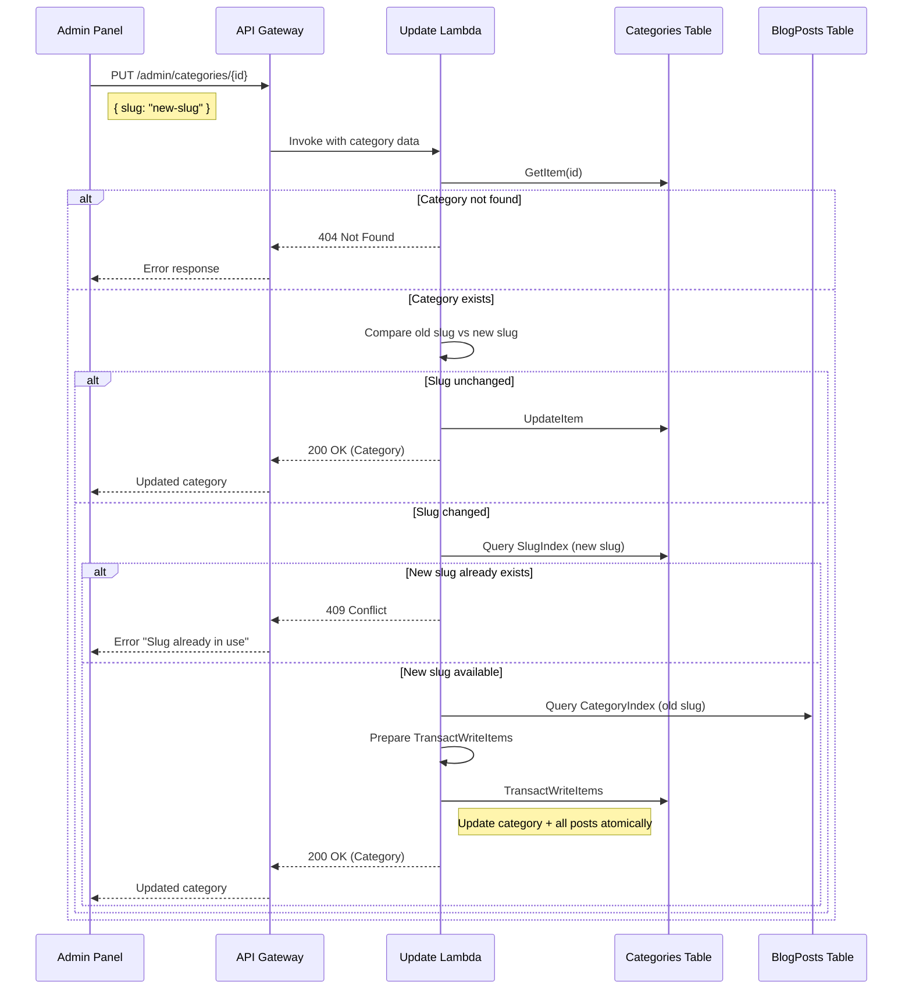
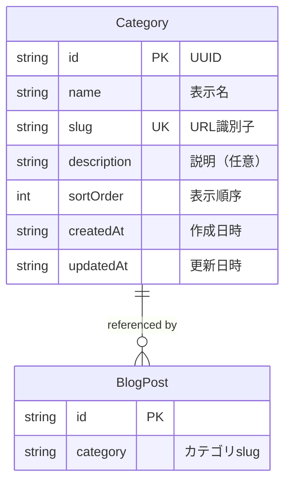

# Design Document: Category Management

## Overview

**Purpose**: カテゴリ管理機能は、管理者がブログ記事のカテゴリを動的に追加・編集・削除できる機能を提供する。現在ハードコードされているカテゴリをデータベース管理に移行し、管理画面から柔軟にカテゴリを操作可能にする。

**Users**: 管理者（Administrator）が管理画面からカテゴリを管理し、公開サイトと管理画面の両方がAPIからカテゴリ一覧を動的に取得する。

**Impact**: PostEditorコンポーネントのハードコードされたカテゴリリストを削除し、APIベースの動的取得に置き換える。新規DynamoDBテーブル、Go Lambda関数、API Gatewayリソース、管理画面ページを追加する。

### Goals
- カテゴリマスタデータのDynamoDB永続化
- カテゴリCRUD APIの実装（公開一覧 + 認証付き管理）
- 管理画面でのカテゴリ管理UI実装
- 記事エディタのカテゴリドロップダウン動的化
- 初期カテゴリデータのシーディング

### Non-Goals
- カテゴリの階層構造（親子関係）
- カテゴリ別の記事件数表示（将来的な拡張）
- 多言語対応（将来的な拡張）
- カテゴリ画像・アイコンの設定

## Architecture

### Architecture Pattern & Boundary Map



**Architecture Integration**:
- **Selected pattern**: 既存アーキテクチャの拡張（サーバーレス + Terraform）
- **Domain/feature boundaries**: カテゴリドメインは独立モジュールとして実装、記事ドメインとは疎結合（カテゴリ文字列参照のみ）
- **Existing patterns preserved**: DynamoDB PAY_PER_REQUEST、Go Lambda、API Gateway REST API、React Admin Panel
- **New components rationale**: 各コンポーネントは既存パターンに準拠し一貫性を維持
- **Steering compliance**: サーバーレスファースト、Infrastructure as Code、セキュリティバイデザイン、テスト駆動開発

### Technology Stack

| Layer | Choice / Version | Role in Feature | Notes |
|-------|------------------|-----------------|-------|
| Frontend | React 18 + TypeScript | カテゴリ管理UI | 既存Admin Panelと同一 |
| Frontend | @dnd-kit/core | ドラッグ&ドロップ並び替え | 新規依存関係 |
| Backend | Go 1.25.x (Lambda) | カテゴリCRUD処理 | 既存パターン踏襲 |
| Data | Amazon DynamoDB | カテゴリマスタ永続化 | 新規テーブル |
| Infrastructure | Terraform | インフラ定義 | 既存モジュール拡張 |

## System Flows

### カテゴリ削除フロー（参照整合性チェック）



**Key Decisions**:
- 削除前に必ずBlogPostsのCategoryIndexをクエリして使用状況を確認
- 使用中の場合は409 Conflictでエラーメッセージ返却

### カテゴリSlug更新フロー（関連記事自動更新）



**Key Decisions**:
- slug変更時は関連する全記事のcategoryフィールドを自動更新
- TransactWriteItemsで原子性を保証（カテゴリ更新と記事更新を同時実行）
- 大量の記事がある場合はTransactWriteItemsの100件制限に注意（分割処理が必要な場合あり）

## Requirements Traceability

| Requirement | Summary | Components | Interfaces | Flows |
|-------------|---------|------------|------------|-------|
| 1.1-1.6 | DynamoDB Categories Table | CategoriesTable | - | - |
| 2.1-2.5 | カテゴリ一覧API | ListCategories Lambda | GET /categories | - |
| 3.1-3.7 | カテゴリ作成API | CreateCategory Lambda | POST /admin/categories | - |
| 4.1-4.6 | カテゴリ更新API | UpdateCategory Lambda | PUT /admin/categories/{id} | - |
| 4.7 | slug変更時の記事自動更新 | UpdateCategory Lambda | PUT /admin/categories/{id} | Slug更新フロー |
| 4B.1-4B.5 | sortOrder一括更新API | BulkUpdateSortOrder Lambda | PATCH /admin/categories/sort | - |
| 5.1-5.5 | カテゴリ削除API | DeleteCategory Lambda | DELETE /admin/categories/{id} | 削除フロー |
| 6.1-6.9 | 管理画面UI | CategoryListPage, CategoryEditPage | categories API client | - |
| 7.1-7.6 | PostEditor動的化 | PostEditor, useCategories | categories API client | - |
| 8.1-8.4 | 初期データシーディング | seed-categories script | - | - |
| 9.1-9.6 | エラーハンドリング | 全Lambda | ErrorResponse | - |
| 10.1-10.5 | テスト | 全コンポーネント | - | - |

## Components and Interfaces

| Component | Domain/Layer | Intent | Req Coverage | Key Dependencies | Contracts |
|-----------|--------------|--------|--------------|------------------|-----------|
| CategoriesTable | Data | カテゴリマスタ永続化 | 1.1-1.6 | DynamoDB (P0) | - |
| ListCategories | Backend | カテゴリ一覧取得 | 2.1-2.5 | CategoriesTable (P0) | API |
| CreateCategory | Backend | カテゴリ作成 | 3.1-3.7 | CategoriesTable (P0) | API |
| UpdateCategory | Backend | カテゴリ更新+記事自動更新 | 4.1-4.7 | CategoriesTable (P0), BlogPostsTable (P1) | API |
| BulkUpdateSortOrder | Backend | sortOrder一括更新 | 4B.1-4B.5 | CategoriesTable (P0) | API |
| DeleteCategory | Backend | カテゴリ削除 | 5.1-5.5 | CategoriesTable (P0), BlogPostsTable (P1) | API |
| CategoryListPage | Frontend | カテゴリ一覧管理UI | 6.1-6.9 | categories API (P0), @dnd-kit (P1) | - |
| CategoryEditPage | Frontend | カテゴリ編集UI | 6.3-6.4 | categories API (P0) | - |
| useCategories | Frontend | カテゴリフック | 7.1-7.4 | categories API (P0) | State |
| seed-categories | Migration | 初期データ投入 | 8.1-8.4 | CategoriesTable (P0) | Batch |

### Data Layer

#### CategoriesTable

| Field | Detail |
|-------|--------|
| Intent | カテゴリマスタデータの永続化 |
| Requirements | 1.1, 1.2, 1.3, 1.4, 1.5, 1.6 |

**Responsibilities & Constraints**
- カテゴリの一意性保証（id + slug）
- sortOrderによる表示順序管理
- PITR・暗号化によるデータ保護

**Dependencies**
- External: Amazon DynamoDB — データストア (P0)

**Contracts**: [x] Batch

##### Batch / Job Contract
- **Trigger**: Terraform apply時（テーブル作成）
- **Input / validation**: HCL定義
- **Output / destination**: DynamoDB Table
- **Idempotency & recovery**: Terraformによる冪等性保証

### Backend Layer

#### ListCategories Lambda

| Field | Detail |
|-------|--------|
| Intent | 全カテゴリをsortOrder昇順で取得 |
| Requirements | 2.1, 2.2, 2.3, 2.4, 2.5 |

**Responsibilities & Constraints**
- 認証不要（公開API）
- 空配列は200で正常レスポンス
- CORSヘッダー付与

**Dependencies**
- Inbound: API Gateway — HTTPリクエストルーティング (P0)
- Outbound: CategoriesTable — カテゴリデータ取得 (P0)

**Contracts**: [x] API

##### API Contract
| Method | Endpoint | Request | Response | Errors |
|--------|----------|---------|----------|--------|
| GET | /categories | - | Category[] | 500 |

**Implementation Notes**
- Scan操作 + sortOrderでソート
- 件数が少ないため全件取得で問題なし

#### CreateCategory Lambda

| Field | Detail |
|-------|--------|
| Intent | 新規カテゴリを作成 |
| Requirements | 3.1, 3.2, 3.3, 3.4, 3.5, 3.6, 3.7 |

**Responsibilities & Constraints**
- Cognito認証必須
- name必須、slug任意（未指定時は自動生成）
- slug一意性チェック（SlugIndex Query）

**Dependencies**
- Inbound: API Gateway — HTTPリクエストルーティング (P0)
- Outbound: CategoriesTable — カテゴリ作成 (P0)

**Contracts**: [x] API

##### API Contract
| Method | Endpoint | Request | Response | Errors |
|--------|----------|---------|----------|--------|
| POST | /admin/categories | CreateCategoryRequest | Category | 400, 401, 409, 500 |

**Implementation Notes**
- slug自動生成: nameをlowercase + ハイフン変換
- sortOrder未指定時: 最大値 + 1

#### UpdateCategory Lambda

| Field | Detail |
|-------|--------|
| Intent | 既存カテゴリを更新（slug変更時は関連記事も自動更新） |
| Requirements | 4.1, 4.2, 4.3, 4.4, 4.5, 4.6, 4.7 |

**Responsibilities & Constraints**
- Cognito認証必須
- 部分更新対応（指定フィールドのみ更新）
- slug変更時は一意性チェック
- slug変更時はBlogPostsの該当categoryを自動更新

**Dependencies**
- Inbound: API Gateway — HTTPリクエストルーティング (P0)
- Outbound: CategoriesTable — カテゴリ更新 (P0)
- Outbound: BlogPostsTable — 記事のcategoryフィールド更新 (P1)

**Contracts**: [x] API

##### API Contract
| Method | Endpoint | Request | Response | Errors |
|--------|----------|---------|----------|--------|
| PUT | /admin/categories/{id} | UpdateCategoryRequest | Category | 400, 401, 404, 409, 500 |

**Implementation Notes**
- UpdateExpressionで部分更新
- updatedAt自動更新
- slug変更検知: 更新前のslugと新slugを比較
- slug変更時の記事更新: CategoryIndexでQuery → 各記事をUpdateItem（TransactWriteItemsで原子性保証）

#### BulkUpdateSortOrder Lambda

| Field | Detail |
|-------|--------|
| Intent | 複数カテゴリのsortOrderを一括更新 |
| Requirements | 4B.1, 4B.2, 4B.3, 4B.4, 4B.5 |

**Responsibilities & Constraints**
- Cognito認証必須
- 一括更新の原子性保証（TransactWriteItems使用）
- 存在しないIDは400エラー

**Dependencies**
- Inbound: API Gateway — HTTPリクエストルーティング (P0)
- Outbound: CategoriesTable — カテゴリ一括更新 (P0)

**Contracts**: [x] API

##### API Contract
| Method | Endpoint | Request | Response | Errors |
|--------|----------|---------|----------|--------|
| PATCH | /admin/categories/sort | UpdateSortOrderRequest | Category[] | 400, 401, 500 |

**Implementation Notes**
- TransactWriteItemsで原子的一括更新（最大100件）
- updatedAt自動更新
- 存在チェック: 更新前に全IDのGetItemを実行

#### DeleteCategory Lambda

| Field | Detail |
|-------|--------|
| Intent | カテゴリを削除（使用中チェック付き） |
| Requirements | 5.1, 5.2, 5.3, 5.4, 5.5 |

**Responsibilities & Constraints**
- Cognito認証必須
- 記事参照チェック（CategoryIndex Query）
- 使用中は削除拒否（409）

**Dependencies**
- Inbound: API Gateway — HTTPリクエストルーティング (P0)
- Outbound: CategoriesTable — カテゴリ削除 (P0)
- Outbound: BlogPostsTable — 参照チェック (P1)

**Contracts**: [x] API

##### API Contract
| Method | Endpoint | Request | Response | Errors |
|--------|----------|---------|----------|--------|
| DELETE | /admin/categories/{id} | - | 204 No Content | 401, 404, 409, 500 |

**Implementation Notes**
- BlogPosts CategoryIndexのQuery (KeyConditionExpression: category = :slug, Limit: 1)
- count > 0 なら409 Conflict

### Frontend Layer

#### CategoryListPage

| Field | Detail |
|-------|--------|
| Intent | カテゴリ一覧表示と管理操作 |
| Requirements | 6.1, 6.2, 6.3, 6.5, 6.6, 6.7, 6.8, 6.9 |

**Responsibilities & Constraints**
- AdminLayoutラッパー
- ドラッグ&ドロップによるsortOrder変更
- 削除確認ダイアログ

**Dependencies**
- Inbound: React Router — ページナビゲーション (P0)
- Outbound: categories API — データ操作 (P0)
- External: @dnd-kit/core — D&D機能 (P1)

**Contracts**: [x] State

##### State Management
- **State model**: categories[], loading, error, successMessage
- **Persistence & consistency**: APIからの再取得で同期
- **Concurrency strategy**: 楽観的UI更新 + エラー時ロールバック

**Implementation Notes**
- sortOrder一括更新API呼び出し（D&D完了時）
- ConfirmDialogコンポーネント再利用

#### CategoryEditPage

| Field | Detail |
|-------|--------|
| Intent | カテゴリ作成・編集フォーム |
| Requirements | 6.3, 6.4 |

**Responsibilities & Constraints**
- 新規作成と編集で共用
- フォームバリデーション

**Dependencies**
- Inbound: React Router — ページナビゲーション (P0)
- Outbound: categories API — データ操作 (P0)

**Implementation Notes**
- useParams()でID取得（undefinedなら新規作成）
- react-hook-formによるバリデーション

#### useCategories Hook

| Field | Detail |
|-------|--------|
| Intent | カテゴリデータの取得とキャッシュ |
| Requirements | 7.1, 7.2, 7.3, 7.4 |

**Responsibilities & Constraints**
- 初回マウント時にAPIフェッチ
- ローディング・エラー状態管理
- refetch関数提供

**Dependencies**
- Outbound: categories API — データ取得 (P0)

**Contracts**: [x] State

##### State Management
- **State model**: { categories, loading, error, refetch }
- **Persistence & consistency**: マウント時フェッチ、refetchで再取得
- **Concurrency strategy**: 単一リクエスト

### Migration Layer

#### seed-categories Script

| Field | Detail |
|-------|--------|
| Intent | 初期カテゴリデータの投入 |
| Requirements | 8.1, 8.2, 8.3, 8.4 |

**Responsibilities & Constraints**
- 冪等性保証（slug存在チェック）
- 既存ハードコードカテゴリの移行

**Dependencies**
- Outbound: CategoriesTable — データ投入 (P0)

**Contracts**: [x] Batch

##### Batch / Job Contract
- **Trigger**: デプロイ後に手動実行 または GitHub Actions
- **Input / validation**: 以下の定義済みカテゴリリスト（JSON）
  ```json
  [
    { "name": "テクノロジー", "slug": "tech", "sortOrder": 1 },
    { "name": "ライフスタイル", "slug": "life", "sortOrder": 2 },
    { "name": "ビジネス", "slug": "business", "sortOrder": 3 },
    { "name": "その他", "slug": "other", "sortOrder": 4 }
  ]
  ```
- **Output / destination**: CategoriesTable
- **Idempotency & recovery**: ConditionExpression: attribute_not_exists(slug)

## Data Models

### Domain Model



**Business Rules & Invariants**:
- `slug`は一意かつURL安全（英数字・ハイフンのみ）
- `name`は必須かつ100文字以内
- `sortOrder`は0以上の整数

### Physical Data Model

#### Categories Table (DynamoDB)

| Attribute | Type | Key | Description |
|-----------|------|-----|-------------|
| id | String | Partition Key | UUID v4 |
| name | String | - | 表示名 |
| slug | String | GSI Partition Key | URL識別子（一意） |
| description | String | - | 説明（任意） |
| sortOrder | Number | - | 表示順序 |
| createdAt | String | - | ISO 8601 |
| updatedAt | String | - | ISO 8601 |

**GSI: SlugIndex**
- Partition Key: `slug`
- Projection: KEYS_ONLY

**Table Settings**:
- Billing Mode: PAY_PER_REQUEST
- Point-in-Time Recovery: enabled
- Server-side Encryption: AWS managed key

### Data Contracts & Integration

#### API Request/Response Schemas

```typescript
// Category entity
interface Category {
  id: string;
  name: string;
  slug: string;
  description?: string;
  sortOrder: number;
  createdAt: string;
  updatedAt: string;
}

// GET /categories response
type ListCategoriesResponse = Category[];

// POST /admin/categories request
interface CreateCategoryRequest {
  name: string;
  slug?: string;        // 未指定時は自動生成
  description?: string;
  sortOrder?: number;   // 未指定時は最大値+1
}

// PUT /admin/categories/{id} request
interface UpdateCategoryRequest {
  name?: string;
  slug?: string;
  description?: string;
  sortOrder?: number;
}

// PATCH /admin/categories/sort request (sortOrder一括更新)
interface UpdateSortOrderRequest {
  orders: Array<{ id: string; sortOrder: number }>;
}

// Error response
interface ErrorResponse {
  message: string;
}
```

#### Go Domain Types

```go
// Category represents a blog category entity.
type Category struct {
    ID          string  `json:"id" dynamodbav:"id"`
    Name        string  `json:"name" dynamodbav:"name"`
    Slug        string  `json:"slug" dynamodbav:"slug"`
    Description *string `json:"description,omitempty" dynamodbav:"description,omitempty"`
    SortOrder   int     `json:"sortOrder" dynamodbav:"sortOrder"`
    CreatedAt   string  `json:"createdAt" dynamodbav:"createdAt"`
    UpdatedAt   string  `json:"updatedAt" dynamodbav:"updatedAt"`
}

// CreateCategoryRequest represents the request body for creating a category.
type CreateCategoryRequest struct {
    Name        string  `json:"name"`
    Slug        *string `json:"slug,omitempty"`
    Description *string `json:"description,omitempty"`
    SortOrder   *int    `json:"sortOrder,omitempty"`
}

// UpdateCategoryRequest represents the request body for updating a category.
type UpdateCategoryRequest struct {
    Name        *string `json:"name,omitempty"`
    Slug        *string `json:"slug,omitempty"`
    Description *string `json:"description,omitempty"`
    SortOrder   *int    `json:"sortOrder,omitempty"`
}

// UpdateSortOrderRequest represents the request for bulk sort order update.
type UpdateSortOrderRequest struct {
    Orders []SortOrderItem `json:"orders"`
}

type SortOrderItem struct {
    ID        string `json:"id"`
    SortOrder int    `json:"sortOrder"`
}
```

## Error Handling

### Error Categories and Responses

**User Errors (4xx)**:
- 400 Bad Request: name未入力、slug形式不正、name100文字超過
- 401 Unauthorized: 認証トークンなし/無効
- 404 Not Found: 指定IDのカテゴリ不存在
- 409 Conflict: slug重複、使用中カテゴリの削除

**System Errors (5xx)**:
- 500 Internal Server Error: DynamoDB接続エラー、予期せぬ例外

### Monitoring
- CloudWatch Logs: 全Lambda関数の構造化ログ（log/slog）
- X-Ray: 分散トレーシング
- CloudWatch Metrics: エラー率、レイテンシ

## Testing Strategy

### Unit Tests
- Go: Category型のValidate()、slug自動生成ロジック、参照チェックロジック
- React: CategoryListPage、CategoryEditPage、useCategoriesフック
- カバレッジ目標: 100%

### Integration Tests
- API: 全4エンドポイントのCRUD操作（DynamoDB Local使用）
- 削除時の参照整合性チェック
- slug重複時の409エラー

### E2E Tests
- カテゴリ作成 → 一覧表示 → 編集 → 削除のフロー
- 記事作成時のカテゴリドロップダウン動的表示

## Security Considerations

- **認証**: 管理API（/admin/categories）はCognito Authorizer必須
- **認可**: 全管理者が全カテゴリを操作可能（将来的なRBAC対応は非スコープ）
- **入力検証**: slug形式（^[a-z0-9-]+$）、name長（1-100文字）
- **暗号化**: DynamoDB SSE（AWS managed key）、HTTPS通信強制

## Migration Strategy

### Phase 1: Infrastructure Deployment
1. Terraform apply: Categoriesテーブル作成
2. Terraform apply: Lambda関数・API Gatewayデプロイ

### Phase 2: Data Migration
1. seed-categoriesスクリプト実行
2. 初期カテゴリ投入（tech, life, business, other）

### Phase 3: Frontend Deployment
1. 管理画面デプロイ（CategoryListPage、CategoryEditPage）
2. PostEditor更新（useCategories統合）

### Rollback Triggers
- Lambda関数のエラー率 > 1%
- API Gateway 5xx率 > 0.1%
- フロントエンドのカテゴリ取得失敗

### Validation Checkpoints
- 各フェーズ後にE2Eテスト実行
- カテゴリ一覧API正常レスポンス確認
- 記事エディタのカテゴリドロップダウン動作確認
