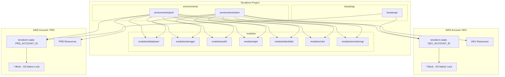
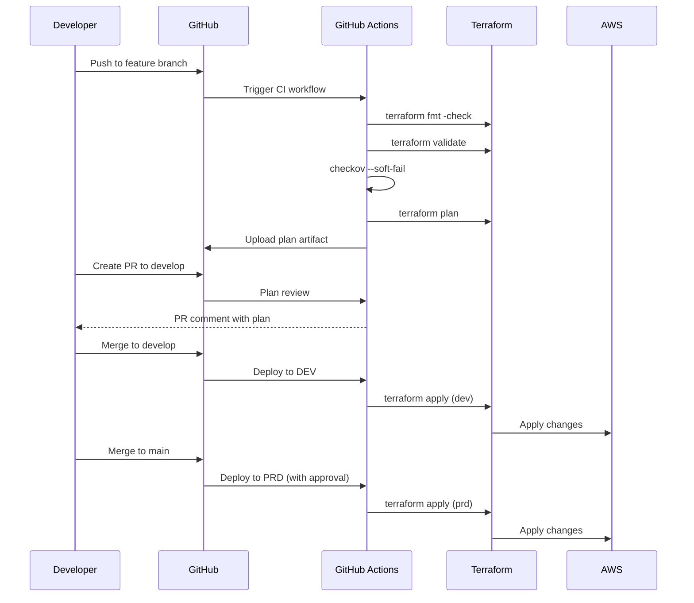
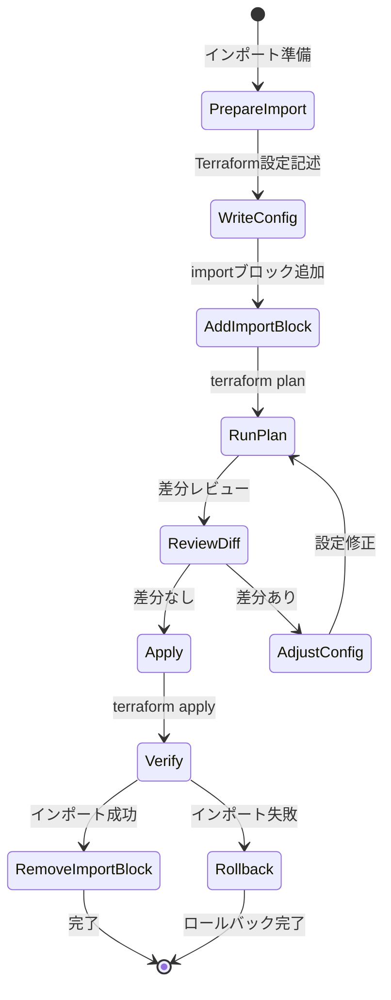
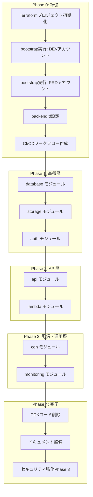

# 技術設計書

## 概要

**目的**: 本機能は、サーバーレスブログプラットフォームのInfrastructure as Code（IaC）をAWS CDK（TypeScript）からTerraform（HCL）へ移行し、ベンダーロックインの軽減、マルチクラウド移植性の向上、成熟したTerraformエコシステムの活用を提供する。

**ユーザー**: DevOpsエンジニアがCI/CDパイプラインでのインフラ管理、環境分離、セキュリティコンプライアンス監査に使用する。

**影響**: 現行の8つのCDKスタック（DatabaseStack、StorageStack、AuthStack、ApiStack、GoLambdaStack、ApiIntegrationsStack、CdnStack、MonitoringStack）を、同等機能を持つ7つのTerraformモジュールに置換する。既存AWSリソースはゼロダウンタイムでインポートされ、機能的同等性を維持する。

### 目標
- 現行CDKインフラと機能的に同等なTerraform構成の実現
- ゼロダウンタイムでの既存AWSリソースのTerraform状態へのインポート
- 再利用可能なモジュラーアーキテクチャによる保守性向上
- Checkov/Trivyによるセキュリティスキャンの統合

### 非目標
- マルチクラウド対応（本移行ではAWS専用）
- OpenTofuへの即時移行（将来オプションとして考慮）
- Terragruntの導入（過剰な複雑性を回避）
- CDKコードの並行維持（移行完了後は削除）

## アーキテクチャ

### 既存アーキテクチャ分析

現行CDKインフラは以下のスタック構成で、明確なドメイン境界を持つ：

| CDKスタック | 役割 | 主要リソース |
|------------|------|-------------|
| DatabaseStack | データ永続化 | DynamoDB BlogPostsTable + 2 GSI |
| StorageStack | ファイルストレージ | S3（images, public-site, admin-site） |
| AuthStack | 認証 | Cognito User Pool + Client |
| ApiStack | APIエンドポイント | REST API + Cognito Authorizer |
| GoLambdaStack | サーバーレス処理 | 11 Go Lambda関数 |
| ApiIntegrationsStack | API統合 | Auth API統合（/auth/*） |
| CdnStack | コンテンツ配信 | CloudFront統合ディストリビューション |
| MonitoringStack | 可観測性 | CloudWatch Alarms + Dashboard + SNS |

**依存関係チェーン**:
```
DatabaseStack → StorageStack → AuthStack → ApiStack → GoLambdaStack → ApiIntegrationsStack → CdnStack → MonitoringStack
```

### アーキテクチャパターン＆境界マップ



**アーキテクチャ統合**:
- **選択パターン**: モジュラー構造（modules/ + environments/）— CDKスタック構成との整合性と段階的移行を実現
- **ドメイン境界**: 各Terraformモジュールは単一のAWSサービスドメインを担当し、責務を分離
- **既存パターン維持**: CDKスタック間の依存関係を尊重し、同等の出力変数を提供
- **新コンポーネント根拠**: Terraformバックエンド管理（S3 + DynamoDB）は状態の永続化と同時実行制御に必須
- **ステアリング準拠**: tech.mdで定義されたサーバーレスパターン、セキュリティ原則を継承

### 技術スタック

| レイヤー | 選択 / バージョン | 機能での役割 | 備考 |
|---------|------------------|-------------|------|
| IaC | Terraform ~> 1.14.0 | インフラ定義・管理 | importブロック、S3ネイティブロック対応 |
| プロバイダ | hashicorp/aws ~> 6.0 | AWSリソースプロビジョニング | 最新の安定版 |
| 状態管理 | S3 (use_lockfile) | リモート状態とネイティブロック | DynamoDB不要、環境別バケット |
| セキュリティ | Checkov + Trivy | IaCスキャン | CI + ローカル |
| CI/CD | GitHub Actions | 自動化パイプライン | 既存ワークフロー拡張 |
| ドキュメント | terraform-docs | モジュールドキュメント生成 | pre-commit統合 |

詳細な技術選定の根拠は`research.md`を参照。

## システムフロー

### CI/CDパイプラインフロー



**フロー決定事項**:
- developブランチへのマージでDEV環境に自動デプロイ
- mainブランチへのマージでPRD環境にデプロイ（承認ゲート付き）
- plan出力はアーティファクトとして保存しレビュー可能

### リソースインポートフロー



## 要件トレーサビリティ

| 要件 | サマリー | コンポーネント | インターフェース | フロー |
|------|---------|--------------|----------------|--------|
| 1.1 | modules/とenvironments/ディレクトリ構造 | 全モジュール | — | — |
| 1.2 | Terraform ~> 1.14.0、プロバイダ制約 | versions.tf | — | — |
| 1.3 | S3 + DynamoDB状態管理 | backend.tf | — | — |
| 1.4 | ディレクトリベース環境分離 | environments/{dev,prd}/ | — | — |
| 1.5 | 変数定義（型、説明、バリデーション） | variables.tf | — | — |
| 1.6 | 環境固有モジュール呼び出し | main.tf | — | — |
| 1.7 | 7モジュール構成 | modules/* | — | — |
| 2.1-2.6 | DynamoDB設定 | modules/database | DynamoDB Table | — |
| 3.1-3.6 | S3バケット設定 | modules/storage | S3 Bucket | — |
| 4.1-4.5 | Cognito設定 | modules/auth | Cognito User Pool | — |
| 5.1-5.6 | API Gateway設定 | modules/api | REST API | CI/CD |
| 6.1-6.7 | Lambda関数設定 | modules/lambda | Lambda Function | — |
| 7.1-7.6 | CloudFront設定 | modules/cdn | CloudFront Distribution | — |
| 8.1-8.5 | モニタリング設定 | modules/monitoring | CloudWatch | — |
| 9.1-9.5 | 状態移行戦略 | importブロック | — | インポートフロー |
| 10.1-10.5 | CI/CD統合 | .github/workflows | — | CI/CDフロー |
| 11.1-11.5 | ドキュメント・テスト | README、examples、tests | — | — |
| 12.1-12.10 | セキュリティ・コンプライアンス | Checkov、Trivy | — | CI/CDフロー |

## コンポーネントとインターフェース

### コンポーネントサマリー

| コンポーネント | ドメイン/レイヤー | 意図 | 要件カバレッジ | 主要依存関係 | コントラクト |
|--------------|-----------------|------|--------------|-------------|-------------|
| bootstrap | 基盤層 | 状態バックエンド初期化 | 1.3 | — | State |
| database | データ層 | DynamoDBテーブル管理 | 2.1-2.6 | — | State |
| storage | データ層 | S3バケット管理 | 3.1-3.6 | — | State |
| auth | 認証層 | Cognito User Pool管理 | 4.1-4.5 | — | State |
| api | API層 | API Gateway管理 | 5.1-5.6 | auth (P0) | State |
| lambda | コンピュート層 | Lambda関数管理 | 6.1-6.7 | database (P0), storage (P0), api (P1) | State |
| cdn | 配信層 | CloudFront管理 | 7.1-7.6 | storage (P0), api (P1) | State |
| monitoring | 運用層 | CloudWatch管理 | 8.1-8.5 | lambda (P1), database (P1), api (P1) | State |

### 基盤層

#### bootstrap

| フィールド | 詳細 |
|----------|------|
| 意図 | Terraform状態バックエンド（S3バケット）の初期化 |
| 要件 | 1.3 |

**責務と制約**
- 状態バケット `terraform-state-{ACCOUNT_ID}` の作成（存在しない場合）
- S3バージョニング、暗号化、パブリックアクセスブロックの設定
- prevent_destroyライフサイクルによる誤削除防止
- DynamoDBは不要（S3ネイティブロックを使用）

**依存関係**
- Inbound: なし
- Outbound: なし
- External: AWS S3 Service (P0)

**コントラクト**: State [x]

##### 状態管理

```hcl
# bootstrap/variables.tf
variable "aws_region" {
  type        = string
  default     = "ap-northeast-1"
  description = "AWSリージョン"
}
```

```hcl
# bootstrap/outputs.tf
output "state_bucket_name" {
  value       = aws_s3_bucket.terraform_state.bucket
  description = "状態バケット名"
}

output "state_bucket_arn" {
  value       = aws_s3_bucket.terraform_state.arn
  description = "状態バケットARN"
}

output "account_id" {
  value       = data.aws_caller_identity.current.account_id
  description = "AWSアカウントID"
}
```

**実装ノート**
- 統合: 各環境のterraform init前に実行必須
- バリデーション: バケット名の一意性はアカウントIDで保証
- リスク: ローカル状態での初回実行（状態バックエンドの鶏と卵問題）
- S3ネイティブロック: `use_lockfile = true`でDynamoDB不要

**初期化手順**:
```bash
# 1. DEVアカウントでブートストラップ実行
cd terraform/bootstrap
AWS_PROFILE=dev terraform init
AWS_PROFILE=dev terraform apply

# 2. PRDアカウントでブートストラップ実行
AWS_PROFILE=prd terraform init
AWS_PROFILE=prd terraform apply

# 3. 出力されたバケット名をenvironments/{dev,prd}/backend.tfに設定
# 4. backend.tfでuse_lockfile = trueを設定
```

---

### データ層

#### modules/database

| フィールド | 詳細 |
|----------|------|
| 意図 | DynamoDBテーブルとGSIの作成・管理 |
| 要件 | 2.1, 2.2, 2.3, 2.4, 2.5, 2.6 |

**責務と制約**
- BlogPostsテーブルの作成（パーティションキー: id）
- CategoryIndex、PublishStatusIndex GSIの作成
- PAY_PER_REQUEST課金モード設定
- PITR（ポイントインタイムリカバリ）有効化
- サーバーサイド暗号化有効化

**依存関係**
- Inbound: なし
- Outbound: なし
- External: AWS DynamoDB Service (P0)

**コントラクト**: State [x]

##### 状態管理

```hcl
# modules/database/variables.tf
variable "table_name" {
  type        = string
  description = "DynamoDBテーブル名"
  validation {
    condition     = length(var.table_name) >= 3 && length(var.table_name) <= 255
    error_message = "テーブル名は3-255文字である必要があります"
  }
}

variable "environment" {
  type        = string
  description = "環境識別子（dev, prd）"
  validation {
    condition     = contains(["dev", "prd"], var.environment)
    error_message = "環境はdevまたはprdである必要があります"
  }
}

variable "enable_pitr" {
  type        = bool
  default     = true
  description = "ポイントインタイムリカバリの有効化"
}
```

```hcl
# modules/database/outputs.tf
output "table_name" {
  value       = aws_dynamodb_table.blog_posts.name
  description = "DynamoDBテーブル名"
}

output "table_arn" {
  value       = aws_dynamodb_table.blog_posts.arn
  description = "DynamoDBテーブルARN"
}

output "category_index_name" {
  value       = "CategoryIndex"
  description = "CategoryIndex GSI名"
}

output "publish_status_index_name" {
  value       = "PublishStatusIndex"
  description = "PublishStatusIndex GSI名"
}
```

**実装ノート**
- 統合: terraform importブロックで既存テーブルをインポート
- バリデーション: table_name、environmentの入力検証
- リスク: GSIのプロビジョニング変更はテーブル再作成を要する可能性

---

#### modules/storage

| フィールド | 詳細 |
|----------|------|
| 意図 | S3バケット（images、public-site、admin-site）の作成・管理 |
| 要件 | 3.1, 3.2, 3.3, 3.4, 3.5, 3.6 |

**責務と制約**
- 3つのS3バケット作成（images、public-site、admin-site）
- SSE-S3暗号化の設定
- パブリックアクセスブロック設定
- バージョニングとライフサイクルルール
- CloudFront OAC用バケットポリシー

**依存関係**
- Inbound: cdn — OACポリシー設定 (P0)
- Outbound: なし
- External: AWS S3 Service (P0)

**コントラクト**: State [x]

##### 状態管理

```hcl
# modules/storage/variables.tf
variable "project_name" {
  type        = string
  description = "プロジェクト名（バケット名プレフィックス）"
}

variable "environment" {
  type        = string
  description = "環境識別子（dev, prd）"
}

variable "enable_access_logs" {
  type        = bool
  default     = false
  description = "アクセスログの有効化（prd推奨）"
}

variable "cloudfront_distribution_arn" {
  type        = string
  default     = ""
  description = "CloudFrontディストリビューションARN（OACポリシー用）"
}
```

```hcl
# modules/storage/outputs.tf
output "image_bucket_name" {
  value       = aws_s3_bucket.images.bucket
  description = "画像バケット名"
}

output "image_bucket_arn" {
  value       = aws_s3_bucket.images.arn
  description = "画像バケットARN"
}

output "public_site_bucket_name" {
  value       = aws_s3_bucket.public_site.bucket
  description = "公開サイトバケット名"
}

output "admin_site_bucket_name" {
  value       = aws_s3_bucket.admin_site.bucket
  description = "管理サイトバケット名"
}
```

**実装ノート**
- 統合: CloudFront OACポリシーはcdnモジュールからARNを受け取って設定
- バリデーション: バケット名のリージョン一意性確認
- リスク: バケット名変更は不可（再作成必要）

---

### 認証層

#### modules/auth

| フィールド | 詳細 |
|----------|------|
| 意図 | Cognito User PoolとApp Clientの作成・管理 |
| 要件 | 4.1, 4.2, 4.3, 4.4, 4.5 |

**責務と制約**
- User Pool作成（Eメールベースサインイン）
- パスワードポリシー設定（12文字、記号必須）
- MFA設定（OPTIONAL）
- App Client作成（USER_PASSWORD_AUTH、USER_SRP_AUTH）
- トークン有効期限設定

**依存関係**
- Inbound: api — Authorizer設定 (P0)
- Outbound: なし
- External: AWS Cognito Service (P0)

**コントラクト**: State [x]

##### 状態管理

```hcl
# modules/auth/variables.tf
variable "user_pool_name" {
  type        = string
  description = "Cognito User Pool名"
}

variable "environment" {
  type        = string
  description = "環境識別子"
}

variable "mfa_configuration" {
  type        = string
  default     = "OPTIONAL"
  description = "MFA設定（OFF, OPTIONAL, ON）"
  validation {
    condition     = contains(["OFF", "OPTIONAL", "ON"], var.mfa_configuration)
    error_message = "MFA設定はOFF、OPTIONAL、ONのいずれかである必要があります"
  }
}

variable "password_minimum_length" {
  type        = number
  default     = 12
  description = "パスワード最小長"
}
```

```hcl
# modules/auth/outputs.tf
output "user_pool_id" {
  value       = aws_cognito_user_pool.main.id
  description = "Cognito User Pool ID"
}

output "user_pool_arn" {
  value       = aws_cognito_user_pool.main.arn
  description = "Cognito User Pool ARN"
}

output "user_pool_client_id" {
  value       = aws_cognito_user_pool_client.main.id
  description = "Cognito User Pool Client ID"
}
```

**実装ノート**
- 統合: API GatewayのCognito Authorizerに出力を渡す
- バリデーション: MFA設定、パスワードポリシーの入力検証
- リスク: User Pool設定変更の一部は再作成を要する

---

### API層

#### modules/api

| フィールド | 詳細 |
|----------|------|
| 意図 | REST APIとCognito Authorizerの作成・管理 |
| 要件 | 5.1, 5.2, 5.3, 5.4, 5.5, 5.6 |

**責務と制約**
- REST API作成
- Cognito Authorizerの設定
- CORS設定（全オリジン許可）
- Lambda統合の設定
- devとprdのステージ作成

**依存関係**
- Inbound: lambda — Lambda統合 (P0)
- Outbound: auth — User Pool ARN (P0)
- External: AWS API Gateway Service (P0)

**コントラクト**: State [x]

##### 状態管理

```hcl
# modules/api/variables.tf
variable "api_name" {
  type        = string
  description = "REST API名"
}

variable "environment" {
  type        = string
  description = "環境識別子"
}

variable "stage_name" {
  type        = string
  description = "APIステージ名"
}

variable "cognito_user_pool_arn" {
  type        = string
  description = "Cognito User Pool ARN（Authorizer用）"
}

variable "cors_allow_origins" {
  type        = list(string)
  default     = ["*"]
  description = "CORS許可オリジン"
}
```

```hcl
# modules/api/outputs.tf
output "rest_api_id" {
  value       = aws_api_gateway_rest_api.main.id
  description = "REST API ID"
}

output "rest_api_execution_arn" {
  value       = aws_api_gateway_rest_api.main.execution_arn
  description = "REST API Execution ARN"
}

output "api_endpoint" {
  value       = aws_api_gateway_stage.main.invoke_url
  description = "APIエンドポイントURL"
}

output "authorizer_id" {
  value       = aws_api_gateway_authorizer.cognito.id
  description = "Cognito Authorizer ID"
}
```

**実装ノート**
- 統合: Lambda関数のARNを受け取りLambda統合を作成
- バリデーション: CORS設定、ステージ名の検証
- リスク: API Gateway設定変更はデプロイが必要

---

### コンピュート層

#### modules/lambda

| フィールド | 詳細 |
|----------|------|
| 意図 | 11のGo Lambda関数とIAMロールの作成・管理 |
| 要件 | 6.1, 6.2, 6.3, 6.4, 6.5, 6.6, 6.7 |

**責務と制約**
- 11のGo Lambda関数作成（ARM64、provided.al2023）
- 関数グループ別IAMロール作成
- 環境変数設定（TABLE_NAME、BUCKET_NAME等）
- prd環境でのX-Rayトレーシング有効化
- 既存Goバイナリ（go-functions/bin/）の参照

**依存関係**
- Inbound: api — Lambda統合 (P0)
- Outbound: database — TABLE_NAME (P0), storage — BUCKET_NAME (P0)
- External: AWS Lambda Service (P0), Go binaries (P0)

**コントラクト**: State [x]

##### 状態管理

```hcl
# modules/lambda/variables.tf
variable "environment" {
  type        = string
  description = "環境識別子"
}

variable "table_name" {
  type        = string
  description = "DynamoDBテーブル名"
}

variable "bucket_name" {
  type        = string
  description = "S3バケット名"
}

variable "user_pool_id" {
  type        = string
  description = "Cognito User Pool ID"
}

variable "user_pool_client_id" {
  type        = string
  description = "Cognito User Pool Client ID"
}

variable "cloudfront_domain" {
  type        = string
  description = "CloudFrontドメイン名"
}

variable "enable_xray" {
  type        = bool
  default     = false
  description = "X-Rayトレーシングの有効化（prd推奨）"
}

variable "go_binary_path" {
  type        = string
  default     = "../../go-functions/bin"
  description = "Goバイナリのパス"
}
```

```hcl
# modules/lambda/outputs.tf
output "function_arns" {
  value = {
    create_post      = aws_lambda_function.create_post.arn
    get_post         = aws_lambda_function.get_post.arn
    get_public_post  = aws_lambda_function.get_public_post.arn
    list_posts       = aws_lambda_function.list_posts.arn
    update_post      = aws_lambda_function.update_post.arn
    delete_post      = aws_lambda_function.delete_post.arn
    login            = aws_lambda_function.login.arn
    logout           = aws_lambda_function.logout.arn
    refresh          = aws_lambda_function.refresh.arn
    get_upload_url   = aws_lambda_function.get_upload_url.arn
    delete_image     = aws_lambda_function.delete_image.arn
  }
  description = "Lambda関数ARNのマップ"
}

output "function_invoke_arns" {
  value = {
    create_post      = aws_lambda_function.create_post.invoke_arn
    get_post         = aws_lambda_function.get_post.invoke_arn
    # ... 他の関数
  }
  description = "Lambda関数Invoke ARNのマップ"
}
```

**実装ノート**
- 統合: API GatewayからのLambda統合、DynamoDB/S3への権限付与
- バリデーション: Goバイナリの存在確認（terraform plan時）
- リスク: バイナリパスの相対参照、CI環境でのビルド順序依存

---

### 配信層

#### modules/cdn

| フィールド | 詳細 |
|----------|------|
| 意図 | CloudFrontディストリビューションの作成・管理 |
| 要件 | 7.1, 7.2, 7.3, 7.4, 7.5, 7.6 |

**責務と制約**
- 統合ディストリビューション作成（public-site、admin、images、api）
- OAC（Origin Access Control）設定
- HTTPSリダイレクト強制
- Gzip/Brotli圧縮有効化
- PRICE_CLASS_100使用

**依存関係**
- Inbound: なし
- Outbound: storage — S3バケット名 (P0), api — REST API ID (P1)
- External: AWS CloudFront Service (P0)

**コントラクト**: State [x]

##### 状態管理

```hcl
# modules/cdn/variables.tf
variable "environment" {
  type        = string
  description = "環境識別子"
}

variable "image_bucket_name" {
  type        = string
  description = "画像バケット名"
}

variable "public_site_bucket_name" {
  type        = string
  description = "公開サイトバケット名"
}

variable "admin_site_bucket_name" {
  type        = string
  description = "管理サイトバケット名"
}

variable "rest_api_id" {
  type        = string
  description = "REST API ID（/api/*オリジン用）"
}

variable "price_class" {
  type        = string
  default     = "PriceClass_100"
  description = "CloudFrontプライスクラス"
}
```

```hcl
# modules/cdn/outputs.tf
output "distribution_id" {
  value       = aws_cloudfront_distribution.main.id
  description = "CloudFrontディストリビューションID"
}

output "distribution_domain_name" {
  value       = aws_cloudfront_distribution.main.domain_name
  description = "CloudFrontドメイン名"
}

output "distribution_arn" {
  value       = aws_cloudfront_distribution.main.arn
  description = "CloudFrontディストリビューションARN"
}
```

**実装ノート**
- 統合: S3バケットポリシーにOAC ARNを設定
- バリデーション: プライスクラス、SSL設定の検証
- リスク: ディストリビューション設定変更の伝播時間

---

### 運用層

#### modules/monitoring

| フィールド | 詳細 |
|----------|------|
| 意図 | CloudWatchアラーム、ダッシュボード、SNS通知の管理 |
| 要件 | 8.1, 8.2, 8.3, 8.4, 8.5 |

**責務と制約**
- Lambda関数のエラー、実行時間、スロットルアラーム
- DynamoDB読み取り/書き込みスロットルアラーム
- API Gateway 4XX/5XX/レイテンシアラーム
- SNSトピックとメールサブスクリプション
- 統合ダッシュボード

**依存関係**
- Inbound: なし
- Outbound: lambda — 関数名 (P1), database — テーブル名 (P1), api — API名 (P1)
- External: AWS CloudWatch Service (P0), AWS SNS Service (P0)

**コントラクト**: State [x]

##### 状態管理

```hcl
# modules/monitoring/variables.tf
variable "environment" {
  type        = string
  description = "環境識別子"
}

variable "alarm_email" {
  type        = string
  description = "アラーム通知先メールアドレス"
  sensitive   = true
}

variable "lambda_function_names" {
  type        = list(string)
  description = "監視対象Lambda関数名リスト"
}

variable "dynamodb_table_names" {
  type        = list(string)
  description = "監視対象DynamoDBテーブル名リスト"
}

variable "api_gateway_names" {
  type        = list(string)
  description = "監視対象API Gateway名リスト"
}

variable "enable_alarms" {
  type        = bool
  default     = true
  description = "アラームの有効化（prd推奨）"
}
```

```hcl
# modules/monitoring/outputs.tf
output "alarm_topic_arn" {
  value       = aws_sns_topic.alarms.arn
  description = "アラームSNSトピックARN"
}

output "dashboard_name" {
  value       = aws_cloudwatch_dashboard.main.dashboard_name
  description = "CloudWatchダッシュボード名"
}
```

**実装ノート**
- 統合: 各リソースモジュールから名前/ARNを受け取りアラーム作成
- バリデーション: メールアドレス形式、閾値の妥当性検証
- リスク: アラーム設定変更による誤通知

---

### CI/CD統合

#### .github/workflows/terraform.yml

| フィールド | 詳細 |
|----------|------|
| 意図 | Terraform CI/CDパイプラインの自動化 |
| 要件 | 10.1, 10.2, 10.3, 10.4, 10.5 |

**責務と制約**
- terraform fmt、validate、planの実行
- Checkovセキュリティスキャン
- OIDC認証によるAWSアクセス
- plan出力のアーティファクト保存
- 環境別terraform apply

**依存関係**
- Inbound: GitHub Events (P0)
- Outbound: AWS (P0), Terraform State (P0)
- External: GitHub Actions (P0), Terraform CLI (P0), Checkov (P1)

**ワークフロー構成**

```yaml
# 概念的な構造（実装時に詳細化）
name: Terraform CI/CD

on:
  push:
    branches: [develop, main]
  pull_request:
    branches: [develop, main]

jobs:
  validate:
    # terraform fmt, validate, checkov

  plan:
    # terraform plan, artifact upload

  apply-dev:
    # develop branch: auto deploy

  apply-prd:
    # main branch: manual approval required
```

**実装ノート**
- 統合: 既存ci.ymlと並行運用、段階的に置換
- バリデーション: plan出力のレビュー必須
- リスク: OIDC設定の誤りによる認証失敗

---

### セキュリティスキャン

#### Checkov/Trivy統合

| フィールド | 詳細 |
|----------|------|
| 意図 | IaCセキュリティスキャンの自動化 |
| 要件 | 12.1, 12.2, 12.3, 12.4, 12.5, 12.10 |

**Phase 1: CI可視化（Checkov導入）**
```yaml
# .checkov.yaml
skip-check:
  # 正当な理由とともに文書化
  - CKV_AWS_XXX  # 理由: ...
```

**Phase 2: ローカル防御（Trivy導入）**
```yaml
# .pre-commit-config.yaml
repos:
  - repo: https://github.com/aquasecurity/trivy
    rev: v0.50.0
    hooks:
      - id: trivy-config
        args: ["--severity", "HIGH,CRITICAL", "--exit-code", "1"]
```

**Phase 3: 統合と自動化**
- Checkovをハードフェイルに切り替え
- .checkov.yamlと.trivyignoreの同期

**実装ノート**
- 統合: GitHub Actions、pre-commitフック
- バリデーション: SARIF出力をGitHub Security tabに送信
- リスク: 偽陽性による開発速度低下

## データモデル

本移行はIaC変更であり、アプリケーションデータモデルに変更はない。Terraform状態ファイルの構造についてのみ記載する。

### Terraform状態管理

**アカウント別状態分離戦略**:
dev環境とprd環境は異なるAWSアカウントにデプロイされるため、状態ファイルは各アカウント内のS3バケットに格納する。

**状態バケット命名規則**:
```
terraform-state-{AWS_ACCOUNT_ID}
```
- DEV環境: `terraform-state-123456789012`（DEVアカウントID）
- PRD環境: `terraform-state-987654321098`（PRDアカウントID）

**状態ファイル構造**:
- DEV: `s3://terraform-state-{DEV_ACCOUNT_ID}/serverless-blog/terraform.tfstate`
- PRD: `s3://terraform-state-{PRD_ACCOUNT_ID}/serverless-blog/terraform.tfstate`
- ロックファイル: `serverless-blog/terraform.tfstate.tflock`（S3ネイティブロック）

**S3ネイティブロック（Terraform 1.10+）**:
Terraform 1.10以降では`use_lockfile = true`によりS3ネイティブロックが使用可能。DynamoDBは不要となり、S3の条件付き書き込み機能（If-None-Match）で排他制御を実現する。

**バックエンド設定例**:
```hcl
# environments/dev/backend.tf
terraform {
  backend "s3" {
    bucket       = "terraform-state-123456789012"  # DEVアカウントID
    key          = "serverless-blog/terraform.tfstate"
    region       = "ap-northeast-1"
    encrypt      = true
    use_lockfile = true  # S3ネイティブロック（Terraform 1.10+）
  }
}
```

```hcl
# environments/prd/backend.tf
terraform {
  backend "s3" {
    bucket       = "terraform-state-987654321098"  # PRDアカウントID
    key          = "serverless-blog/terraform.tfstate"
    region       = "ap-northeast-1"
    encrypt      = true
    use_lockfile = true  # S3ネイティブロック（Terraform 1.10+）
  }
}
```

**ブートストラップ（状態バックエンド初期化）**:
状態バケットが存在しない場合、自動作成するブートストラップモジュールを提供する。DynamoDBロックテーブルは不要。

```hcl
# bootstrap/main.tf
data "aws_caller_identity" "current" {}

locals {
  state_bucket_name = "terraform-state-${data.aws_caller_identity.current.account_id}"
}

resource "aws_s3_bucket" "terraform_state" {
  bucket = local.state_bucket_name

  lifecycle {
    prevent_destroy = true
  }
}

resource "aws_s3_bucket_versioning" "terraform_state" {
  bucket = aws_s3_bucket.terraform_state.id
  versioning_configuration {
    status = "Enabled"
  }
}

resource "aws_s3_bucket_server_side_encryption_configuration" "terraform_state" {
  bucket = aws_s3_bucket.terraform_state.id
  rule {
    apply_server_side_encryption_by_default {
      sse_algorithm = "AES256"
    }
  }
}

resource "aws_s3_bucket_public_access_block" "terraform_state" {
  bucket                  = aws_s3_bucket.terraform_state.id
  block_public_acls       = true
  block_public_policy     = true
  ignore_public_acls      = true
  restrict_public_buckets = true
}

# DynamoDBロックテーブルは不要（S3ネイティブロックを使用）
```

**状態の一貫性**:
- S3バージョニングによるロールバック対応
- S3ネイティブロック（use_lockfile）による同時実行制御
- plan/apply間の状態ドリフト検出
- アカウント間の完全な状態分離によるセキュリティ強化
- DynamoDB不要によるインフラ簡素化とコスト削減

## エラーハンドリング

### エラー戦略

| エラーカテゴリ | 検出方法 | 対応 |
|--------------|---------|------|
| 設定エラー | terraform validate | PR段階でブロック |
| 状態ドリフト | terraform plan | レビュー時に検出、修正 |
| インポート失敗 | terraform apply | ロールバック手順実行 |
| セキュリティ違反 | Checkov/Trivy | soft-fail→hard-fail段階的移行 |
| 認証エラー | OIDC検証 | IAMロール設定確認 |

### モニタリング

- Terraform plan/apply出力のアーティファクト保存
- Checkov SARIF出力のGitHub Security tab統合
- 移行進捗のダッシュボード（手動管理）

## テスト戦略

### ユニットテスト（terraform test）
- モジュール変数バリデーションテスト
- 出力値の型・存在テスト
- 条件分岐ロジックのテスト

### 統合テスト
- モジュール間の依存関係テスト
- 環境固有変数の適用テスト
- インポートブロックの動作検証

### E2E/バリデーションテスト
- terraform plan差分なし検証（インポート後）
- 既存リソースとの整合性検証
- API疎通テスト（移行後）

### セキュリティテスト
- Checkovスキャン（全ルール）
- Trivyスキャン（HIGH/CRITICAL）
- IAMポリシーの最小権限検証

## セキュリティ考慮事項

### 認証・認可
- GitHub Actions OIDC認証によるAWSアクセス
- 環境別IAMロール分離
- 最小権限原則の維持

### データ保護
- 状態ファイルのS3暗号化（SSE-S3）
- sensitive変数のログ露出防止
- シークレットのTerraform変数での直接管理禁止

### コンプライアンス
- Checkovによる継続的コンプライアンスチェック
- CDK Nag相当のルールカバレッジ確保
- 抑制ルールの文書化（.checkov.yaml）

## 移行戦略

### 移行フェーズ



**Phase 0詳細: 状態バックエンドのブートストラップ**

各AWSアカウントで状態バックエンドを初期化する手順：

1. **DEVアカウントでブートストラップ実行**
   ```bash
   cd terraform/bootstrap
   AWS_PROFILE=dev terraform init
   AWS_PROFILE=dev terraform apply
   # 出力: state_bucket_name = "terraform-state-{DEV_ACCOUNT_ID}"
   ```

2. **PRDアカウントでブートストラップ実行**
   ```bash
   AWS_PROFILE=prd terraform init
   AWS_PROFILE=prd terraform apply
   # 出力: state_bucket_name = "terraform-state-{PRD_ACCOUNT_ID}"
   ```

3. **backend.tf設定**
   - 出力されたバケット名を `environments/dev/backend.tf` と `environments/prd/backend.tf` に設定
   - 各環境で `terraform init` を実行してバックエンドを初期化

### ロールバックトリガー
- terraform apply失敗時
- plan差分検出（予期しない変更）
- サービス疎通失敗

### 検証チェックポイント
- 各モジュールインポート後: terraform plan差分なし
- 各フェーズ完了後: API疎通テスト
- 移行完了後: 全機能E2Eテスト
