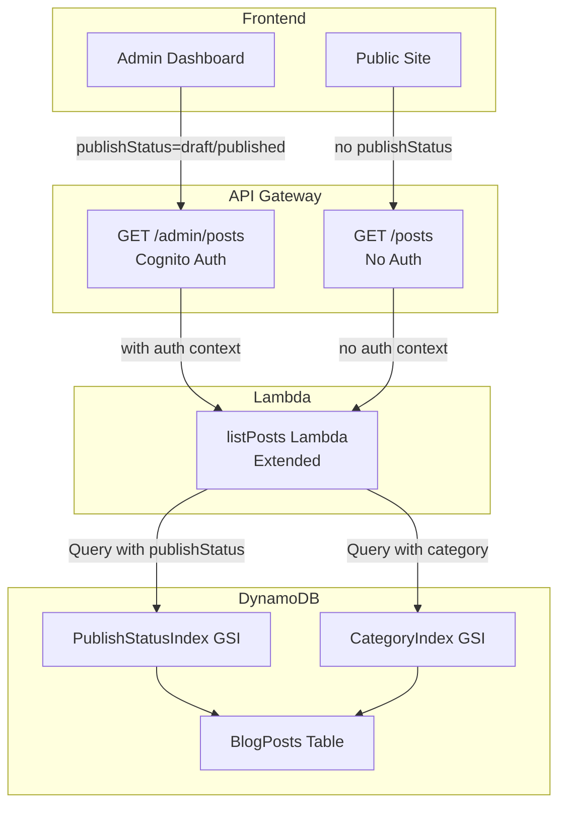
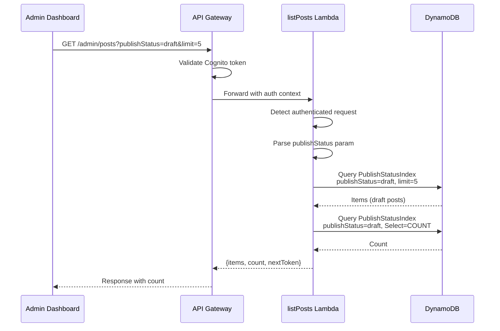
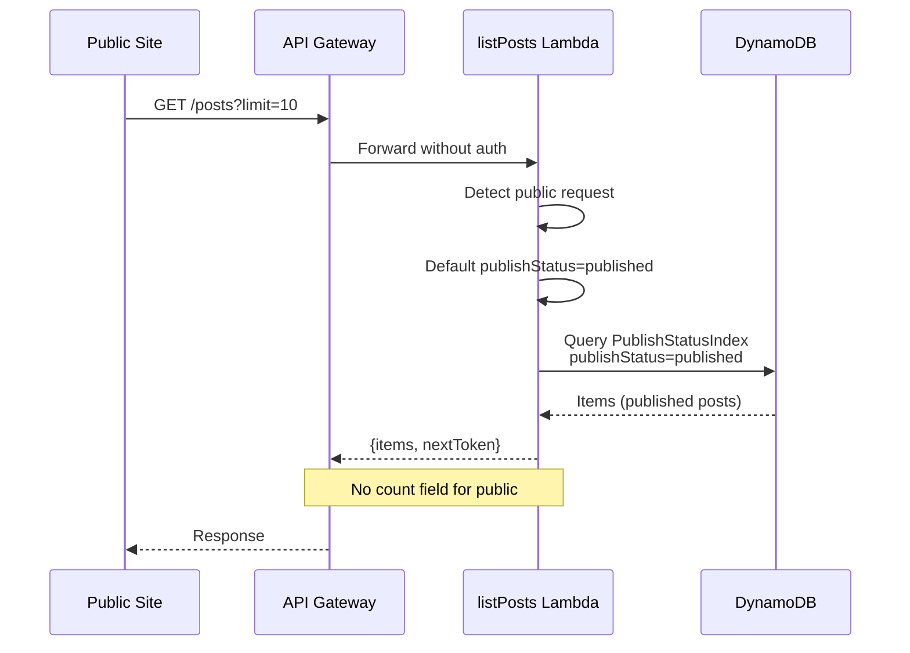

# Technical Design: fix-article-publish-flow

## Overview

**Purpose**: This feature fixes critical bugs in the article publishing workflow where the admin dashboard cannot filter articles by publish status and article counts are not displayed correctly.

**Users**: Blog administrators will use the corrected dashboard to monitor their published and draft content accurately.

**Impact**: Modifies the `listPosts` Lambda function to accept `publishStatus` query parameter and return article counts, while maintaining backward compatibility with the public endpoint.

### Goals
- Enable filtering articles by publish status (`published` or `draft`) in admin endpoint
- Return accurate article counts for admin dashboard statistics
- Maintain backward compatibility with public endpoint (`/posts`)
- Ensure public site displays only published articles

### Non-Goals
- Creating a separate admin list Lambda (using extension approach instead)
- Modifying the createPost or updatePost Lambda functions (already working correctly)
- Changing the DynamoDB schema or GSI definitions (already correct)
- Implementing real-time count updates (refresh-based is sufficient)

## Architecture

### Existing Architecture Analysis

The current architecture uses a single `listPosts` Lambda function for both public (`/posts`) and admin (`/admin/posts`) endpoints. Key constraints:

- **PublishStatusIndex GSI**: Partition key = `publishStatus`, Sort key = `createdAt`
- **CategoryIndex GSI**: Partition key = `category`, Sort key = `createdAt`
- **Current behavior**: Always queries `publishStatus = "published"` regardless of parameters
- **API Gateway**: Routes both endpoints to same Lambda, admin requires Cognito authorization

### Architecture Pattern & Boundary Map



**Architecture Integration**:
- **Selected pattern**: Extend existing Lambda with parameter-based behavior
- **Domain boundaries**: Single Lambda handles both public and admin, differentiated by authentication context
- **Existing patterns preserved**: Query parameter parsing, DynamoDB GSI usage, response structure
- **New components rationale**: None - extending existing component only
- **Steering compliance**: Maintains serverless-first approach, Go Lambda implementation

### Technology Stack

| Layer | Choice / Version | Role in Feature | Notes |
|-------|------------------|-----------------|-------|
| Backend | Go 1.25.x Lambda | ListPosts handler modification | Existing stack |
| Data | DynamoDB | PublishStatusIndex GSI queries | No changes to schema |
| Infrastructure | AWS CDK | No infrastructure changes | Existing configuration |

## System Flows

### Admin Dashboard Article List Flow



### Public Site Article List Flow (Unchanged)



## Requirements Traceability

| Requirement | Summary | Components | Interfaces | Flows |
|-------------|---------|------------|------------|-------|
| 1.1-1.6 | Article status storage | N/A (already working) | N/A | N/A |
| 2.1 | Query published count | listPosts Lambda | ListPostsResponseBody.Count | Admin Dashboard Flow |
| 2.2 | Query draft count | listPosts Lambda | ListPostsResponseBody.Count | Admin Dashboard Flow |
| 2.3-2.6 | Dashboard reflects counts | listPosts Lambda | ListPostsResponseBody.Count | Admin Dashboard Flow |
| 3.1-3.4 | Public site shows published only | listPosts Lambda | Default publishStatus behavior | Public Site Flow |
| 3.5-3.6 | Single article returns 404 for draft | N/A (getPublicPost already working) | N/A | N/A |
| 4.1-4.6 | createPost API correctness | N/A (already working) | N/A | N/A |
| 5.1-5.5 | GSI data integrity | N/A (already working) | N/A | N/A |

## Components and Interfaces

| Component | Domain/Layer | Intent | Req Coverage | Key Dependencies | Contracts |
|-----------|--------------|--------|--------------|------------------|-----------|
| listPosts Lambda | Backend/Go | List articles with status filtering and count | 2.1-2.6, 3.1-3.4 | DynamoDB (P0) | API |

### Backend / Lambda

#### listPosts Lambda (Extended)

| Field | Detail |
|-------|--------|
| Intent | List articles with optional publishStatus filtering and count for admin |
| Requirements | 2.1, 2.2, 2.3, 2.4, 2.5, 2.6, 3.1, 3.2, 3.3, 3.4 |

**Responsibilities & Constraints**
- Parse `publishStatus` query parameter (valid values: `published`, `draft`)
- Default to `published` when parameter not provided (backward compatibility)
- Return `count` field only for authenticated (admin) requests
- Execute separate COUNT query for accurate totals
- Maintain existing pagination behavior

**Dependencies**
- Inbound: API Gateway — routes requests (P0)
- Outbound: DynamoDB — query operations (P0)
- External: None

**Contracts**: API [x]

##### API Contract

| Method | Endpoint | Request | Response | Errors |
|--------|----------|---------|----------|--------|
| GET | /posts | `?limit&category&nextToken` | `{items, nextToken}` | 500 |
| GET | /admin/posts | `?limit&category&nextToken&publishStatus` | `{items, count, nextToken}` | 400, 500 |

**Request Parameters (Admin)**:
```
publishStatus: "published" | "draft" (optional, default: "published")
limit: number (1-100, default: 10)
category: string (optional)
nextToken: string (optional, base64-encoded)
```

**Response Body (Admin)**:
```go
type ListPostsResponseBody struct {
    Items     []ListPostsResponseItem `json:"items"`
    Count     *int64                  `json:"count,omitempty"`     // NEW: only for admin
    NextToken *string                 `json:"nextToken,omitempty"`
}
```

**Response Body (Public)** - unchanged:
```go
type ListPostsResponseBody struct {
    Items     []ListPostsResponseItem `json:"items"`
    NextToken *string                 `json:"nextToken,omitempty"`
}
```

**Error Responses**:
- `400 Bad Request`: Invalid publishStatus value (admin only)
- `500 Internal Server Error`: DynamoDB query failure

**Implementation Notes**
- Integration: Extend `buildQueryInput()` to accept publishStatus parameter
- Validation: Only accept `published` or `draft` values for publishStatus
- Risks: Additional DynamoDB read for count query (mitigated by admin-only)

### Authentication Detection Mechanism

To determine whether a request is from an authenticated admin or a public user, use the existing project pattern that checks `request.RequestContext.Authorizer`:

```go
// isAuthenticated checks if the request has valid Cognito authorization
func isAuthenticated(request events.APIGatewayProxyRequest) bool {
    if request.RequestContext.Authorizer == nil {
        return false
    }
    claims, ok := request.RequestContext.Authorizer["claims"]
    return ok && claims != nil
}
```

**Behavior by Endpoint**:
- **Public endpoint** (`GET /posts`): `Authorizer` is `nil` → Do not return `count` field
- **Admin endpoint** (`GET /admin/posts`): `Authorizer` contains claims → Return `count` field

**Infrastructure Note**: Both `/posts` and `/admin/posts` routes already exist in `api-integrations-stack.ts` (lines 94-102 and 240-247) and route to the same `listPostsFunction`. No infrastructure changes required.

### Query Strategy Notes

**PublishStatus Filtering (Primary Use Case)**:
- Uses `PublishStatusIndex` GSI efficiently
- Query complexity: O(n) where n = items with matching publishStatus
- Supports pagination with consistent performance

**Category + PublishStatus Combination**:
- Uses `CategoryIndex` GSI with `FilterExpression` for publishStatus
- Less efficient: scans all items in category, then filters by publishStatus
- Acceptable for MVP as this combination is not a core requirement for admin dashboard
- Primary use case for category filtering is public site (published articles only)
- Future optimization: Add composite GSI (`category#publishStatus`) if performance becomes an issue

**Design Decision**: The requirements (2.1-2.6) focus on dashboard statistics by publishStatus only. Category filtering with publishStatus is not explicitly required. Current implementation is sufficient for MVP scope.

## Data Models

### Domain Model

No changes to domain model. BlogPost entity remains unchanged.

### Logical Data Model

No changes to logical data model. PublishStatusIndex GSI is already correctly defined:
- Partition Key: `publishStatus` (String)
- Sort Key: `createdAt` (String)
- Projection: ALL

### Data Contracts & Integration

**API Response Schema Change (Admin Only)**:

| Field | Type | Required | Description |
|-------|------|----------|-------------|
| items | []ListPostsResponseItem | Yes | Array of article items |
| count | int64 | No | Total count (admin only) |
| nextToken | string | No | Pagination token |

## Error Handling

### Error Strategy

| Error Type | HTTP Code | Message | Recovery |
|------------|-----------|---------|----------|
| Invalid publishStatus | 400 | "invalid publishStatus value" | Admin provides valid value |
| DynamoDB Query failure | 500 | "failed to retrieve posts" | Retry request |
| DynamoDB Count failure | 500 | "failed to retrieve posts" | Retry request |

### Error Categories and Responses

**User Errors (4xx)**:
- `400 Bad Request`: When publishStatus is not `published` or `draft`

**System Errors (5xx)**:
- `500 Internal Server Error`: DynamoDB connectivity or query execution failure

### Monitoring

- Existing CloudWatch logs capture Lambda execution
- Existing X-Ray tracing tracks DynamoDB calls
- No additional monitoring required

## Testing Strategy

### Unit Tests
1. **parsePublishStatus**: Valid values (`published`, `draft`), invalid values, empty string
2. **buildQueryInput with publishStatus**: Correct GSI selection and key condition
3. **isAuthenticated**: Detect auth context from request
4. **executeCountQuery**: DynamoDB count query execution
5. **Response body with count**: Count included for admin, omitted for public

### Integration Tests
1. **Admin endpoint with publishStatus=published**: Returns published articles with count
2. **Admin endpoint with publishStatus=draft**: Returns draft articles with count
3. **Public endpoint without publishStatus**: Returns published articles without count
4. **Pagination with publishStatus filter**: Correct nextToken handling
5. **Category + publishStatus combination**: Correct filtering

### E2E Tests
1. **Admin dashboard displays counts**: Published and draft counts shown correctly
2. **Admin dashboard filters articles**: Switching tabs shows correct articles
3. **Public site shows published only**: Draft articles not visible

## Security Considerations

- **Authorization**: Admin endpoints require Cognito authentication (existing)
- **Parameter validation**: Reject invalid publishStatus values with 400 error
- **No new security concerns**: Extension of existing secured endpoint
