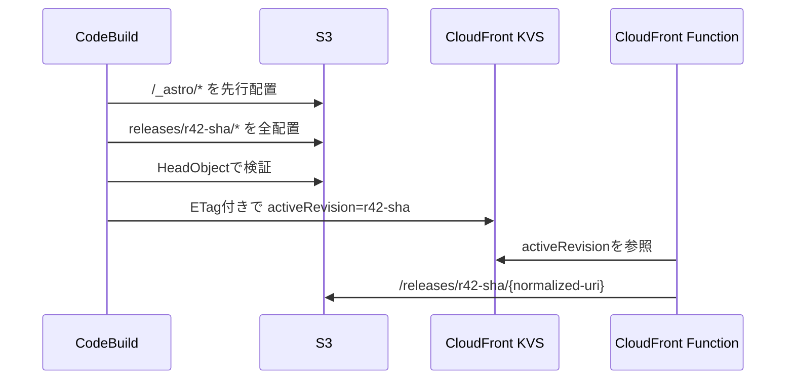

# 技術設計: KVS atomic deployment

## 概要

公開サイトをリリース別S3プレフィックスへ完全に配置し、CloudFront KeyValueStoreの `activeRevision` 一値だけを更新して切り替える。CloudFront Functionはviewer-requestで公開URIを内部リリースURIへ変換する。

## 主な判断

- リリースプレフィックス自体をstagingとfinalの両方として扱う。参照されるのはKVS更新後だけなので、追加コピーは不要。
- `/_astro` はファイル名が内容ハッシュを含むというAstroの契約を利用し、旧・新リリースで共有する。KVSのエッジ伝播中にも双方のHTMLが参照可能となる。
- KVS未設定時は既存ルートを配信する。Terraform適用直後に空のKVSがFunctionへ関連付いても既存サイトを停止させない。
- revisionは `r{CodeBuild build number}-{source SHA}` とする。通常デプロイでは数値部分を比較し、完了順が逆転した古いビルドによる巻き戻しを拒否する。
- 更新はKVSのETagを `IfMatch` に渡す。競合時はKVS値とETagを再取得し、最大3回再試行する。
- キャッシュinvalidationは行わない。viewer-requestで変更された内部URIがリリース別になるため、旧オブジェクトと新オブジェクトは別キーとして扱われる。

## 障害時の挙動

| 障害 | 結果 |
|---|---|
| S3アップロード失敗 | KVSを更新せず旧リリースを維持 |
| HeadObject検証失敗 | KVSを更新せず失敗 |
| KVS ETag競合 | 最新値を再取得して再判定・再試行 |
| 古いビルドが遅れて完了 | `STALE_RELEASE` として自動昇格を拒否 |
| FunctionからKVSを読めない | 移行前S3ルートへフォールバック |

## リスクと制約

1. KVS更新は全エッジで同時ではない。旧・新リリースと共有アセットを併存させることで影響を吸収する。
2. 30日を超えたリリースはS3 lifecycleで失効するため、そのrevisionへのポインタ復帰はできない。
3. `/_astro` の自動削除を行わないため容量は増加する。参照関係を追跡できる安全なGCは別課題とする。
4. 初回移行時に既存 `/_astro` と同名・同サイズのファイルがある場合は再利用する。内容ハッシュ命名が守られない構成へ変更する場合はチェックサム検証が必要。
