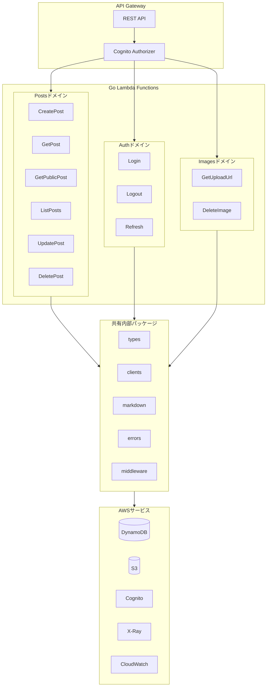
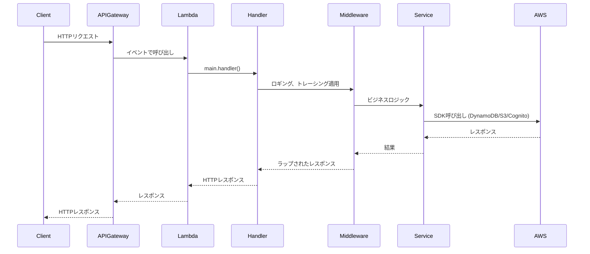
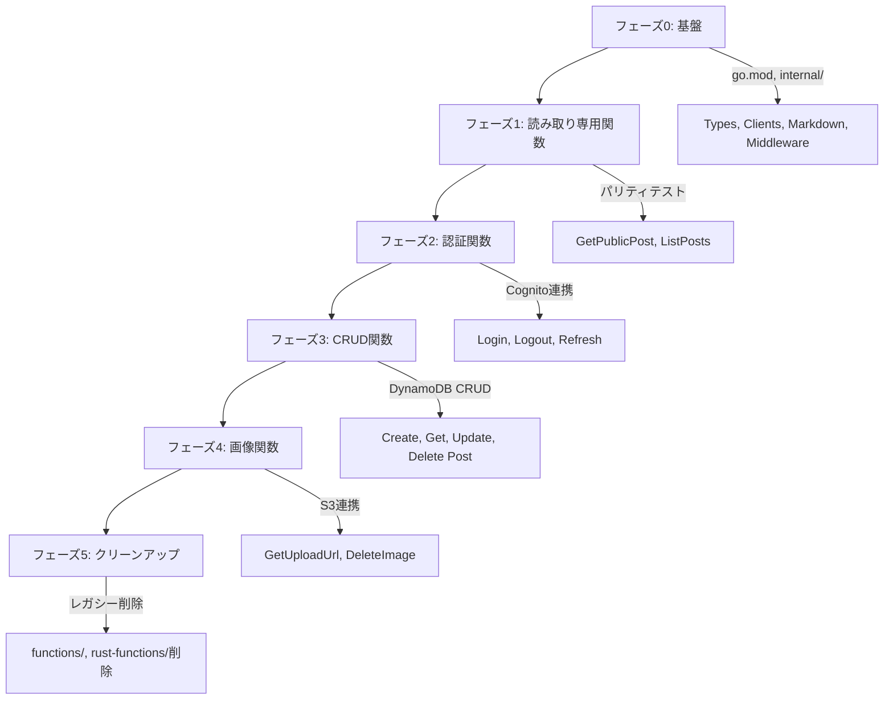

# 技術設計ドキュメント

## 概要

**目的**: 本機能は、現在のデュアル言語実装（Node.jsおよびRust）からすべてのLambda関数を統一されたGolangコードベースへ移行し、保守オーバーヘッドの削減とパフォーマンスの向上を実現する。

**ユーザー**: プラットフォーム開発者は単一言語コードベースを保守する。DevOpsエンジニアは簡素化されたCI/CDパイプラインを運用する。エンドユーザーはコールドスタートレイテンシの改善による恩恵を受ける。

**影響範囲**: 22個のLambda関数（Node.js 11個 + Rust 11個）を11個のGo関数に置き換える。ビルドパイプラインを統合し、デュアル言語テスト要件を排除する。

### ゴール

- すべてのLambda関数を単一のGoコードベースに統一
- ARM64と最適化ビルドによりコールドスタート時間 < 50ms (P95)を達成
- 既存実装との100% APIパリティを維持
- CI/CDパイプライン実行時間を < 5分に短縮
- デュアル言語保守オーバーヘッドの排除

### 非ゴール

- フロントエンド変更（Reactアプリケーションは変更なし）
- DynamoDBスキーマ変更
- APIエンドポイントURL変更
- 現行機能を超える新機能追加
- OpenTelemetry移行（将来フェーズとして文書化）

## アーキテクチャ

### 既存アーキテクチャ分析

**現状**:
- `functions/`内のTypeScriptによるNode.js 24.x Lambda関数
- `rust-functions/`内のカスタムランタイムによるRust Lambda関数
- 両実装間で重複する共有型
- 両言語スタック用の並列CI/CDジョブ
- オブザーバビリティ用Lambda Powertools（TypeScript）

**保持するパターン**:
- ドメイン駆動構成（posts、auth、images）
- シングルトンAWSクライアントパターン
- CloudWatch Logs Insights用構造化ロギング
- X-Ray分散トレーシング
- API Gateway + Cognito Authorizer連携

**解消される技術的負債**:
- デュアル言語保守の排除
- ビルド時間削減（Rustコンパイル除去）
- パリティテスト簡素化（単一の信頼できるソース）

### アーキテクチャパターン＆境界マップ



**アーキテクチャ統合**:
- 選択パターン: ドメイン駆動構成を伴う標準Goプロジェクトレイアウト
- ドメイン境界: Posts、Auth、Imagesを別個のコマンドディレクトリとして
- 保持される既存パターン: シングルトンクライアント、構造化ロギング、X-Rayトレーシング
- 新コンポーネントの根拠: `internal/`パッケージが共有ロジックをカプセル化
- ステアリング準拠: サーバーレスファースト、ARM64、CDKデプロイメント

### 技術スタック

| レイヤー | 選択 / バージョン | 機能における役割 | 備考 |
|-------|------------------|-----------------|-------|
| ランタイム | Go 1.21+ | Lambda関数実装 | log/slogに必要 |
| Lambdaランタイム | provided.al2023 | Goバイナリ用カスタムランタイム | ARM64アーキテクチャ |
| AWS SDK | aws-sdk-go-v2 v1.30+ | DynamoDB、S3、Cognito連携 | スレッドセーフクライアント |
| Markdown | goldmark v1.7+ | MarkdownからHTML変換 | CommonMark準拠 |
| サニタイザー | bluemonday v1.0.26+ | XSS防止 | ブログコンテンツ用UGCPolicy |
| トレーシング | aws-xray-sdk-go | 分散トレーシング | 2026年2月メンテナンスモード |
| ロギング | log/slog (stdlib) | 構造化JSONロギング | CloudWatch互換 |
| ビルド | go build (直接) | ARM64クロスコンパイル | Dockerオーバーヘッドなし |
| CDK | Code.fromAsset() | 事前ビルド済みバイナリ参照 | GoFunction不使用 |
| リント | golangci-lint | 静的解析 | CIに統合 |
| テスト | go test | ユニット・統合テスト | レースディテクタ有効 |

### ビルド戦略

**方針**: CI/CDで`go build`を直接実行し、CDKは事前ビルド済みバイナリを参照する。

**理由**:
- Goのクロスコンパイルは標準機能で高速（数秒）
- CDK GoFunctionのDockerビルドは遅い（特にMac/Windows）
- 現在のRustビルド（cargo-lambda）と同じパターンで一貫性確保
- CI/CDキャッシュ（go mod cache）を最大限活用

**ビルドコマンド**:
```bash
CGO_ENABLED=0 GOOS=linux GOARCH=arm64 go build \
  -ldflags="-s -w" -tags=lambda.norpc \
  -o bin/{function}/bootstrap ./cmd/{domain}/{function}
```

**CDK構成**:
```typescript
new Function(this, 'CreatePost', {
  runtime: Runtime.PROVIDED_AL2023,
  architecture: Architecture.ARM_64,
  handler: 'bootstrap',
  code: Code.fromAsset('go-functions/bin/posts-create'),
});
```

## システムフロー

### Lambdaリクエスト処理フロー



**主要な決定事項**:
- ミドルウェアチェーンがビジネスロジック前にロギングとトレーシングを適用
- AWSクライアントは一度初期化（シングルトン）され、呼び出し間で再利用
- エラーレスポンスはミドルウェアを通じて標準化

### 移行ロールアウトフロー

```mermaid
flowchart LR
    subgraph Phase0[フェーズ0: 基盤]
        A[Goプロジェクト初期化]
        B[内部パッケージ作成]
    end

    subgraph Phase1[フェーズ1: 読み取り専用]
        C[GetPublicPost]
        D[ListPosts]
    end

    subgraph Phase2[フェーズ2: 認証]
        E[Login]
        F[Logout]
        G[Refresh]
    end

    subgraph Phase3[フェーズ3: CRUD]
        H[CreatePost]
        I[GetPost]
        J[UpdatePost]
        K[DeletePost]
    end

    subgraph Phase4[フェーズ4: 画像]
        L[GetUploadUrl]
        M[DeleteImage]
    end

    subgraph Phase5[フェーズ5: クリーンアップ]
        N[Node.js削除]
        O[Rust削除]
    end

    Phase0 --> Phase1
    Phase1 --> Phase2
    Phase2 --> Phase3
    Phase3 --> Phase4
    Phase4 --> Phase5
```



## 要件トレーサビリティ

| 要件 | 概要 | コンポーネント | インターフェース | フロー |
|-------------|---------|------------|------------|-------|
| 1.1-1.6 | Goプロジェクト基盤 | go-functions/, Makefile | go.mod, .golangci.yml | ビルドフロー |
| 2.1-2.8 | 共通ライブラリ | internal/*パッケージ | types, clients, middleware | リクエスト処理 |
| 3.1-3.6 | Postsドメイン関数 | cmd/posts/* | PostsService | CRUDフロー |
| 4.1-4.3 | Authドメイン関数 | cmd/auth/* | AuthService | 認証フロー |
| 5.1-5.2 | Imagesドメイン関数 | cmd/images/* | ImagesService | アップロード/削除フロー |
| 6.1-6.6 | CI/CD統合 | .github/workflows | ci.yml, deploy.yml | CI/CDパイプライン |
| 7.1-7.5 | APIパリティテスト | tests/parity | ParityTestSuite | テストフロー |
| 8.1-8.5 | オブザーバビリティ | internal/middleware | Logger, Tracer, Metrics | リクエスト処理 |
| 9.1-9.5 | CDKインフラストラクチャ | infrastructure/lib | go-lambda-stack.ts | デプロイフロー |
| 10.1-10.5 | クリーンアップ/廃止 | - | - | 移行ロールアウト |
| 11.1-11.4 | パフォーマンス目標 | 全関数 | ベンチマーク | - |
| 12.1-12.5 | セキュリティ | internal/* | バリデーション、サニタイゼーション | リクエスト処理 |

## コンポーネントとインターフェース

### コンポーネント概要

| コンポーネント | ドメイン/レイヤー | 目的 | 要件カバレッジ | 主要依存関係 | コントラクト |
|-----------|--------------|--------|--------------|------------------|-----------|
| types | internal/types | ドメイン型定義 | 2.1 | - | - |
| errors | internal/errors | カスタムエラー型 | 2.2 | - | - |
| clients | internal/clients | AWS SDKシングルトンクライアント | 2.3, 2.5 | aws-sdk-go-v2 (P0) | Service |
| markdown | internal/markdown | XSS保護付きMDからHTML変換 | 2.4 | goldmark, bluemonday (P0) | Service |
| middleware | internal/middleware | ロギング、トレーシング、メトリクス | 2.6, 2.7, 2.8, 8.1-8.5 | aws-xray-sdk-go, log/slog (P0) | - |
| CreatePost | cmd/posts/create | ブログ投稿作成 | 3.1 | clients, markdown, types (P0) | API |
| GetPost | cmd/posts/get | 投稿取得（認証済み） | 3.2 | clients, types (P0) | API |
| GetPublicPost | cmd/posts/get_public | 公開投稿取得 | 3.3 | clients, types (P0) | API |
| ListPosts | cmd/posts/list | ページネーション付き投稿一覧 | 3.4 | clients, types (P0) | API |
| UpdatePost | cmd/posts/update | 投稿更新 | 3.5 | clients, markdown, types (P0) | API |
| DeletePost | cmd/posts/delete | 投稿と画像削除 | 3.6 | clients, types (P0) | API |
| Login | cmd/auth/login | ユーザー認証 | 4.1 | clients, types (P0) | API |
| Logout | cmd/auth/logout | ユーザーサインアウト | 4.2 | clients, types (P0) | API |
| Refresh | cmd/auth/refresh | トークン更新 | 4.3 | clients, types (P0) | API |
| GetUploadUrl | cmd/images/get_upload_url | 署名付きURL生成 | 5.1 | clients, types (P0) | API |
| DeleteImage | cmd/images/delete | S3から画像削除 | 5.2 | clients, types (P0) | API |

---

### 内部レイヤー

#### types

| フィールド | 詳細 |
|-------|--------|
| 目的 | 既存TypeScript/Rust型に対応するドメイン型定義 |
| 要件 | 2.1 |

**責務と制約**
- camelCase API形式に対応するJSONタグ付きGo構造体を定義
- バリデーションヘルパーメソッドを提供
- 既存実装との型パリティを確保

**コントラクト**: 状態 [x]

##### 状態管理

```go
// BlogPost はブログ投稿エンティティを表す
type BlogPost struct {
    ID              string   `json:"id"`
    Title           string   `json:"title"`
    ContentMarkdown string   `json:"contentMarkdown"`
    ContentHTML     string   `json:"contentHtml"`
    Category        string   `json:"category"`
    Tags            []string `json:"tags"`
    PublishStatus   string   `json:"publishStatus"` // "draft" | "published"
    AuthorID        string   `json:"authorId"`
    CreatedAt       string   `json:"createdAt"`
    UpdatedAt       string   `json:"updatedAt"`
    PublishedAt     *string  `json:"publishedAt,omitempty"`
    ImageURLs       []string `json:"imageUrls"`
}

// CreatePostRequest は投稿作成のリクエストボディを表す
type CreatePostRequest struct {
    Title           string   `json:"title"`
    ContentMarkdown string   `json:"contentMarkdown"`
    Category        string   `json:"category"`
    Tags            []string `json:"tags,omitempty"`
    PublishStatus   *string  `json:"publishStatus,omitempty"`
    ImageURLs       []string `json:"imageUrls,omitempty"`
}

// UpdatePostRequest は投稿更新のリクエストボディを表す
type UpdatePostRequest struct {
    Title           *string  `json:"title,omitempty"`
    ContentMarkdown *string  `json:"contentMarkdown,omitempty"`
    Category        *string  `json:"category,omitempty"`
    Tags            []string `json:"tags,omitempty"`
    PublishStatus   *string  `json:"publishStatus,omitempty"`
    ImageURLs       []string `json:"imageUrls,omitempty"`
}

// ListPostsResponse はページネーション付き一覧レスポンスを表す
type ListPostsResponse struct {
    Items     []BlogPost `json:"items"`
    NextToken *string    `json:"nextToken,omitempty"`
}

// TokenResponse は認証トークンを表す
type TokenResponse struct {
    AccessToken  string  `json:"accessToken"`
    IDToken      string  `json:"idToken"`
    RefreshToken *string `json:"refreshToken,omitempty"`
    ExpiresIn    int     `json:"expiresIn"`
}

// ErrorResponse はAPIエラーレスポンスを表す
type ErrorResponse struct {
    Message string `json:"message"`
}
```

---

#### errors

| フィールド | 詳細 |
|-------|--------|
| 目的 | 一貫したエラーハンドリングのためのカスタムエラー型 |
| 要件 | 2.2 |

**責務と制約**
- エラー型定義: ValidationError、NotFoundError、AuthorizationError
- すべてのカスタム型にerrorインターフェースを実装
- HTTPステータスコードマッピングを提供

**コントラクト**: Service [x]

##### Serviceインターフェース

```go
// ValidationError は入力バリデーション失敗を表す
type ValidationError struct {
    Field   string
    Message string
}

func (e *ValidationError) Error() string

// NotFoundError はリソースが見つからないことを表す
type NotFoundError struct {
    Resource string
    ID       string
}

func (e *NotFoundError) Error() string

// AuthorizationError はアクセス拒否を表す
type AuthorizationError struct {
    Message string
}

func (e *AuthorizationError) Error() string

// HTTPStatusCode はエラー型に対応するHTTPステータスを返す
func HTTPStatusCode(err error) int
```

---

#### clients

| フィールド | 詳細 |
|-------|--------|
| 目的 | シングルトンAWS SDK v2クライアント初期化 |
| 要件 | 2.3, 2.5 |

**責務と制約**
- sync.Onceを使用してDynamoDB、S3、Cognitoクライアントを一度だけ初期化
- 環境から設定を読み込み（リージョン、エンドポイントオーバーライド）
- スレッドセーフなシングルトンアクセス

**依存関係**
- 外部: aws-sdk-go-v2/config — AWS設定 (P0)
- 外部: aws-sdk-go-v2/service/dynamodb — DynamoDBクライアント (P0)
- 外部: aws-sdk-go-v2/service/s3 — S3クライアント (P0)
- 外部: aws-sdk-go-v2/service/cognitoidentityprovider — Cognitoクライアント (P0)

**コントラクト**: Service [x]

##### Serviceインターフェース

```go
// GetDynamoDBClient はシングルトンDynamoDBクライアントを返す
func GetDynamoDBClient() *dynamodb.Client

// GetS3Client はシングルトンS3クライアントを返す
func GetS3Client() *s3.Client

// GetCognitoClient はシングルトンCognitoクライアントを返す
func GetCognitoClient() *cognitoidentityprovider.Client

// GetPresignClient はURL生成用S3 Presignクライアントを返す
func GetPresignClient() *s3.PresignClient
```

**実装ノート**
- スレッドセーフな遅延初期化に`sync.Once`を使用
- LocalStackテスト用にDYNAMODB_ENDPOINT、S3_ENDPOINT、COGNITO_ENDPOINTをサポート
- AWS_REGION環境変数からリージョンを読み込み

---

#### markdown

| フィールド | 詳細 |
|-------|--------|
| 目的 | XSSサニタイゼーション付きMarkdownからHTML変換 |
| 要件 | 2.4 |

**責務と制約**
- goldmarkを使用してMarkdownをHTMLに変換
- bluemonday UGCPolicyを使用してHTML出力をサニタイズ
- 一般的なMarkdown拡張（テーブル、打ち消し線）をサポート

**依存関係**
- 外部: github.com/yuin/goldmark — Markdownパーサー (P0)
- 外部: github.com/microcosm-cc/bluemonday — HTMLサニタイザー (P0)

**コントラクト**: Service [x]

##### Serviceインターフェース

```go
// ConvertToHTML はMarkdownをサニタイズ済みHTMLに変換する
// 空入力に対しては空文字列を返す
func ConvertToHTML(markdown string) (string, error)
```

**実装ノート**
- 順序: goldmark.Convert() → bluemonday.UGCPolicy().Sanitize()
- goldmark拡張を有効化: GFM（テーブル、打ち消し線、自動リンク）
- bluemonday.UGCPolicy()はブログコンテンツに安全なHTML要素を許可

---

#### middleware

| フィールド | 詳細 |
|-------|--------|
| 目的 | 横断的関心事: ロギング、トレーシング、メトリクス |
| 要件 | 2.6, 2.7, 2.8, 8.1-8.5 |

**責務と制約**
- CloudWatch Logs Insights用構造化JSONロギング
- AWS SDK呼び出し用X-Rayサブセグメント作成
- CloudWatch EMFメトリクス出力

**依存関係**
- 外部: log/slog (stdlib) — 構造化ロギング (P0)
- 外部: github.com/aws/aws-xray-sdk-go — X-Rayトレーシング (P0)

**コントラクト**: Service [x]

##### Serviceインターフェース

```go
// Logger はリクエストコンテキスト付き構造化ロギングを提供
type Logger interface {
    Info(msg string, args ...any)
    Error(msg string, args ...any)
    With(args ...any) Logger
}

// NewLogger はLambdaリクエストコンテキスト付きロガーを作成
func NewLogger(requestID, traceID string) Logger

// WrapHandler はLambdaハンドラーをミドルウェアでラップ
func WrapHandler(handler interface{}) interface{}

// EmitMetric はCloudWatch EMFメトリクスを出力
func EmitMetric(name string, value float64, unit string)
```

**実装ノート**
- 構造化出力用にlog/slogとJSONハンドラーを使用
- すべてのログエントリにrequestId、traceIdを含める
- X-Ray SDKは2027年2月までにADOTに置き換え

---

### Postsドメイン

#### CreatePost Lambda

| フィールド | 詳細 |
|-------|--------|
| 目的 | Markdown変換付き新規ブログ投稿作成 |
| 要件 | 3.1 |

**責務と制約**
- 必須フィールド（title、contentMarkdown）のバリデーション
- 投稿ID用UUIDを生成
- contentMarkdownをcontentHtmlに変換
- DynamoDBに投稿を保存

**依存関係**
- インバウンド: API Gateway — HTTPリクエスト (P0)
- アウトバウンド: clients.GetDynamoDBClient() — DynamoDBストレージ (P0)
- アウトバウンド: markdown.ConvertToHTML() — Markdown変換 (P0)

**コントラクト**: API [x]

##### APIコントラクト

| メソッド | エンドポイント | リクエスト | レスポンス | エラー |
|--------|----------|---------|----------|--------|
| POST | /posts | CreatePostRequest | BlogPost | 400 (バリデーション), 401 (認証), 500 (サーバー) |

---

#### GetPost Lambda

| フィールド | 詳細 |
|-------|--------|
| 目的 | ID指定での投稿取得（認証済みユーザー） |
| 要件 | 3.2 |

**依存関係**
- インバウンド: API Gateway — パスパラメータ付きHTTPリクエスト (P0)
- アウトバウンド: clients.GetDynamoDBClient() — DynamoDBクエリ (P0)

**コントラクト**: API [x]

##### APIコントラクト

| メソッド | エンドポイント | リクエスト | レスポンス | エラー |
|--------|----------|---------|----------|--------|
| GET | /posts/:id | - | BlogPost | 401 (認証), 404 (見つからない), 500 (サーバー) |

---

#### GetPublicPost Lambda

| フィールド | 詳細 |
|-------|--------|
| 目的 | ID指定での公開投稿取得（パブリックアクセス） |
| 要件 | 3.3 |

**依存関係**
- インバウンド: API Gateway — パスパラメータ付きHTTPリクエスト (P0)
- アウトバウンド: clients.GetDynamoDBClient() — DynamoDBクエリ (P0)

**コントラクト**: API [x]

##### APIコントラクト

| メソッド | エンドポイント | リクエスト | レスポンス | エラー |
|--------|----------|---------|----------|--------|
| GET | /posts/:id | - | BlogPost | 404 (見つからないまたは未公開), 500 (サーバー) |

---

#### ListPosts Lambda

| フィールド | 詳細 |
|-------|--------|
| 目的 | ページネーションとフィルタリング付き投稿一覧 |
| 要件 | 3.4 |

**依存関係**
- インバウンド: API Gateway — クエリパラメータ付きHTTPリクエスト (P0)
- アウトバウンド: clients.GetDynamoDBClient() — GSI使用DynamoDBクエリ (P0)

**コントラクト**: API [x]

##### APIコントラクト

| メソッド | エンドポイント | リクエスト | レスポンス | エラー |
|--------|----------|---------|----------|--------|
| GET | /posts | クエリ: limit, nextToken, category | ListPostsResponse | 400 (無効なlimit), 500 (サーバー) |

---

#### UpdatePost Lambda

| フィールド | 詳細 |
|-------|--------|
| 目的 | 既存投稿フィールドの更新 |
| 要件 | 3.5 |

**依存関係**
- インバウンド: API Gateway — パスパラメータとボディ付きHTTPリクエスト (P0)
- アウトバウンド: clients.GetDynamoDBClient() — DynamoDB更新 (P0)
- アウトバウンド: markdown.ConvertToHTML() — contentMarkdown更新時のMarkdown変換 (P1)

**コントラクト**: API [x]

##### APIコントラクト

| メソッド | エンドポイント | リクエスト | レスポンス | エラー |
|--------|----------|---------|----------|--------|
| PUT | /posts/:id | UpdatePostRequest | BlogPost | 400 (バリデーション), 401 (認証), 404 (見つからない), 500 (サーバー) |

---

#### DeletePost Lambda

| フィールド | 詳細 |
|-------|--------|
| 目的 | 投稿と関連画像の削除 |
| 要件 | 3.6 |

**依存関係**
- インバウンド: API Gateway — パスパラメータ付きHTTPリクエスト (P0)
- アウトバウンド: clients.GetDynamoDBClient() — DynamoDB削除 (P0)
- アウトバウンド: clients.GetS3Client() — 画像のS3バッチ削除 (P1)

**コントラクト**: API [x]

##### APIコントラクト

| メソッド | エンドポイント | リクエスト | レスポンス | エラー |
|--------|----------|---------|----------|--------|
| DELETE | /posts/:id | - | 204 No Content | 401 (認証), 404 (見つからない), 500 (サーバー) |

---

### Authドメイン

#### Login Lambda

| フィールド | 詳細 |
|-------|--------|
| 目的 | Cognitoによるユーザー認証 |
| 要件 | 4.1 |

**依存関係**
- インバウンド: API Gateway — 認証情報付きHTTPリクエスト (P0)
- アウトバウンド: clients.GetCognitoClient() — Cognito InitiateAuth (P0)

**コントラクト**: API [x]

##### APIコントラクト

| メソッド | エンドポイント | リクエスト | レスポンス | エラー |
|--------|----------|---------|----------|--------|
| POST | /auth/login | LoginRequest | TokenResponse | 400 (フィールド不足), 401 (無効な認証情報), 500 (サーバー) |

---

#### Logout Lambda

| フィールド | 詳細 |
|-------|--------|
| 目的 | 全セッションからのユーザーサインアウト |
| 要件 | 4.2 |

**依存関係**
- インバウンド: API Gateway — アクセストークン付きHTTPリクエスト (P0)
- アウトバウンド: clients.GetCognitoClient() — Cognito GlobalSignOut (P0)

**コントラクト**: API [x]

##### APIコントラクト

| メソッド | エンドポイント | リクエスト | レスポンス | エラー |
|--------|----------|---------|----------|--------|
| POST | /auth/logout | LogoutRequest | 200 OK | 401 (無効なトークン), 500 (サーバー) |

---

#### Refresh Lambda

| フィールド | 詳細 |
|-------|--------|
| 目的 | アクセストークンとIDトークンの更新 |
| 要件 | 4.3 |

**依存関係**
- インバウンド: API Gateway — リフレッシュトークン付きHTTPリクエスト (P0)
- アウトバウンド: clients.GetCognitoClient() — REFRESH_TOKEN_AUTH付きCognito InitiateAuth (P0)

**コントラクト**: API [x]

##### APIコントラクト

| メソッド | エンドポイント | リクエスト | レスポンス | エラー |
|--------|----------|---------|----------|--------|
| POST | /auth/refresh | RefreshRequest | TokenResponse | 401 (無効なトークン), 500 (サーバー) |

---

### Imagesドメイン

#### GetUploadUrl Lambda

| フィールド | 詳細 |
|-------|--------|
| 目的 | 署名付きS3アップロードURL生成 |
| 要件 | 5.1 |

**依存関係**
- インバウンド: API Gateway — ファイルメタデータ付きHTTPリクエスト (P0)
- アウトバウンド: clients.GetPresignClient() — S3署名付きURL生成 (P0)

**コントラクト**: API [x]

##### APIコントラクト

| メソッド | エンドポイント | リクエスト | レスポンス | エラー |
|--------|----------|---------|----------|--------|
| POST | /images/upload-url | GetUploadUrlRequest | GetUploadUrlResponse | 400 (無効なファイルタイプ), 401 (認証), 500 (サーバー) |

---

#### DeleteImage Lambda

| フィールド | 詳細 |
|-------|--------|
| 目的 | 所有者確認付きS3画像削除 |
| 要件 | 5.2 |

**依存関係**
- インバウンド: API Gateway — 画像キー付きHTTPリクエスト (P0)
- アウトバウンド: clients.GetS3Client() — S3 DeleteObject (P0)

**コントラクト**: API [x]

##### APIコントラクト

| メソッド | エンドポイント | リクエスト | レスポンス | エラー |
|--------|----------|---------|----------|--------|
| DELETE | /images/{key+} | - | 204 No Content | 400 (パストラバーサル), 401 (認証), 403 (所有者でない), 500 (サーバー) |

---

## データモデル

### ドメインモデル

ドメインモデルは既存のNode.js/Rust実装から変更なし:

- **BlogPost** (集約ルート): コンテンツ、メタデータ、公開状態を持つブログ記事を表す
- **PublishStatus** (値オブジェクト): "draft" | "published"の列挙型
- **Author** (エンティティ参照): authorIdで参照、Cognitoで管理

**不変条件**:
- 投稿IDは作成後に変更不可
- publishedAtはpublishStatusが"published"に遷移したときのみ設定
- contentHtmlはcontentMarkdownから派生（独立して保存しない）

### 物理データモデル

**DynamoDBテーブル: BlogPosts** (変更なし)

| 属性 | 型 | 説明 |
|-----------|------|-------------|
| id (PK) | String | UUID |
| title | String | 投稿タイトル |
| contentMarkdown | String | Markdownソース |
| contentHtml | String | レンダリング済みHTML |
| category | String | カテゴリ名 |
| tags | List<String> | タグ配列 |
| publishStatus | String | "draft"または"published" |
| authorId | String | Cognitoユーザーsub |
| createdAt | String | ISO8601タイムスタンプ |
| updatedAt | String | ISO8601タイムスタンプ |
| publishedAt | String? | ISO8601タイムスタンプ（オプション） |
| imageUrls | List<String> | S3画像URL |

**GSI: CategoryIndex**
- PK: category, SK: createdAt
- Projection: ALL

**GSI: PublishStatusIndex**
- PK: publishStatus, SK: createdAt
- Projection: ALL

## エラーハンドリング

### エラー戦略

すべてのLambda関数は一貫したエラーハンドリングに従う:

1. **入力バリデーション**: 処理前にリクエストボディ/パラメータをバリデーション
2. **エラー分類**: エラーを適切なHTTPステータスコードにマッピング
3. **構造化レスポンス**: messageフィールドを持つErrorResponseを返す
4. **ロギング**: スタックトレースとリクエストコンテキスト付きですべてのエラーをログ

### エラーカテゴリとレスポンス

**ユーザーエラー (4xx)**:
- 400 Bad Request: バリデーション失敗、無効な入力形式
- 401 Unauthorized: 認証がないまたは無効
- 403 Forbidden: アクセス拒否（例: 画像所有者でない）
- 404 Not Found: リソースが存在しない

**システムエラー (5xx)**:
- 500 Internal Server Error: AWS SDK失敗、予期しないエラー

### モニタリング

- すべてのエラーをslogでERRORレベルでログ
- X-Rayがトレースセグメントにエラーメタデータをキャプチャ
- 5xx率上昇時のCloudWatchアラーム

## テスト戦略

### ユニットテスト

- **internal/types**: 型バリデーション、JSONマーシャリング/アンマーシャリング
- **internal/errors**: errorインターフェース実装、HTTPステータスマッピング
- **internal/markdown**: 変換正確性、XSS防止
- **internal/clients**: モックAWS SDKクライアント
- **cmd/*/**: モック依存関係付きハンドラーロジック

### 統合テスト

- LocalStackによるDynamoDB CRUD操作
- S3署名付きURL生成と削除
- Cognito認証フロー

### パリティテスト

- **リクエスト/レスポンス比較**: GoとNode.js実装に同じリクエストを実行
- **ステータスコード検証**: 同一のHTTPステータスコードを確認
- **ボディ構造バリデーション**: JSON構造とフィールド名が一致
- **エラー形式バリデーション**: エラーメッセージ形式の一貫性

### パフォーマンステスト

- コールドスタート計測（目標: <50ms P95）
- バイナリサイズ検証（目標: <20MB）
- メモリ使用量プロファイリング

## セキュリティ考慮事項

- **入力バリデーション**: すべてのリクエストボディを処理前にバリデーション
- **XSS防止**: bluemondayがMarkdown派生HTMLをすべてサニタイズ
- **パストラバーサル**: 画像キーをバリデーションしディレクトリエスケープを防止
- **機密データ**: パスワードとトークンはログに出力しない
- **最小権限**: Lambda IAMロールを必要なリソースにスコープ

## パフォーマンス＆スケーラビリティ

### 目標

| メトリクス | 目標 | 計測方法 |
|--------|--------|-------------|
| コールドスタート | <50ms P95 | X-Rayデュレーション |
| バイナリサイズ | <20MB | ビルド出力 |
| メモリ（読み取り操作） | <128MB | CloudWatchメトリクス |
| CIパイプライン | <5分 | GitHub Actionsデュレーション |

### 最適化技法

- コストとパフォーマンス向上のためARM64（Graviton2）
- 小さいバイナリのため`lambda.norpc`ビルドタグ
- デバッグ情報除去のため`-ldflags="-s -w"`
- 繰り返し初期化を避けるシングルトンクライアント

## 移行戦略



### フェーズ詳細

| フェーズ | 関数 | 依存関係 | 検証 |
|-------|-----------|--------------|------------|
| 0 | internal/* | なし | ユニットテスト |
| 1 | GetPublicPost, ListPosts | フェーズ0 | パリティテスト、本番トラフィックシャドウ |
| 2 | Login, Logout, Refresh | フェーズ0 | Cognito統合テスト |
| 3 | CreatePost, GetPost, UpdatePost, DeletePost | フェーズ0, 1 | 完全CRUDパリティテスト |
| 4 | GetUploadUrl, DeleteImage | フェーズ0 | S3統合テスト |
| 5 | クリーンアップ | 全関数パス | CI簡素化 |

### ロールバックトリガー

- APIパリティテスト失敗
- コールドスタートが100ms P95を超過
- エラー率が1%以上増加
- 本番インシデント発生
