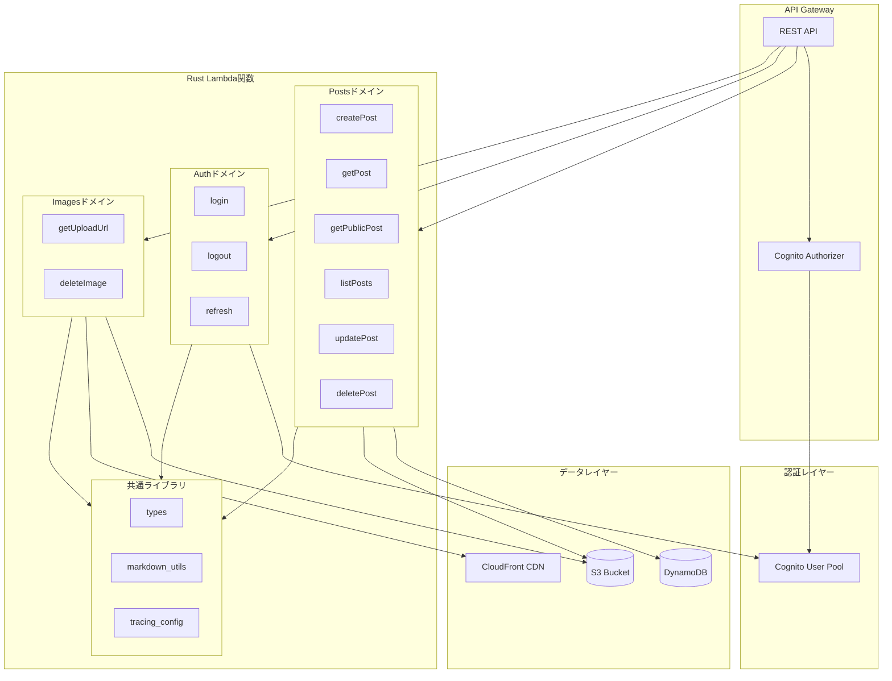
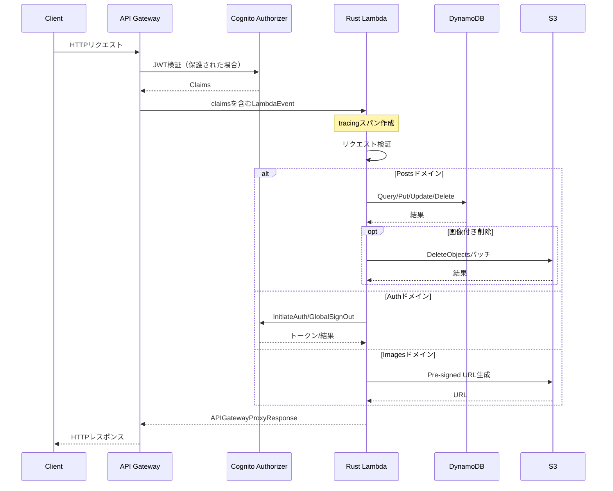
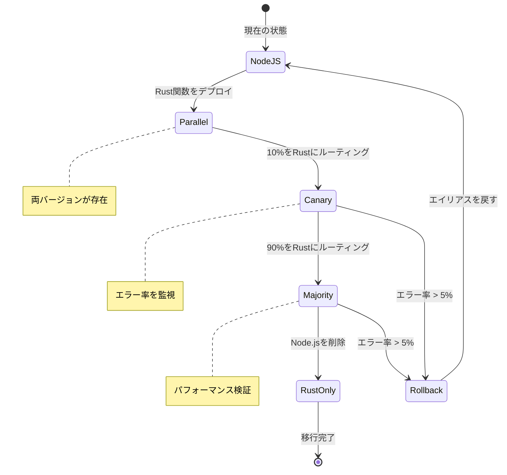
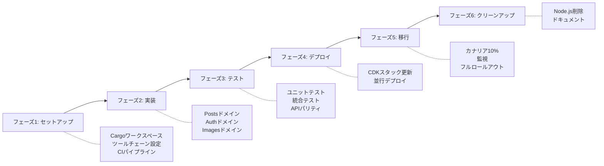
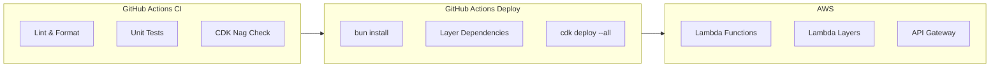
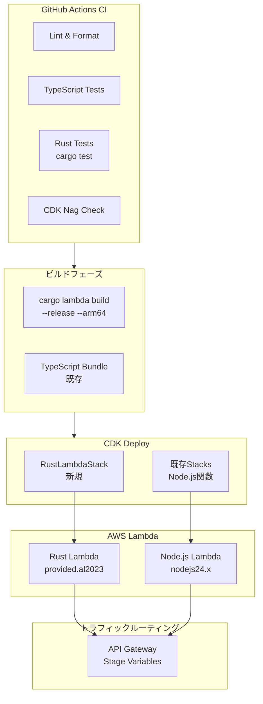

# 技術設計: Lambda Rust移行

## 概要

**目的**: 本機能は、既存の12個のNode.js 24.x Lambda関数をRustランタイムに移行し、コールドスタートパフォーマンスの改善（<100ms）、メモリフットプリントの削減（128MB）、40%以上のコスト削減を実現しながら、完全なAPI互換性を維持します。

**ユーザー**: プラットフォーム運用者は運用コストの削減から恩恵を受け、開発者は型安全でメモリ効率の良いサーバーレス関数を得られ、エンドユーザーは低レイテンシのAPIレスポンスを体験できます。

**影響**: 現在のNode.js Lambda実行レイヤーを`provided.al2023`ランタイムを使用するRustバイナリに置き換えます。既存のAPI Gatewayルート、DynamoDBテーブル、S3バケット、Cognito認証は変更されません。

### ゴール
- <100msのコールドスタート時間を達成（Node.jsの約300msと比較）
- Lambdaメモリ構成を128MBに削減
- 既存エンドポイントとの100% API互換性を維持
- ロールバック機能を備えた段階的移行を可能にする
- Lambda課金で40%以上のコスト削減を達成

### 非ゴール
- フロントエンド変更（公開サイト、管理画面）
- API Gatewayルートの変更
- DynamoDBスキーマの変更
- 移行中の新機能追加
- Cognito User Poolの変更

## アーキテクチャ

### 既存アーキテクチャ分析

**現在のアーキテクチャパターン**:
- Node.js 24.x Lambda関数によるサーバーレスファースト
- Cognito AuthorizerによるAPI Gateway REST API
- GSI（CategoryIndex、PublishStatusIndex）を備えたDynamoDBシングルテーブル設計
- CloudFront CDNによるS3画像ストレージ
- 可観測性のためのLambda Powertools（Logger、Tracer、Metrics）

**既存ドメイン境界**:
- `posts/`: 6関数（createPost、getPost、getPublicPost、listPosts、updatePost、deletePost）
- `auth/`: 3関数（login、logout、refresh）
- `images/`: 2関数（getUploadUrl、deleteImage）
- `shared/`: 共通型、定数、ユーティリティ

**維持すべき統合ポイント**:
- API Gateway Lambda統合（変更なし）
- DynamoDBテーブル/インデックスアクセスパターン（変更なし）
- S3 Pre-signed URL生成（変更なし）
- Cognitoトークン検証（変更なし）

**対処される技術的負債**:
- Node.jsコールドスタートレイテンシ（約300ms）
- メモリ集約型ランタイム（通常256MB以上）
- AWSマネージドランタイムへのランタイムパッチ依存

### アーキテクチャパターン & 境界マップ



**アーキテクチャ統合**:
- **選択パターン**: ドメインベースのバイナリクレートを持つCargoワークスペース
- **ドメイン境界**: Posts、Auth、Imagesを個別クレートに; Commonをライブラリクレートに
- **既存パターン維持**: ハンドラー毎関数、環境変数ベース設定、遅延クライアント初期化
- **新コンポーネントの根拠**: `common`クレートが`functions/shared/`と`layers/common/`を置き換え
- **ステアリング準拠**: サーバーレスファースト、ARM64/Graviton2、TDD原則を維持

### 技術スタック

| レイヤー | 選択 / バージョン | 機能での役割 | 備考 |
|---------|------------------|--------------|------|
| ランタイム | Rust 1.83 stable | Lambda関数実行 | `rust-toolchain.toml`で固定 |
| Lambdaランタイム | aws-lambda-rust-runtime 0.13 | Lambda RIC統合 | 公式AWSクレート |
| HTTPイベント | lambda-http 0.13 | API Gatewayイベント処理 | Request/Responseビルダー |
| AWS SDK | aws-sdk-rust 1.x | DynamoDB、S3、Cognito、CloudWatch | Fluent builder API |
| シリアライゼーション | serde 1.x + serde_json | JSONパース/生成 | Deriveマクロ |
| ロギング | tracing 0.1 + tracing-subscriber 0.3 | 構造化JSONログ | CloudWatch互換 |
| Markdown | pulldown-cmark 0.11 | MarkdownからHTML変換 | CommonMark準拠 |
| XSS防止 | ammonia 4.x | HTMLサニタイゼーション | DOMPurify相当 |
| エラーハンドリング | thiserror 1.x + anyhow 1.x | 型安全エラー | ドメイン + ハンドラーエラー |
| 非同期ランタイム | tokio 1.x | async/await実行 | Lambdaランタイム依存 |
| ビルドツール | cargo-lambda 1.x | ビルドとローカルテスト | ARM64クロスコンパイル |
| インフラ | AWS CDK 2.x | Lambdaデプロイ | `Runtime.PROVIDED_AL2023` |

## システムフロー

### リクエスト処理フロー



**主要な決定事項**:
- Tracingスパンがリクエスト相関のためにハンドラー全体をラップ
- Cognito claimsは`event.request_context.authorizer`から抽出
- エラーレスポンスは既存のHTTPステータスコード（400、401、404、500）と一致

### 段階的移行フロー



## 要件トレーサビリティ

| 要件 | 概要 | コンポーネント | インターフェース | フロー |
|------|------|---------------|-----------------|-------|
| 1.1 | Lambda Powertoolsマッピング | common::tracing_config | TracingConfig | - |
| 1.2 | Markdownクレートマッピング | common::markdown_utils | MarkdownConverter | - |
| 1.3 | AWS SDK検証 | 全ハンドラー | AWS SDKクライアント | リクエストフロー |
| 2.1 | Cargoワークスペース | rust-functions/ | Cargo.toml | - |
| 2.2 | ARM64ビルド | ビルドシステム | cargo-lambda | - |
| 2.3 | バイナリサイズ <10MB | ビルドシステム | Releaseプロファイル | - |
| 2.4 | ローカルテスト | 開発環境 | cargo lambda watch | - |
| 2.5 | ツールチェーンファイル | rust-toolchain.toml | - | - |
| 3.1-3.6 | Postsドメイン | posts/* ハンドラー | PostService | リクエストフロー |
| 4.1-4.5 | Authドメイン | auth/* ハンドラー | AuthService | リクエストフロー |
| 5.1-5.5 | Imagesドメイン | images/* ハンドラー | ImageService | リクエストフロー |
| 6.1-6.5 | 可観測性 | common::tracing_config | TracingConfig, Metrics | - |
| 7.1-7.5 | CDK更新 | RustLambdaStack | CDKコンストラクト | - |
| 8.1-8.5 | テスト | tests/* | テストハーネス | - |
| 9.1-9.5 | 移行 | CDK, CloudWatch | エイリアスルーティング | 移行フロー |
| 10.1-10.5 | パフォーマンス | 全ハンドラー | ベンチマーク | - |

## コンポーネントとインターフェース

### コンポーネント概要

| コンポーネント | ドメイン/レイヤー | 意図 | 要件カバレッジ | 主要依存関係 (P0) | コントラクト |
|---------------|-----------------|------|---------------|-------------------|-------------|
| common | 共有ライブラリ | 型、ユーティリティ、tracing設定 | 1.1, 1.2, 6.1-6.5 | tracing, serde, pulldown-cmark, ammonia | Service |
| create_post | Posts | Markdown付きブログ記事作成 | 3.1 | common, aws-sdk-dynamodb | API |
| get_post | Posts | ID指定で記事取得（管理者） | 3.2 | common, aws-sdk-dynamodb | API |
| get_public_post | Posts | 公開記事取得 | 3.2 | common, aws-sdk-dynamodb | API |
| list_posts | Posts | ページネーション付き記事一覧 | 3.3 | common, aws-sdk-dynamodb | API |
| update_post | Posts | 既存記事更新 | 3.4 | common, aws-sdk-dynamodb | API |
| delete_post | Posts | 記事と画像の削除 | 3.5, 3.6 | common, aws-sdk-dynamodb, aws-sdk-s3 | API |
| login | Auth | Cognito認証 | 4.1, 4.4 | common, aws-sdk-cognitoidentityprovider | API |
| refresh | Auth | トークン更新 | 4.2 | common, aws-sdk-cognitoidentityprovider | API |
| logout | Auth | グローバルサインアウト | 4.3 | common, aws-sdk-cognitoidentityprovider | API |
| get_upload_url | Images | S3 Pre-signed URL | 5.1-5.5 | common, aws-sdk-s3 | API |
| delete_image | Images | S3オブジェクト削除 | 5.5 | common, aws-sdk-s3 | API |
| RustLambdaStack | インフラ | CDKデプロイ | 7.1-7.5 | aws-cdk-lib | - |

### 共有ライブラリ

#### common

| フィールド | 詳細 |
|-----------|------|
| 意図 | 全Lambda関数用の共有型、ユーティリティ、可観測性設定 |
| 要件 | 1.1, 1.2, 1.3, 6.1-6.5 |

**責務と制約**
- ドメイン型の定義（BlogPost、CreatePostRequest、ErrorResponse）
- XSSサニタイゼーション付きMarkdown-to-HTML変換の提供
- CloudWatch互換JSONログ用のtracing subscriberの設定
- エンドポイントオーバーライドサポート付きAWS SDKクライアントの初期化

**依存関係**
- 外部: serde, serde_json — JSONシリアライゼーション (P0)
- 外部: tracing, tracing-subscriber — 可観測性 (P0)
- 外部: pulldown-cmark — Markdownパース (P0)
- 外部: ammonia — HTMLサニタイゼーション (P0)
- 外部: thiserror, anyhow — エラーハンドリング (P0)

**コントラクト**: Service [x]

##### サービスインターフェース

```rust
// common/src/types.rs
use serde::{Deserialize, Serialize};

#[derive(Debug, Clone, Serialize, Deserialize)]
pub struct BlogPost {
    pub id: String,
    pub title: String,
    pub content_markdown: String,
    pub content_html: String,
    pub category: String,
    pub tags: Vec<String>,
    pub publish_status: PublishStatus,
    pub author_id: String,
    pub created_at: String,
    pub updated_at: String,
    #[serde(skip_serializing_if = "Option::is_none")]
    pub published_at: Option<String>,
    pub image_urls: Vec<String>,
}

#[derive(Debug, Clone, Serialize, Deserialize, PartialEq)]
#[serde(rename_all = "lowercase")]
pub enum PublishStatus {
    Draft,
    Published,
}

#[derive(Debug, Clone, Deserialize)]
pub struct CreatePostRequest {
    pub title: String,
    pub content_markdown: String,
    pub category: String,
    #[serde(default)]
    pub tags: Vec<String>,
    #[serde(default)]
    pub publish_status: Option<PublishStatus>,
    #[serde(default)]
    pub image_urls: Vec<String>,
}

#[derive(Debug, Serialize)]
pub struct ErrorResponse {
    pub message: String,
}
```

```rust
// common/src/markdown.rs
use ammonia::Builder;
use pulldown_cmark::{html, Options, Parser};

pub fn markdown_to_safe_html(markdown: &str) -> String {
    if markdown.is_empty() {
        return String::new();
    }

    let parser = Parser::new_ext(markdown, Options::all());
    let mut html_output = String::new();
    html::push_html(&mut html_output, parser);

    Builder::new()
        .tags(hashset!["h1", "h2", "h3", "h4", "h5", "h6", "p", "br",
                       "span", "div", "strong", "em", "u", "s", "del",
                       "a", "img", "ul", "ol", "li", "blockquote",
                       "code", "pre", "table", "thead", "tbody",
                       "tr", "th", "td"])
        .tag_attributes(hashmap![
            "a" => hashset!["href", "title"],
            "img" => hashset!["src", "alt", "title"],
            "*" => hashset!["class", "id"]
        ])
        .clean(&html_output)
        .to_string()
}
```

```rust
// common/src/tracing_config.rs
use tracing_subscriber::fmt::format::FmtSpan;

pub fn init_tracing() {
    tracing_subscriber::fmt()
        .json()
        .with_max_level(tracing::Level::INFO)
        .with_current_span(false)
        .with_ansi(false)
        .without_time()
        .with_target(false)
        .init();
}
```

- 事前条件: 型定義にはなし; tracingはハンドラー前に初期化が必要
- 事後条件: HTML出力はXSS安全; ログはJSON形式
- 不変条件: 型シリアライゼーションはNode.js APIコントラクトと一致

**実装ノート**
- 統合: 全ハンドラークレートはワークスペース経由で`common`に依存
- バリデーション: リクエスト型は`serde`バリデーション付き`#[derive(Deserialize)]`を使用
- リスク: `marked`と`pulldown-cmark`間のMarkdownレンダリング差異

### Postsドメイン

#### create_post

| フィールド | 詳細 |
|-----------|------|
| 意図 | Markdown-to-HTML変換付きの新規ブログ記事作成 |
| 要件 | 3.1, 3.6 |

**責務と制約**
- API GatewayイベントからCreatePostRequestをパースおよび検証
- Cognito claimsからauthor_idを抽出
- Markdownをサニタイズ済みHTMLに変換
- BlogPostをDynamoDBに永続化
- 作成された記事またはエラーレスポンスを返却

**依存関係**
- インバウンド: API Gateway — HTTP POST /admin/posts (P0)
- アウトバウンド: DynamoDB — PutItem BlogPostsテーブル (P0)
- 外部: commonクレート — types, markdown, tracing (P0)

**コントラクト**: API [x]

##### APIコントラクト

| メソッド | エンドポイント | リクエスト | レスポンス | エラー |
|---------|---------------|-----------|-----------|--------|
| POST | /admin/posts | CreatePostRequest | BlogPost (201) | 400, 401, 500 |

```rust
// posts/create_post/src/main.rs
use lambda_http::{run, service_fn, Body, Error, Request, Response};
use common::{types::*, markdown::markdown_to_safe_html, tracing_config::init_tracing};
use aws_sdk_dynamodb::Client as DynamoClient;

#[tracing::instrument(skip(event), fields(req_id = %event.lambda_context().request_id))]
async fn handler(event: Request) -> Result<Response<Body>, Error> {
    let claims = event.request_context()
        .authorizer()
        .and_then(|a| a.claims.get("sub"))
        .ok_or_else(|| /* 401 error */)?;

    let request: CreatePostRequest = serde_json::from_slice(event.body())?;
    // 検証、markdown変換、DynamoDBへ永続化
    // ステータス201とBlogPost JSONを含むResponseを返却
}

#[tokio::main]
async fn main() -> Result<(), Error> {
    init_tracing();
    run(service_fn(handler)).await
}
```

**実装ノート**
- 統合: API Gateway v1イベント用に`lambda_http::Request`を使用
- バリデーション: 空のtitle/content/categoryは400を返却
- リスク: `uuid`クレート経由のUUID生成（Node.jsと同じアルゴリズム）

### Authドメイン

#### login

| フィールド | 詳細 |
|-----------|------|
| 意図 | ユーザー認証とJWTトークン返却 |
| 要件 | 4.1, 4.4, 4.5 |

**責務と制約**
- リクエストボディからemailとpasswordを検証
- USER_PASSWORD_AUTHフローでCognito InitiateAuthを呼び出し
- access、refresh、IDトークンを返却
- 認証エラーを401ステータスで処理

**依存関係**
- インバウンド: API Gateway — HTTP POST /auth/login (P0)
- アウトバウンド: Cognito — InitiateAuth (P0)
- 外部: commonクレート — types, tracing (P0)

**コントラクト**: API [x]

##### APIコントラクト

| メソッド | エンドポイント | リクエスト | レスポンス | エラー |
|---------|---------------|-----------|-----------|--------|
| POST | /auth/login | LoginRequest | TokenResponse (200) | 400, 401, 500 |

```rust
#[derive(Deserialize)]
pub struct LoginRequest {
    pub email: String,
    pub password: String,
}

#[derive(Serialize)]
pub struct TokenResponse {
    pub access_token: String,
    pub refresh_token: String,
    pub id_token: String,
    pub expires_in: i32,
}
```

**実装ノート**
- 統合: LocalStack用にCOGNITO_ENDPOINT環境変数をサポート
- バリデーション: メール形式とパスワード存在確認
- リスク: CognitoエラーマッピングはNode.jsの動作と一致させる必要あり

### Imagesドメイン

#### get_upload_url

| フィールド | 詳細 |
|-----------|------|
| 意図 | 画像アップロード用S3 Pre-signed URL生成 |
| 要件 | 5.1, 5.2, 5.3, 5.4, 5.5 |

**責務と制約**
- ファイル拡張子とコンテンツタイプを検証
- 5MBファイルサイズ制限を適用
- ユーザーIDとタイムスタンプでS3キーを生成
- 15分有効期限のPre-signed PUT URLを作成
- CloudFront URLまたはS3ダイレクトURLを返却

**依存関係**
- インバウンド: API Gateway — HTTP POST /admin/images/upload-url (P0)
- アウトバウンド: S3 — PutObjectプリサイニング (P0)
- 外部: commonクレート — types, tracing (P0)

**コントラクト**: API [x]

##### APIコントラクト

| メソッド | エンドポイント | リクエスト | レスポンス | エラー |
|---------|---------------|-----------|-----------|--------|
| POST | /admin/images/upload-url | UploadUrlRequest | UploadUrlResponse (200) | 400, 401, 500 |

```rust
#[derive(Deserialize)]
pub struct UploadUrlRequest {
    pub file_name: String,
    pub content_type: String,
}

#[derive(Serialize)]
pub struct UploadUrlResponse {
    pub upload_url: String,
    pub image_url: String,
    pub key: String,
}
```

**実装ノート**
- 統合: `PresigningConfig::expires_in(Duration::from_secs(900))`を使用
- バリデーション: 許可拡張子: `.jpg`, `.jpeg`, `.png`, `.gif`, `.webp`
- リスク: S3プリサイニングAPIはNode.js SDKと異なる; 署名形式を検証

## データモデル

### ドメインモデル

**エンティティ**:
- `BlogPost`: ブログコンテンツの集約ルート（Node.jsから変更なし）
- `PublishStatus`: 値オブジェクト（Draft | Published）

**ドメインイベント**（APIレスポンス経由で暗黙的）:
- PostCreated、PostUpdated、PostDeleted
- LoginSuccess、LoginFailure

**不変条件**:
- `published_at`は`publish_status` = Publishedの場合のみ設定
- `author_id`は作成後不変
- `id`はUUID v4形式

### 論理データモデル

既存のDynamoDBスキーマに変更なし。Rust型は既存属性に1:1でマッピング:

| Rustフィールド | DynamoDB属性 | 型 |
|---------------|-------------|-----|
| id | id | S |
| title | title | S |
| content_markdown | contentMarkdown | S |
| content_html | contentHtml | S |
| category | category | S |
| tags | tags | L (SS) |
| publish_status | publishStatus | S |
| author_id | authorId | S |
| created_at | createdAt | S |
| updated_at | updatedAt | S |
| published_at | publishedAt | S (optional) |
| image_urls | imageUrls | L (SS) |

**注意**: Serdeの`#[serde(rename = "contentMarkdown")]`属性でフィールド名マッピングを処理。

### データコントラクト & 統合

**APIデータ転送**:
- リクエスト/レスポンスJSONスキーマはNode.js実装と同一
- Serdeシリアライゼーションは互換性のある出力を生成
- CORSヘッダーはレスポンスビルダーで維持

**クロスサービスデータ管理**:
- DynamoDB操作はアイテム単位でアトミック
- S3カスケード削除はベストエフォート（部分失敗時はログ記録）
- 分散トランザクション不要

## エラーハンドリング

### エラー戦略

```rust
// common/src/error.rs
use thiserror::Error;

#[derive(Error, Debug)]
pub enum DomainError {
    #[error("バリデーションエラー: {0}")]
    Validation(String),

    #[error("見つかりません: {0}")]
    NotFound(String),

    #[error("認証エラー")]
    Unauthorized,

    #[error("DynamoDBエラー: {0}")]
    DynamoDB(#[from] aws_sdk_dynamodb::Error),

    #[error("S3エラー: {0}")]
    S3(#[from] aws_sdk_s3::Error),

    #[error("Cognitoエラー: {0}")]
    Cognito(#[from] aws_sdk_cognitoidentityprovider::Error),
}

impl DomainError {
    pub fn status_code(&self) -> u16 {
        match self {
            Self::Validation(_) => 400,
            Self::NotFound(_) => 404,
            Self::Unauthorized => 401,
            _ => 500,
        }
    }
}
```

### エラーカテゴリとレスポンス

**ユーザーエラー (4xx)**:
- 400: 必須フィールド欠落、無効な形式、ファイルサイズ超過
- 401: Cognitoトークン欠落/無効、認証失敗
- 404: 記事未発見、画像未発見

**システムエラー (5xx)**:
- 500: DynamoDBエラー、S3エラー、予期せぬ例外

### モニタリング

- Tracingスパンがエラータイプとメッセージをキャプチャ
- エラーメトリクスをCloudWatch `BlogPlatform`名前空間に出力
- 全5xxレスポンスはログレベルERROR

## テスト戦略

### ユニットテスト
- `common::markdown::markdown_to_safe_html` — XSSサニタイゼーション
- `common::types` — Serdeシリアライゼーション/デシリアライゼーション
- ハンドラー毎のリクエストバリデーションロジック
- エラー型変換

### 統合テスト
- DynamoDB Local: 既存46テストと一致するCRUD操作
- LocalStack: Cognito認証フロー、S3プリサイニング
- `lambda_http::RequestBuilder`経由のAPI Gatewayイベントシミュレーション

### パフォーマンステスト
- コールドスタート測定: `cargo lambda invoke`タイミング
- 負荷テスト: デプロイ済み関数に対するArtillery
- メモリプロファイリング: 128MB十分性を検証

## 移行戦略

### フェーズ内訳



### ロールバックトリガー
- 5分ウィンドウでエラー率 > 5%
- コールドスタート > 200ms P99
- メモリ128MB超過

### 検証チェックポイント
- 全46統合テストがパス
- パフォーマンスベンチマークが目標達成
- APIコントラクト変更が検出されない

## デプロイ戦略

### 現行デプロイプロセス（Node.js）

現在のTypeScript Lambda関数は以下のプロセスでデプロイされています：



**現行の特徴**:
- `bun install --frozen-lockfile`でTypeScript依存関係をインストール
- Lambda Layers（Powertools、Common）を個別にパッケージ化
- CDKが`Code.fromAsset()`でソースをバンドル
- OIDC認証によるAWSクレデンシャル管理

### Rust Lambdaデプロイ方式

#### 採用方式: cargo-lambda-cdk

`cargo-lambda-cdk`は、Rust Lambda関数をCDKで直接ビルド・デプロイするためのコンストラクトライブラリです。

```bash
# インストール
npm install cargo-lambda-cdk
```

```typescript
// infrastructure/lib/rust-lambda-stack.ts
import { RustFunction } from 'cargo-lambda-cdk';
import * as lambda from 'aws-cdk-lib/aws-lambda';

const createPostRust = new RustFunction(this, 'CreatePostRust', {
  manifestPath: '../rust-functions/posts/create_post',
  bundling: {
    architecture: lambda.Architecture.ARM_64,
    cargoLambdaFlags: ['--release'],
  },
  environment: {
    TABLE_NAME: postsTable.tableName,
    BUCKET_NAME: imagesBucket.bucketName,
  },
  timeout: cdk.Duration.seconds(30),
  memorySize: 128,
  tracing: lambda.Tracing.ACTIVE,
});
```

**採用理由**:
- 既存CDKスタックにシームレスに統合
- ビルドキャッシュが効く
- TypeScript CDKコードで一元管理

### 移行期間中のデプロイアーキテクチャ



### トラフィックルーティング戦略

API Gatewayのステージ変数を使用して、Node.jsとRust関数間のトラフィックを制御：

```typescript
// API Gateway Stage Variables
const stage = api.deploymentStage;

// ルーティング設定（CDK Context or Parameter Store）
// RUST_TRAFFIC_PERCENT: 0 → 10 → 50 → 90 → 100
```

| フェーズ | Rust % | Node.js % | 条件 |
|---------|--------|-----------|------|
| 初期デプロイ | 0% | 100% | Rust関数デプロイ確認 |
| カナリア | 10% | 90% | 基本動作確認 |
| 拡大 | 50% | 50% | パフォーマンス検証 |
| 移行 | 90% | 10% | 最終検証 |
| 完了 | 100% | 0% | Node.js削除可能 |

### GitHub Actions ワークフロー更新

#### ci.yml への追加（Rustテスト）

```yaml
# Rust関連のCIジョブを追加
rust-tests:
  name: Rust Unit Tests
  runs-on: ubuntu-latest
  if: needs.setup-labels.outputs.has-rust == 'true'

  steps:
    - uses: actions/checkout@v4

    - name: Install Rust toolchain
      uses: dtolnay/rust-toolchain@stable

    - name: Cache Cargo dependencies
      uses: Swatinem/rust-cache@v2
      with:
        workspaces: rust-functions

    - name: Run Rust tests
      working-directory: rust-functions
      run: cargo test --all --release

    - name: Check formatting
      working-directory: rust-functions
      run: cargo fmt --all -- --check

    - name: Run Clippy
      working-directory: rust-functions
      run: cargo clippy --all -- -D warnings
```

#### deploy.yml への追加（Rustビルド）

```yaml
# deploy-infrastructure ジョブに追加
- name: Install Rust and Cargo Lambda
  uses: moonrepo/setup-rust@v1
  with:
    bins: cargo-lambda

- name: Install Zig (cross-compilation)
  uses: mlugg/setup-zig@v1
  with:
    version: 0.14.0

- name: Cache Cargo dependencies
  uses: Swatinem/rust-cache@v2
  with:
    workspaces: rust-functions
    cache-on-failure: true

# CDK Deployは変更なし（cargo-lambda-cdkが自動ビルド）
- name: CDK Deploy
  working-directory: infrastructure
  run: bunx cdk deploy --all --require-approval never --context stage=${{ steps.env.outputs.stage }}
```

#### .github/labeler.yml への追加

```yaml
rust:
  - changed-files:
      - any-glob-to-any-file:
          - 'rust-functions/**'
          - 'Cargo.toml'
          - 'Cargo.lock'
          - 'rust-toolchain.toml'
```

### ディレクトリ構造（移行期間中）

```
serverlessBlog/
├── .github/
│   └── workflows/
│       ├── ci.yml           # Rustテスト追加
│       └── deploy.yml       # Rustビルド追加
├── functions/               # 既存Node.js関数（維持）
│   ├── posts/
│   ├── auth/
│   ├── images/
│   └── shared/
├── rust-functions/          # 新規Rust関数
│   ├── Cargo.toml           # ワークスペース定義
│   ├── rust-toolchain.toml
│   ├── common/              # 共有ライブラリ
│   ├── posts/
│   │   ├── create_post/
│   │   ├── get_post/
│   │   └── ...
│   ├── auth/
│   └── images/
├── layers/                  # 既存Layers（維持）
└── infrastructure/
    └── lib/
        ├── api-stack.ts             # 既存
        ├── lambda-functions-stack.ts # 既存Node.js関数（維持）
        └── rust-lambda-stack.ts     # 新規Rust関数
```

### Node.js環境削除プロセス

Rust環境の検証完了後、以下の手順でNode.js環境を削除：

#### Step 1: 削除前チェックリスト

- [ ] 全12関数のRust版が本番稼働中
- [ ] トラフィック100%がRust関数にルーティング
- [ ] 1週間以上エラー率0.1%未満を維持
- [ ] パフォーマンス目標達成（コールドスタート<100ms）
- [ ] 全46統合テストがRust関数に対してパス

#### Step 2: CDKスタック更新

```typescript
// infrastructure/lib/lambda-functions-stack.ts を削除
// または ENABLE_NODEJS_FUNCTIONS フラグで無効化

// cdk.json または context
{
  "context": {
    "enableNodejsFunctions": false  // 削除フラグ
  }
}
```

#### Step 3: 削除対象ファイル

```bash
# Node.js関連の削除
rm -rf functions/           # Lambda関数ソース
rm -rf layers/              # Lambda Layers
rm infrastructure/lib/lambda-functions-stack.ts

# package.json から不要な依存関係を削除
# - @aws-lambda-powertools/*
# - marked, dompurify
# - Lambda関連のdev dependencies
```

#### Step 4: CI/CD更新

```yaml
# ci.yml から削除
# - backend-unit-tests ジョブ（Node.js）
# - Lambda Layer依存関係インストール

# deploy.yml から削除
# - Layer依存関係インストールステップ
```

### ビルド時間見積もり

| フェーズ | 移行期間中 | 移行完了後 |
|---------|-----------|-----------|
| 依存関係（Node.js） | 30秒 | 0秒 |
| 依存関係（Rust、キャッシュ有） | 10秒 | 10秒 |
| TypeScriptビルド | 20秒 | 0秒 |
| Rustビルド（キャッシュ有） | 1-2分 | 1-2分 |
| CDKデプロイ | 5-8分 | 3-5分 |
| **合計** | **7-11分** | **4-7分** |

### ロールバック手順

移行期間中に問題が発生した場合：

```bash
# 即時ロールバック（API Gateway設定変更）
# ステージ変数でRustトラフィックを0%に

# CDKロールバック（必要な場合）
cd infrastructure
bunx cdk deploy --all --context stage=prd --context rustTrafficPercent=0
```

## セキュリティ考慮事項

**認証**: Cognito JWT検証は変更なし; `lambda_http`経由のclaims抽出
**データ保護**: 既存の暗号化（DynamoDB、S3 SSE-S3）を維持
**入力バリデーション**: Rust型システムがスキーマを強制; ammoniaがHTMLをサニタイズ

## パフォーマンス & スケーラビリティ

**目標メトリクス**:
- コールドスタート: <100ms (P99)
- ウォーム呼び出し: <20ms (P99、読み取り操作)
- メモリ: 128MB構成

**最適化テクニック**:
- 最小バイナリのためのmusl静的リンク
- LTO有効化のReleaseビルド
- AWS SDKクライアントの遅延初期化
- コスト/パフォーマンスバランスのためのARM64 (Graviton2)
