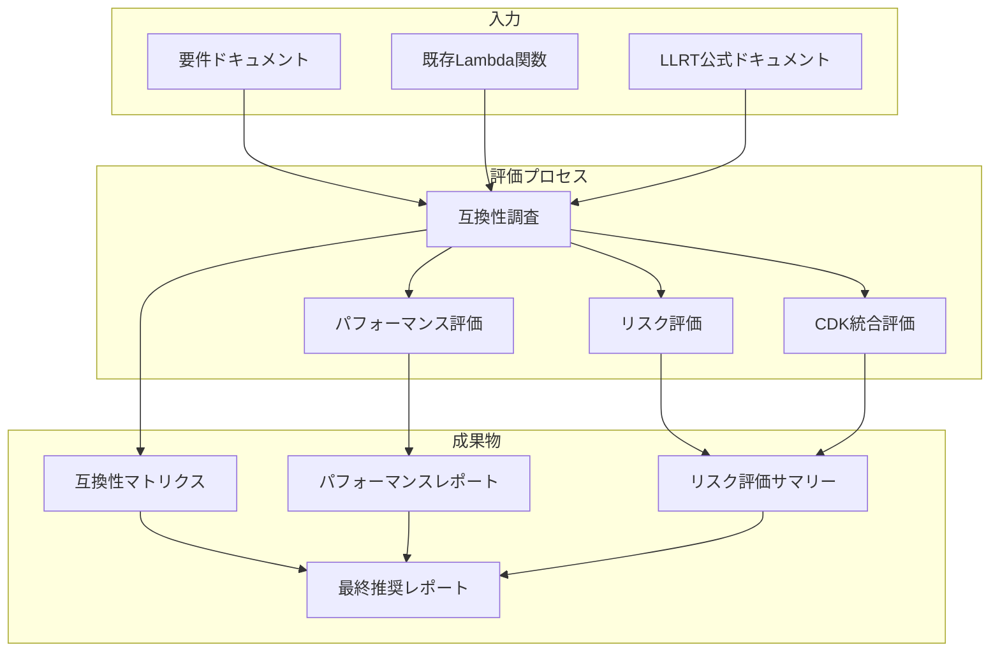
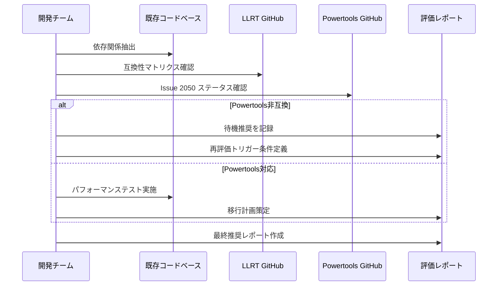
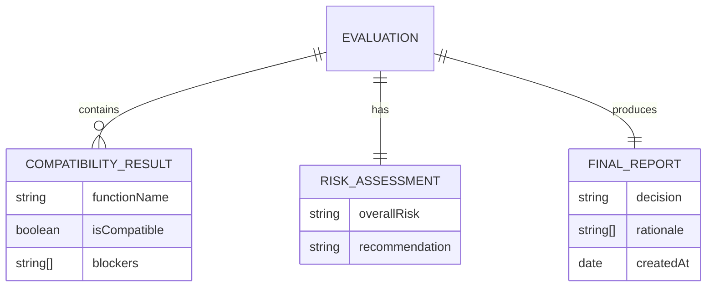

# 技術設計書: LLRT導入評価

## Overview

**Purpose**: 本設計書は、サーバーレスブログプラットフォームの各Lambda関数に対するLLRT（Low Latency Runtime）導入可能性を評価するプロセスと成果物を定義する。

**Users**: 開発チームおよび技術責任者が、LLRT導入の意思決定に必要な情報を得るために利用する。

**Impact**: 本評価プロジェクトはコード変更を伴わない調査・文書化作業であり、現行システムへの直接的な影響はない。評価結果に基づき、将来のLLRT移行プロジェクトが立ち上げられる可能性がある。

### Goals

- 全11Lambda関数のLLRT互換性を評価し、互換性マトリクスを作成する
- 現行Node.js 24.xとLLRTのパフォーマンス比較ベースラインを確立する
- 導入可否の推奨事項と根拠を文書化する
- 再評価トリガー条件を定義し、継続的なモニタリング体制を確立する

### Non-Goals

- 実際のLLRTへの移行実装（別プロジェクトで実施）
- フロントエンドアプリケーションへの影響評価
- CI/CDパイプラインの変更
- 他のLambdaランタイム（Python、Go等）の評価
- 本番環境でのテスト実行

---

## Architecture

### Existing Architecture Analysis

現行システムは以下の構成を採用しており、これらがLLRT評価の制約条件となる：

| 項目 | 現行構成 | LLRT評価への影響 |
|------|---------|-----------------|
| ランタイム | Node.js 24.x (NODEJS_24_X) | 比較ベースライン |
| アーキテクチャ | ARM64 (Graviton2) | LLRT ARM64対応確認必須 |
| 監視基盤 | Lambda Powertools (Logger, Tracer, Metrics) | **致命的ブロッカー** |
| バンドラー | esbuild (NodejsFunction) | ESMバンドリング要確認 |
| Layers | Powertools Layer, Common Layer | Layer互換性要確認 |

> 詳細な互換性調査結果は `research.md` Section 1-2 を参照

### Architecture Pattern & Boundary Map

本評価プロジェクトは「調査・文書化」タスクであり、ソフトウェアアーキテクチャではなく**評価プロセスアーキテクチャ**を定義する。



**Architecture Integration**:
- Selected pattern: 調査ワークフローパターン
- Domain boundaries: 互換性調査、パフォーマンス評価、リスク評価の3領域に分離
- Steering compliance: 既存の監視パターン（`monitoring-patterns.md`）との整合性を評価

### Technology Stack & Alignment

| Layer | Choice / Version | Role in Feature | Notes |
|-------|------------------|-----------------|-------|
| Documentation | Markdown | 評価レポート作成 | `.kiro/specs/`配下に格納 |
| Research Tools | WebSearch, GitHub API | 外部情報収集 | LLRT GitHub Issues監視含む |
| Performance Tools | CloudWatch Logs Insights | ベースライン測定 | 現行Node.js 24.xのメトリクス取得 |
| Version Control | Git | 成果物管理 | ブランチ: feature/llrt-evaluation |

---

## System Flows

### 評価実行フロー



**Key Decisions**:
- ギャップ分析の結果、Lambda Powertoolsが非互換のため、**左側パス（待機推奨）** を選択
- パフォーマンステスト実施は延期し、再評価トリガー条件の定義を優先

---

## Requirements Traceability

| Requirement | Summary | Components | Interfaces | Flows |
|-------------|---------|------------|------------|-------|
| 1.1-1.6 | 依存関係互換性調査 | CompatibilityAnalyzer | CompatibilityMatrix | 評価実行フロー |
| 2.1-2.6 | パフォーマンス評価基準 | PerformanceEvaluator | PerformanceReport | N/A（延期） |
| 3.1-3.6 | 機能検証要件 | FunctionalVerifier | TestReport | N/A（延期） |
| 4.1-4.6 | リスク評価 | RiskAssessor | RiskMatrix | 評価実行フロー |
| 5.1-5.5 | CDK統合評価 | CDKIntegrationAnalyzer | CDKCompatibilityReport | 評価実行フロー |
| 6.1-6.6 | 移行計画策定 | MigrationPlanner | MigrationRoadmap | N/A（導入非推奨時はスキップ） |
| 7.1-7.6 | ドキュメント成果物 | ReportGenerator | FinalReport | 評価実行フロー |

---

## Components and Interfaces

### Summary

| Component | Domain | Intent | Req Coverage | Key Dependencies | Contracts |
|-----------|--------|--------|--------------|------------------|-----------|
| CompatibilityAnalyzer | 互換性調査 | 各Lambda関数の依存関係をLLRT互換性と照合 | 1.1-1.6 | CODE, LLRT_DOC (P0) | Compatibility Matrix |
| RiskAssessor | リスク評価 | LLRT導入リスクを評価・分類 | 4.1-4.6 | CompatibilityAnalyzer (P0) | Risk Matrix |
| ReportGenerator | 成果物 | 評価結果を文書化 | 7.1-7.6 | All (P1) | Final Report |
| ReEvaluationMonitor | 継続監視 | 再評価トリガー条件を監視 | 6.6, 7.6 | GitHub API (P1) | Trigger Alerts |

### 互換性調査 Domain

#### CompatibilityAnalyzer

| Field | Detail |
|-------|--------|
| Intent | 各Lambda関数の依存関係をLLRT互換性マトリクスと照合し、導入可否を判定する |
| Requirements | 1.1, 1.2, 1.3, 1.4, 1.5, 1.6 |

**Responsibilities & Constraints**
- 全11Lambda関数の依存パッケージを列挙
- LLRT公式ドキュメントとの照合
- Lambda Powertools Issue #2050のステータス追跡
- Node.js固有API使用箇所の特定

**Dependencies**
- Inbound: 既存Lambda関数ソースコード (P0)
- External: LLRT GitHub Repository (P0), Powertools GitHub Issues (P0)

**Contracts**: State [ ✓ ]

##### State Management

**互換性マトリクス構造**:

```typescript
interface CompatibilityMatrix {
  functions: FunctionCompatibility[];
  layers: LayerCompatibility[];
  overallStatus: 'compatible' | 'partial' | 'incompatible';
  blockers: Blocker[];
}

interface FunctionCompatibility {
  functionName: string;
  filePath: string;
  dependencies: DependencyStatus[];
  powertoolsUsage: boolean;
  llrtCompatible: boolean;
  notes: string;
}

interface DependencyStatus {
  packageName: string;
  version: string;
  llrtSupport: 'built-in' | 'compatible' | 'incompatible' | 'unknown';
  source: string; // 確認元URL
}

interface Blocker {
  type: 'powertools' | 'dependency' | 'api' | 'layer';
  description: string;
  severity: 'critical' | 'high' | 'medium' | 'low';
  workaround: string | null;
  trackingUrl: string;
}
```

**Implementation Notes**
- Integration: `research.md` Section 1.2 の調査結果を構造化
- Validation: 各依存関係のソースURL記録必須
- Risks: LLRT互換性マトリクスが頻繁に更新されるため、調査時点の日付を明記

### リスク評価 Domain

#### RiskAssessor

| Field | Detail |
|-------|--------|
| Intent | LLRT導入に伴うリスクを評価し、推奨アクションを導出する |
| Requirements | 4.1, 4.2, 4.3, 4.4, 4.5, 4.6 |

**Responsibilities & Constraints**
- LLRTの成熟度評価（実験的/プレビュー/GA）
- AWSサポートポリシーの確認
- 既知の問題・バグの調査
- 本番環境導入リスクレベルの判定

**Dependencies**
- Inbound: CompatibilityAnalyzer.CompatibilityMatrix (P0)
- External: LLRT GitHub Issues (P1), AWS Documentation (P1)

**Contracts**: State [ ✓ ]

##### State Management

**リスクマトリクス構造**:

```typescript
interface RiskMatrix {
  evaluationDate: string;
  llrtVersion: string;
  llrtStatus: 'experimental' | 'preview' | 'ga';
  awsSupportLevel: string;
  risks: Risk[];
  overallRiskLevel: 'high' | 'medium' | 'low';
  recommendation: 'proceed' | 'wait' | 'reject';
}

interface Risk {
  category: 'maturity' | 'compatibility' | 'support' | 'security' | 'performance';
  description: string;
  likelihood: 'high' | 'medium' | 'low';
  impact: 'critical' | 'major' | 'minor';
  mitigation: string | null;
}
```

### 成果物 Domain

#### ReportGenerator

| Field | Detail |
|-------|--------|
| Intent | 評価結果を構造化された最終レポートとして文書化する |
| Requirements | 7.1, 7.2, 7.3, 7.4, 7.5, 7.6 |

**Responsibilities & Constraints**
- 互換性マトリクスの最終版作成
- パフォーマンス比較レポート（ベースラインのみ）
- リスク評価サマリー
- 導入可否の推奨事項と根拠

**Dependencies**
- Inbound: CompatibilityAnalyzer (P0), RiskAssessor (P0)
- Outbound: `.kiro/specs/llrt-runtime-evaluation/` 配下に成果物格納

**Contracts**: State [ ✓ ]

##### State Management

**最終レポート構造**:

```typescript
interface FinalReport {
  metadata: ReportMetadata;
  executiveSummary: string;
  compatibilityMatrix: CompatibilityMatrix;
  riskMatrix: RiskMatrix;
  performanceBaseline: PerformanceBaseline;
  recommendation: Recommendation;
  reEvaluationTriggers: ReEvaluationTrigger[];
}

interface ReportMetadata {
  version: string;
  createdAt: string;
  authors: string[];
  approvedBy: string | null;
}

interface Recommendation {
  decision: 'proceed' | 'wait' | 'reject';
  rationale: string[];
  nextActions: string[];
}

interface ReEvaluationTrigger {
  condition: string;
  source: string;
  monitoringMethod: string;
}
```

### 継続監視 Domain

#### ReEvaluationMonitor

| Field | Detail |
|-------|--------|
| Intent | 再評価トリガー条件を定義し、継続的な監視体制を確立する |
| Requirements | 6.6, 7.6 |

**Responsibilities & Constraints**
- GitHub Issues監視（Lambda Powertools #2050）
- AWS公式アナウンス監視
- LLRTリリースノート監視

**Dependencies**
- External: GitHub API (P1), AWS Blog RSS (P2)

**Contracts**: Event [ ✓ ]

##### Event Contract

**再評価トリガーイベント**:

| Event | Trigger Condition | Action |
|-------|-------------------|--------|
| `PowertoolsLLRTSupport` | Issue #2050 が closed になる | 再評価プロジェクト立ち上げ |
| `LLRTv1Release` | LLRT v1.0（GA）リリース | リスク再評価 |
| `NodeConsoleAPIFix` | `node:console` API完全実装 | 互換性マトリクス更新 |

**Monitoring Method**: 月次手動チェック（自動化は Out of Scope）

---

## Data Models

### Domain Model

本評価プロジェクトのドメインモデルは以下の3つの集約で構成される：



**Business Rules & Invariants**:
- 1つでも critical blocker が存在する場合、`overallStatus = 'incompatible'`
- `recommendation = 'wait'` の場合、`reEvaluationTriggers` は必須
- 評価レポートは承認者の署名なしに公開不可

### Logical Data Model

評価データは以下のファイル構造で永続化：

```
.kiro/specs/llrt-runtime-evaluation/
├── spec.json              # メタデータ
├── requirements.md        # 要件定義
├── design.md              # 本設計書
├── research.md            # 調査ログ
├── tasks.md               # タスク一覧（生成予定）
└── reports/               # 成果物（実装フェーズで作成）
    ├── compatibility-matrix.md
    ├── risk-assessment.md
    └── final-report.md
```

---

## Error Handling

### Error Strategy

本評価プロジェクトは調査・文書化タスクであるため、技術的エラーハンドリングは限定的。以下のリスクシナリオに対応：

| シナリオ | 対応 |
|----------|------|
| LLRT GitHub リポジトリにアクセス不可 | 最新キャッシュ情報を使用、調査日付を明記 |
| 依存関係情報が不完全 | `unknown` ステータスを設定、再調査対象としてフラグ |
| 矛盾する情報源 | 公式ドキュメントを優先、複数ソースを併記 |

---

## Testing Strategy

### Evaluation Validation

評価プロセスの品質保証として以下のチェックリストを適用：

**互換性調査の検証** (1.1-1.6):
- 全11Lambda関数がマトリクスに含まれていること
- 各依存関係のソースURLが有効であること
- Powertoolsステータスが最新Issue状態と一致すること

**リスク評価の検証** (4.1-4.6):
- LLRTバージョンが最新リリースと一致すること
- リスク評価が根拠付きで記載されていること
- 推奨アクションが明確であること

**成果物の検証** (7.1-7.6):
- 全レポートがMarkdown形式で正しく構造化されていること
- 要件トレーサビリティが維持されていること
- 再評価トリガーが具体的に定義されていること

---

## Security Considerations

本評価プロジェクトはコード変更を伴わないため、セキュリティリスクは最小限。ただし以下に留意：

- **機密情報の除外**: AWS認証情報、内部URLをレポートに含めない
- **外部リンクの検証**: 公式ドキュメントのみを参照元として使用
- **評価結果の取り扱い**: 内部文書として管理、外部公開時は機密部分を削除

---

## Supporting References

### LLRT公式ドキュメント

- [LLRT GitHub Repository](https://github.com/awslabs/llrt)
- [LLRT Compatibility Matrix](https://github.com/awslabs/llrt#compatibility-matrix)
- [cdk-lambda-llrt Construct](https://constructs.dev/packages/cdk-lambda-llrt)

### Lambda Powertools

- [Powertools LLRT Support Issue #2050](https://github.com/aws-powertools/powertools-lambda-typescript/issues/2050)

### プロジェクト内部参照

- `research.md`: 詳細な調査ログとギャップ分析
- `.kiro/steering/tech.md`: 現行技術スタック
- `.kiro/steering/monitoring-patterns.md`: 監視パターン
