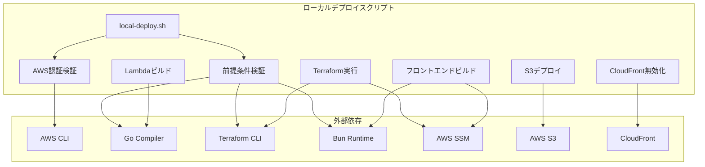
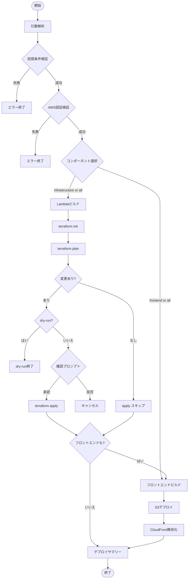

# 技術設計書: ローカルデプロイワークフロー

## 概要

**目的**: この機能は、開発者がGitHub Actions CI/CDパイプラインと同等のデプロイワークフローをローカル環境から実行できるようにする。

**ユーザー**: 開発者がローカルでのテスト、デバッグ、迅速な開発サイクルのためにこの機能を使用する。

**影響**: 現在のデプロイフロー（GitHub Actionsのみ）に、ローカル実行オプションを追加する。

### ゴール
- GitHub Actionsワークフローと同等のローカルデプロイ機能を提供
- 単一のエントリーポイントスクリプトで操作を簡素化
- CI/CDとの環境一貫性を確保
- 開発者の生産性を向上

### 非ゴール
- GitHub ActionsのOIDC認証の再現（ローカル認証情報を使用）
- GitHub Actionsのアーティファクトキャッシュの再現
- ワークフローの自動トリガー（手動実行のみ）
- GitHub Environmentsの承認フローの完全再現

## アーキテクチャ

### アーキテクチャパターン & 境界マップ



**アーキテクチャ統合**:
- 選択パターン: 単一シェルスクリプト（関数分離）- シンプルさとポータブル性を重視
- 機能境界: 各デプロイステップを独立した関数として実装し、責任を明確に分離
- 既存パターン維持: `validate-import.sh`のスタイルガイド（色付き出力、セクションヘッダー）を踏襲
- 新規コンポーネント理由: 既存のCI/CDワークフローをローカルで再現する必要性
- ステアリング準拠: Bash使用、既存ツール（Make、Terraform）の再利用

### 技術スタック

| レイヤー | 選択 / バージョン | 機能での役割 | 備考 |
|---------|------------------|--------------|------|
| スクリプト | Bash 5.x | メインオーケストレーション | POSIX互換、追加依存なし |
| ビルド | Make | Lambdaビルド管理 | 既存Makefile再利用 |
| インフラ | Terraform 1.14.0 | AWSリソースデプロイ | GitHub Actionsと同一バージョン |
| コンパイラ | Go 1.25.5 | Lambdaバイナリ生成 | GitHub Actionsと同一バージョン |
| フロントエンド | Bun (latest) | フロントエンドビルド | 高速なパッケージ管理 |
| AWS CLI | v2 | AWS API呼び出し | SSM、S3、CloudFront操作 |

## システムフロー

### メインデプロイフロー



**キー決定**:
- 前提条件検証を最初に実行し、早期失敗を実現
- dry-runモードはTerraform planまで実行し、applyをスキップ
- prd環境では二重確認を要求（`--auto-approve`でスキップ可能）

## 要件トレーサビリティ

| 要件 | サマリー | コンポーネント | インターフェース |
|------|---------|---------------|-----------------|
| 1.1-1.10 | スクリプトエントリーポイント | EntryPoint, ArgParser | CLI引数 |
| 2.1-2.6 | AWS認証検証 | AWSValidator | aws sts |
| 3.1-3.7 | 前提条件検証 | PrereqValidator | バージョンチェック |
| 4.1-4.10 | Lambdaビルド | LambdaBuilder | make build |
| 5.1-5.10 | Terraformデプロイ | TerraformRunner | terraform CLI |
| 6.1-6.8 | フロントエンドビルド | FrontendBuilder | bun build |
| 7.1-7.5 | S3デプロイ | S3Deployer | aws s3 sync |
| 8.1-8.5 | CloudFront無効化 | CFInvalidator | aws cloudfront |
| 9.1-9.6 | デプロイサマリー | SummaryReporter | stdout |
| 10.1-10.5 | 選択的デプロイ | SelectiveDeployer | CLI引数 |
| 11.1-11.4 | 環境一貫性 | VersionChecker | バージョン比較 |
| 12.1-12.5 | SSM統合 | SSMFetcher | aws ssm |

## コンポーネントとインターフェース

### コンポーネントサマリー

| コンポーネント | ドメイン/レイヤー | 意図 | 要件カバレッジ | キー依存 | コントラクト |
|---------------|------------------|------|---------------|---------|--------------|
| local-deploy.sh | スクリプト | メインエントリーポイント | 1.1-1.10 | Bash | CLI |
| validate_prereq | 検証 | 前提条件チェック | 3.1-3.7 | go, terraform, bun, node | 関数 |
| validate_aws | 検証 | AWS認証チェック | 2.1-2.6 | aws CLI | 関数 |
| build_lambdas | ビルド | Go Lambdaビルド | 4.1-4.10 | make, go | 関数 |
| run_terraform | インフラ | Terraformデプロイ | 5.1-5.10 | terraform | 関数 |
| build_frontend | ビルド | フロントエンドビルド | 6.1-6.8 | bun | 関数 |
| deploy_s3 | デプロイ | S3同期 | 7.1-7.5 | aws s3 | 関数 |
| invalidate_cf | デプロイ | CloudFront無効化 | 8.1-8.5 | aws cloudfront | 関数 |
| fetch_ssm | ユーティリティ | SSMパラメータ取得 | 12.1-12.5 | aws ssm | 関数 |

### スクリプト層

#### local-deploy.sh

| フィールド | 詳細 |
|----------|------|
| 意図 | ローカルデプロイワークフローのメインエントリーポイント |
| 要件 | 1.1-1.10, 9.1-9.6, 10.1-10.5 |

**責務と制約**
- CLI引数の解析とバリデーション
- デプロイフローのオーケストレーション
- 成功/失敗のサマリー表示
- 終了コード管理（0: 成功, 1: 失敗）

**依存関係**
- Inbound: なし（エントリーポイント）
- Outbound: validate_prereq, validate_aws, build_lambdas, run_terraform, build_frontend, deploy_s3, invalidate_cf (P0)

**コントラクト**: CLI [ x ]

##### CLIインターフェース

```bash
# 使用方法
./scripts/local-deploy.sh [OPTIONS]

# オプション
--env <dev|prd>           # ターゲット環境（デフォルト: dev）
--component <all|infrastructure|frontend>  # デプロイコンポーネント（デフォルト: all）
--dry-run                 # 変更なしでプランのみ表示
--auto-approve            # 確認プロンプトをスキップ
--skip-prereq-check       # 前提条件チェックをスキップ
--no-invalidation         # CloudFront無効化をスキップ
--lambda <function-name>  # 特定のLambda関数のみデプロイ
--frontend <public|admin> # 特定のフロントエンドのみデプロイ
--parallel                # 並列ビルド（デフォルト: 有効）
--verbose                 # 詳細出力
--strict-versions         # バージョン不一致でエラー終了
--help                    # ヘルプ表示
```

- 終了コード: 0（成功）, 1（失敗）
- 出力: 色付きステータスメッセージ、デプロイサマリー

### 検証層

#### validate_prereq

| フィールド | 詳細 |
|----------|------|
| 意図 | 必要なツールのインストールとバージョンを検証 |
| 要件 | 3.1-3.7, 11.1-11.4 |

**責務と制約**
- Go 1.25+の確認
- Terraform 1.14+の確認
- Bunの確認
- Node.js 22+の確認
- バージョン不一致時の警告表示

**依存関係**
- External: go, terraform, bun, node コマンド (P0)

**コントラクト**: 関数 [ x ]

##### 関数シグネチャ

```bash
# 戻り値: 0（すべて成功）, 1（失敗）
validate_prereq() {
    # 引数: なし（グローバル変数使用）
    # 副作用: 標準出力にステータス表示
    # 条件: --strict-versions有効時はバージョン不一致でも失敗
}
```

**実装ノート**
- バージョン抽出は`grep -oP`または`awk`を使用
- GitHub Actionsの期待バージョン: Go 1.25.5, Terraform 1.14.0, Node.js 22.x

#### validate_aws

| フィールド | 詳細 |
|----------|------|
| 意図 | AWS CLI設定と認証情報の有効性を検証 |
| 要件 | 2.1-2.6 |

**責務と制約**
- AWS CLIインストールの確認
- 認証情報の有効性確認（`aws sts get-caller-identity`）
- アカウントIDとリージョンの表示

**依存関係**
- External: aws CLI (P0)

**コントラクト**: 関数 [ x ]

##### 関数シグネチャ

```bash
# 戻り値: 0（有効）, 1（無効）
validate_aws() {
    # 引数: なし
    # 副作用: アカウントID、リージョン、ユーザー名を表示
    # エラー: 認証失敗時はインストール/設定ガイダンスを表示
}
```

### ビルド層

#### build_lambdas

| フィールド | 詳細 |
|----------|------|
| 意図 | すべてのGo Lambda関数をビルド |
| 要件 | 4.1-4.10 |

**責務と制約**
- 11個のLambda関数のビルド
- ARM64クロスコンパイル
- 並列ビルドのサポート
- ビルド時間の計測と表示

**依存関係**
- External: make, go (P0)
- Outbound: go-functions/Makefile (P0)

**コントラクト**: 関数 [ x ]

##### 関数シグネチャ

```bash
# 戻り値: 0（成功）, 1（失敗）
# 引数: $1 - 特定の関数名（オプション、空の場合は全関数）
build_lambdas() {
    local target_function="${1:-}"
    # 出力: go-functions/bin/{function-name}/bootstrap
    # 副作用: ビルドステータスと時間を表示
}
```

**実装ノート**
- 既存の`go-functions/Makefile`を使用
- 並列ビルド: `make -j$(nproc) build`
- 単一関数: `make build-one FUNC=posts/create`

#### build_frontend

| フィールド | 詳細 |
|----------|------|
| 意図 | フロントエンドアプリケーションをビルド |
| 要件 | 6.1-6.8 |

**責務と制約**
- Public Siteのビルド
- Admin Siteのビルド（Cognito設定取得含む）
- 依存関係インストール
- ビルドサイズと時間の表示

**依存関係**
- External: bun (P0)
- Outbound: fetch_ssm（Admin Site用）(P1)

**コントラクト**: 関数 [ x ]

##### 関数シグネチャ

```bash
# 戻り値: 0（成功）, 1（失敗）
# 引数: $1 - ターゲット環境（dev|prd）
#       $2 - 特定のサイト（public|admin、オプション）
build_frontend() {
    local env="$1"
    local target="${2:-}"
    # 出力: frontend/{public,admin}/dist/
    # 環境変数: NODE_ENV, VITE_COGNITO_*
}
```

### インフラ層

#### run_terraform

| フィールド | 詳細 |
|----------|------|
| 意図 | Terraformによるインフラデプロイを実行 |
| 要件 | 5.1-5.10 |

**責務と制約**
- terraform init の実行
- terraform plan の実行と表示
- 確認プロンプト（prd環境は二重確認）
- terraform apply の実行
- 出力値の取得と表示

**依存関係**
- External: terraform (P0)
- Outbound: fetch_ssm（Basic Auth取得）(P1)

**コントラクト**: 関数 [ x ]

##### 関数シグネチャ

```bash
# 戻り値: 0（成功）, 1（失敗）
# 引数: $1 - ターゲット環境（dev|prd）
#       $2 - dry-runフラグ（true|false）
#       $3 - auto-approveフラグ（true|false）
#       $4 - ターゲットリソース（オプション、-target用）
run_terraform() {
    local env="$1"
    local dry_run="${2:-false}"
    local auto_approve="${3:-false}"
    local target="${4:-}"
    # 作業ディレクトリ: terraform/environments/{env}/
    # 副作用: CloudFront URL、API endpointを表示
}
```

**実装ノート**
- Basic Auth認証情報はTF_VAR環境変数として設定
- prd環境では"I understand this is production"入力を要求

### デプロイ層

#### deploy_s3

| フィールド | 詳細 |
|----------|------|
| 意図 | フロントエンドビルドをS3にデプロイ |
| 要件 | 7.1-7.5 |

**責務と制約**
- SSMからバケット名を取得
- aws s3 sync の実行（--delete付き）
- アップロード/削除ファイル数の表示

**依存関係**
- External: aws s3 (P0)
- Outbound: fetch_ssm (P1)

**コントラクト**: 関数 [ x ]

##### 関数シグネチャ

```bash
# 戻り値: 0（成功）, 1（失敗）
# 引数: $1 - ターゲット環境（dev|prd）
#       $2 - 特定のサイト（public|admin、オプション）
deploy_s3() {
    local env="$1"
    local target="${2:-}"
    # 同期元: frontend/{public,admin}/dist/
    # 同期先: s3://{bucket-name}/
}
```

#### invalidate_cf

| フィールド | 詳細 |
|----------|------|
| 意図 | CloudFrontキャッシュを無効化 |
| 要件 | 8.1-8.5 |

**責務と制約**
- Terraformから配信IDを取得
- 無効化リクエストの作成
- 無効化IDの表示

**依存関係**
- External: aws cloudfront (P0)

**コントラクト**: 関数 [ x ]

##### 関数シグネチャ

```bash
# 戻り値: 0（成功）, 1（失敗、警告のみで続行）
# 引数: $1 - ターゲット環境（dev|prd）
invalidate_cf() {
    local env="$1"
    # 無効化パス: /*
    # 副作用: 無効化IDを表示
}
```

### ユーティリティ層

#### fetch_ssm

| フィールド | 詳細 |
|----------|------|
| 意図 | AWS SSMからパラメータを取得 |
| 要件 | 12.1-12.5 |

**責務と制約**
- SSMパラメータの取得
- SecureStringの復号
- 機密値のマスク

**依存関係**
- External: aws ssm (P0)

**コントラクト**: 関数 [ x ]

##### 関数シグネチャ

```bash
# 戻り値: パラメータ値（stdoutに出力）
# 引数: $1 - パラメータ名（フルパス）
#       $2 - 暗号化フラグ（true|false、デフォルト: false）
fetch_ssm() {
    local param_name="$1"
    local with_decryption="${2:-false}"
    # エラー: パラメータ未検出時は終了コード1
}
```

## データモデル

### ドメインモデル

この機能は永続データを持たない。すべての状態はスクリプト実行中のみ存在する。

### 設定データ

```bash
# スクリプト内定数
EXPECTED_GO_VERSION="1.25"
EXPECTED_TERRAFORM_VERSION="1.14"
EXPECTED_NODE_VERSION="22"
DEFAULT_ENV="dev"
DEFAULT_COMPONENT="all"

# SSMパラメータパス
SSM_BASIC_AUTH_USER="/serverless-blog/{env}/basic-auth/username"
SSM_BASIC_AUTH_PASS="/serverless-blog/{env}/basic-auth/password"
SSM_COGNITO_POOL_ID="/serverless-blog/{env}/cognito/user-pool-id"
SSM_COGNITO_CLIENT_ID="/serverless-blog/{env}/cognito/user-pool-client-id"
SSM_PUBLIC_BUCKET="/serverless-blog/{env}/storage/public-site-bucket-name"
SSM_ADMIN_BUCKET="/serverless-blog/{env}/storage/admin-site-bucket-name"
```

## エラーハンドリング

### エラー戦略

`set -euo pipefail`を使用して、エラー発生時に即座に終了する。

### エラーカテゴリと対応

**ユーザーエラー（設定ミス）**:
- 無効な引数 → ヘルプ表示と終了
- 環境指定エラー → 有効な値リストを表示
- 関数名エラー → 有効な関数名リストを表示

**システムエラー（ツール未検出）**:
- AWS CLI未インストール → インストールガイダンス表示
- Go未インストール → インストールガイダンス表示
- Terraform未インストール → インストールガイダンス表示
- Bun未インストール → インストールガイダンス表示

**実行エラー（操作失敗）**:
- AWS認証失敗 → 認証設定ガイダンス表示
- Lambdaビルド失敗 → エラー出力を表示して終了
- Terraform失敗 → エラー出力を表示して終了
- S3同期失敗 → エラー出力を表示して終了

### モニタリング

ローカルスクリプトのため、ログはstdout/stderrに出力される。`--verbose`オプションで詳細ログを有効化。

## テスト戦略

### ユニットテスト

シェルスクリプトのユニットテストは困難なため、手動テストを主とする。

### 統合テスト

1. **前提条件チェック**: 各ツールのインストール有無と検出
2. **AWS認証**: 有効/無効な認証情報での動作確認
3. **dry-runモード**: 実際の変更なしでフロー確認
4. **コンポーネント選択**: 各コンポーネントの個別デプロイ

### E2Eテスト

1. **dev環境フルデプロイ**: `./scripts/local-deploy.sh --env dev`
2. **インフラのみ**: `./scripts/local-deploy.sh --component infrastructure`
3. **フロントエンドのみ**: `./scripts/local-deploy.sh --component frontend`
4. **単一Lambda**: `./scripts/local-deploy.sh --lambda posts-create`

## セキュリティ考慮事項

- **認証情報保護**: SSM SecureStringは`--with-decryption`で取得し、ログに出力しない
- **prd環境保護**: 二重確認プロンプト、`--auto-approve`の明示的指定が必要
- **最小権限**: スクリプトは既存のAWS認証情報を使用、新たな権限は付与しない
