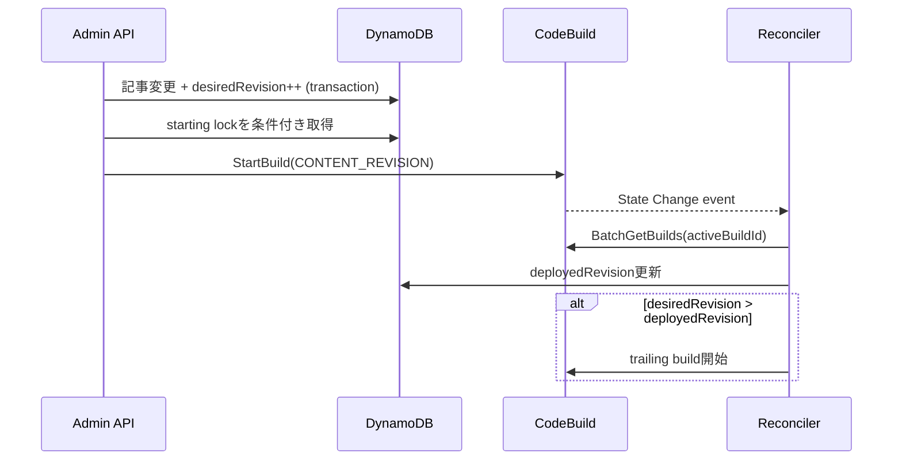

# 技術設計: 記事と公開サイトビルドの整合性

## 概要

BlogPostsテーブルに予約ID `__SITE_BUILD_STATE__` の制御項目を置き、記事変更と
`desiredRevision` の加算をDynamoDB transactionで一体化する。CodeBuildは一度に
1件だけ開始し、実行中の変更は `desiredRevision > activeRevision` として保持する。
完了照合Lambdaは成功したrevisionを `deployedRevision` へ反映し、差分が残れば
後続ビルドを開始する。



## 状態モデル

| 属性 | 意味 |
|---|---|
| `desiredRevision` | 記事変更transactionで単調増加する要求revision |
| `deployedRevision` | KVS昇格まで成功した最新revision |
| `activeRevision` | 現在開始中または実行中のrevision |
| `activeBuildId` | CodeBuild Build ID |
| `startToken` | StartBuildの冪等トークン |
| `status` | `queued`, `starting`, `in-progress`, `succeeded`, `failed` |
| `requestedAt/startedAt/completedAt` | 状態遷移時刻 |
| `lastError` | 直近失敗内容 |

## API契約

ビルド要求を伴う作成・更新レスポンスは従来の記事フィールドに次を追加する。

```json
{
  "siteBuild": {
    "targetRevision": 42,
    "buildId": "optional",
    "status": "queued"
  }
}
```

`GET /admin/posts/{id}/build-status?targetRevision=42` はDynamoDBの制御項目を読み、
`deployedRevision >= targetRevision` の場合だけ `succeeded` を返す。記事IDは既存API
互換性のため維持するが、相関キーには使用しない。

## 明示保存と自動保存

- `saveMode=manual`（省略時の既定）: category必須。公開サイトへ影響する場合はrevisionを作成する。
- `saveMode=autosave`: publishStatusを無視し、作成時はdraft固定。空categoryを省略し、更新時は既存値を維持する。

## 完了・補償経路

- EventBridge CodeBuild State Changeを低遅延経路とする。
- EventBridge targetはretry policyとSQS DLQを持つ。
- EventBridge Schedulerが5分間隔で同じLambdaを起動する。
- ReconcilerはDynamoDBのactiveBuildIdを正としてBatchGetBuildsし、イベント重複・順不同を無害化する。
- `starting` が5分以上継続した場合は同じStartBuild idempotency tokenで再開する。

## リスク

1. 記事用単一テーブルへ制御項目を置くため、Scanを追加する場合は予約ID除外が必要となる。現行記事一覧はGSI Queryのため影響しない。
2. 記事更新transaction成功後にStartBuildが失敗しても要求はqueued/failedとして残り、定期照合で再試行される。
3. 状態表示はポーリング方式で最大5秒程度の遅延がある。
4. S3/KVSの完全性はKVS atomic deploymentの成功をCodeBuild成功として扱う契約に依存する。
