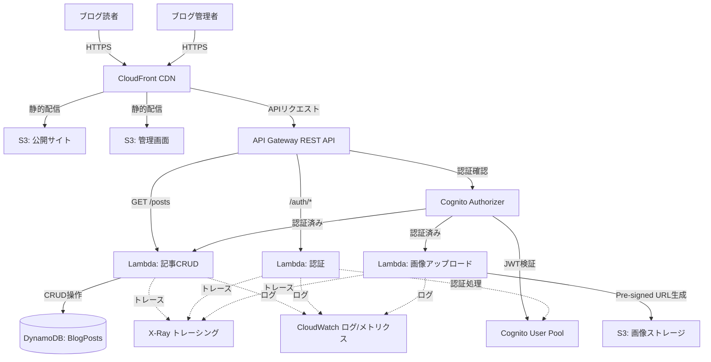
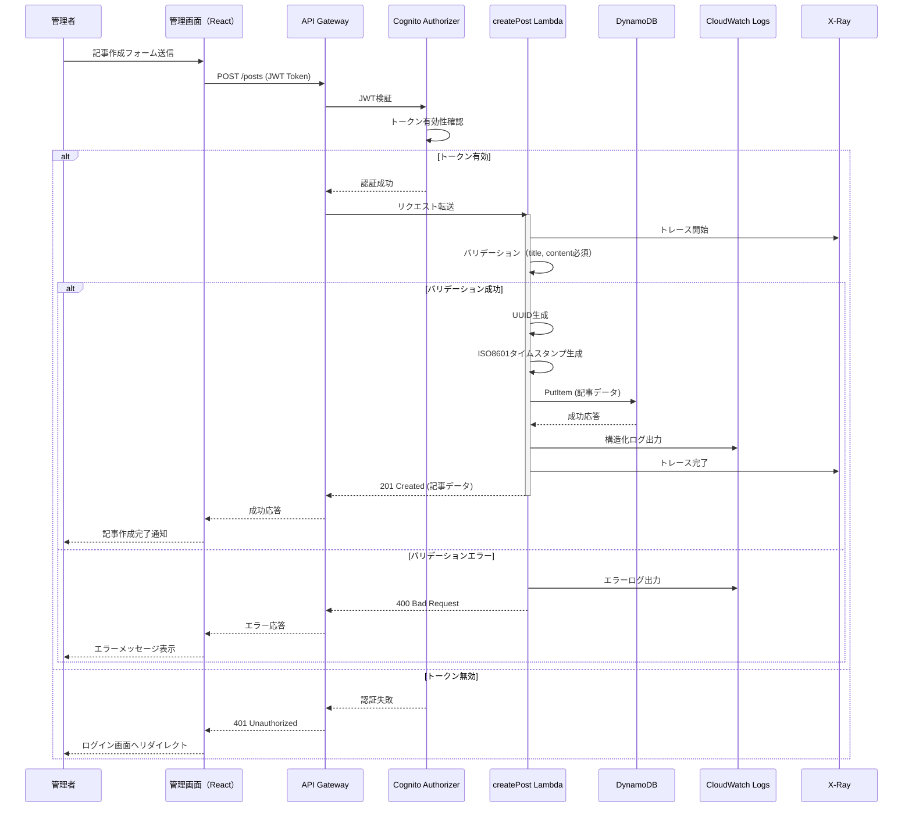
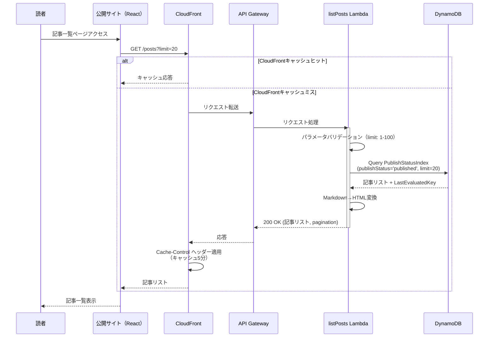
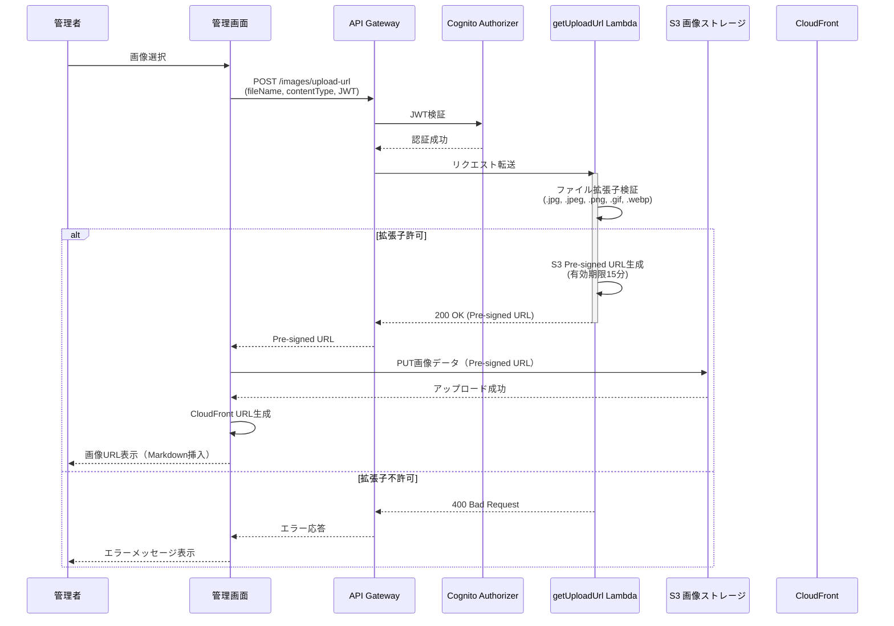
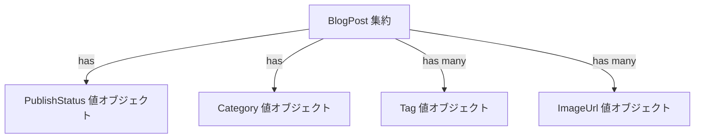
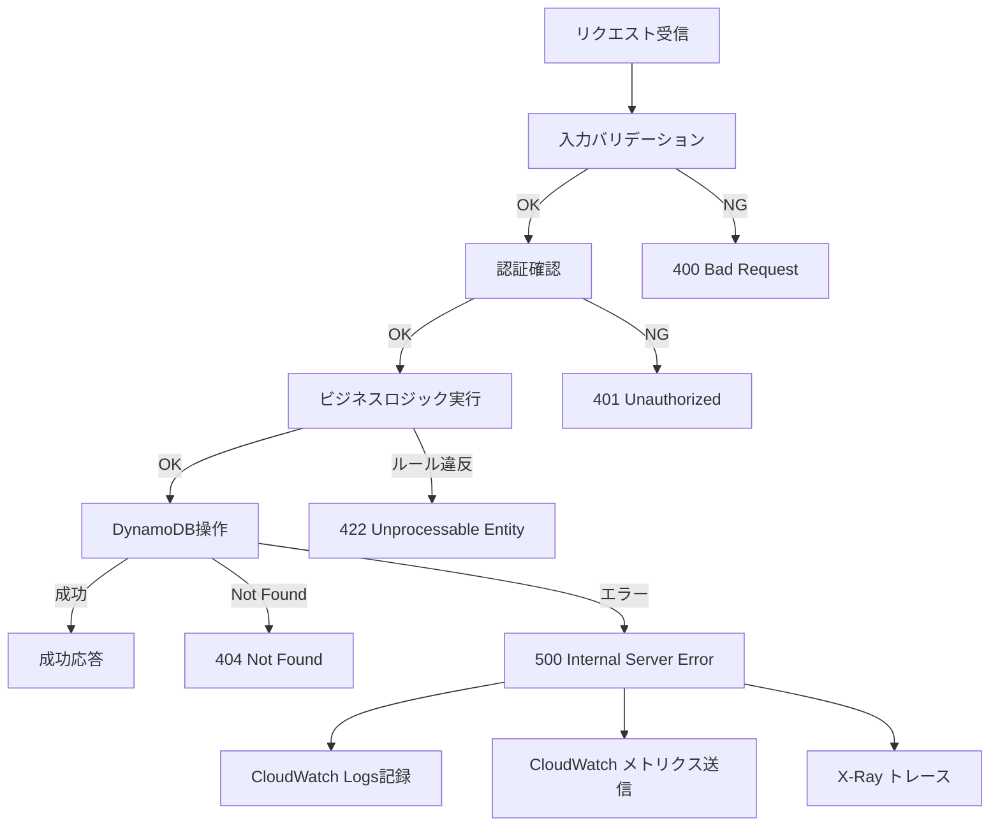

# 技術設計書

## 概要

**目的**: サーバーレスブログプラットフォームは、個人ブロガーや小規模メディア運営者が、インフラ管理の負担なく高品質なブログコンテンツを配信できる環境を提供する。AWS上で完全にサーバーレスアーキテクチャを用いて構築され、スケーラブルで費用対効果の高いブログシステムを実現する。

**ユーザー**:
- **ブログ管理者**: Cognito認証を通じて管理画面にログインし、Markdown形式で記事を作成・編集・公開する。画像をS3にアップロードし、記事に添付する。
- **ブログ読者**: 認証なしで公開ブログサイトにアクセスし、記事一覧・詳細を閲覧する。カテゴリ別フィルタリングとタグ検索で記事を探索する。

**影響**: ゼロからサーバーレスブログシステムを構築し、従来のサーバー管理型ブログプラットフォームから完全マネージドサービスベースのアーキテクチャへ移行する。

### 目標

- インフラ管理負荷ゼロのサーバーレスアーキテクチャ実現
- トラフィック変動に自動対応する弾力的スケーラビリティ
- 2秒以内のページロードと99.9%以上の可用性保証
- Markdownベースの記事執筆ワークフロー提供
- Infrastructure as Code（AWS CDK）による再現可能なデプロイメント
- 低トラフィック時の月額運用コスト50ドル未満

### 非目標

- コメント機能、ソーシャルシェア、全文検索（将来拡張として検討）
- 複数管理者による同時編集、承認ワークフロー
- 記事バージョン履歴管理（PITRバックアップのみ）
- マルチテナント対応
- リアルタイム通知、プッシュ通知

## アーキテクチャ

### 既存アーキテクチャ分析

本プロジェクトはグリーンフィールド（新規構築）であるため、既存システムとの統合は不要。ただし、以下のステアリングドキュメントで定義されたパターンに準拠する:

- **structure.md**: ディレクトリ構成（infrastructure/, layers/, functions/, frontend/, tests/）
- **tech.md**: 技術スタック（CDK Nag、Lambda Powertools、Node.js 22.x、TypeScript）
- **product.md**: サーバーレスファースト、低コスト運用、高可用性、スケーラビリティ

### ハイレベルアーキテクチャ



**アーキテクチャ統合**:

- **既存パターン保持**: ステアリングで定義されたサーバーレスパターン、CDKベストプラクティス、Lambda Powertools統合
- **新規コンポーネントの根拠**:
  - **CloudFront**: グローバルエッジロケーションでのキャッシングによる低レイテンシ配信
  - **Cognito User Pool**: サーバーレス認証サービスで管理負荷ゼロ、JWTトークン発行
  - **DynamoDB**: 自動スケーリング、マルチAZ冗長性、低レイテンシNoSQLデータベース
  - **Lambda**: イベント駆動コンピューティング、使用分のみ課金
- **技術スタック整合性**: すべてAWSマネージドサービス、ステアリング文書で推奨される技術
- **ステアリング準拠**: CDK Nag適用、Lambda Powertools必須実装、テストカバレッジ80%以上

### 技術スタックと設計判断

#### インフラストラクチャ層

**選定**: AWS CDK v2（TypeScript）

**根拠**:
- ステアリング文書で必須指定
- TypeScriptによる型安全性とIDEサポート
- CloudFormationよりも高レベルの抽象化と再利用可能なコンストラクト
- CDK Nagによるセキュリティ検証機能

**代替案**:
- Terraform: マルチクラウド対応だが、AWSマネージドサービスとの統合が弱い
- CloudFormation直接記述: 冗長でメンテナンス困難

#### コンピューティング層

**選定**: AWS Lambda + Node.js 22.x

**根拠**:
- サーバーレスファースト原則
- 自動スケーリング、高可用性
- 使用分のみ課金（コスト最適化）
- Lambda Powertools for TypeScriptの強力なサポート

**代替案**:
- Fargate: コンテナ管理が必要、コールドスタート問題、コスト高
- EC2: インフラ管理負荷、固定コスト

#### データベース層

**選定**: Amazon DynamoDB（オンデマンドモード）

**根拠**:
- サーバーレスアーキテクチャとの整合性
- 自動スケーリング、マルチAZ冗長性
- Global Secondary Indexes（GSI）による柔軟なクエリ
- オンデマンド課金でトラフィック変動に対応

**代替案**:
- Aurora Serverless: リレーショナルデータベースの複雑さ不要、コスト高
- RDS: 固定コスト、スケーリング遅延

#### 認証層

**選定**: Amazon Cognito User Pool

**根拠**:
- サーバーレス認証サービス
- JWT標準トークン発行
- MFA（多要素認証）サポート
- API Gateway統合が容易

**代替案**:
- Auth0: 外部SaaS依存、コスト高
- 自前実装: セキュリティリスク、開発負荷大

#### ストレージ層

**選定**: Amazon S3 + CloudFront

**根拠**:
- 高耐久性（11 9's）、低コスト
- 静的ウェブサイトホスティング機能
- CloudFront統合によるグローバル配信
- ライフサイクルポリシーで古いデータ低頻度アクセス層へ移行

**代替案**:
- EFS: コスト高、オーバーエンジニアリング

### 主要設計判断

#### 設計判断1: DynamoDB単一テーブル設計 vs 複数テーブル設計

**決定**: 単一テーブル（BlogPosts）+ 2つのGSI（CategoryIndex, PublishStatusIndex）

**コンテキスト**: 記事データを効率的にクエリするために、カテゴリ別・公開状態別のアクセスパターンをサポートする必要がある。

**代替案**:
1. **複数テーブル設計**: 記事テーブル、カテゴリテーブル、タグテーブルを分離
2. **単一テーブル設計（GSIなし）**: Scan操作に依存
3. **選択: 単一テーブル + GSI**: 記事データを1つのテーブルに集約し、GSIで効率的なクエリを実現

**選択アプローチ**:
- パーティションキー: `id`（UUID）
- GSI1: `CategoryIndex` - PK: `category`, SK: `createdAt`
- GSI2: `PublishStatusIndex` - PK: `publishStatus`, SK: `createdAt`

**根拠**:
- **パフォーマンス**: GSIによりQuery操作が可能、Scanを回避
- **コスト効率**: 単一テーブルでRCU/WCU最適化
- **シンプルさ**: データモデルの複雑さ低減、トランザクション不要

**トレードオフ**:
- **利点**: 低レイテンシクエリ、コスト最適化、シンプルなデータモデル
- **犠牲**: GSIの最終的整合性（強整合性が不要なユースケース）、複雑なクエリパターンには不向き

#### 設計判断2: Pre-signed URL方式 vs API経由アップロード

**決定**: Pre-signed URL方式で画像をS3に直接アップロード

**コンテキスト**: 管理者が記事に画像を添付する際、効率的かつセキュアなアップロード方法が必要。

**代替案**:
1. **API Gateway + Lambda経由**: 画像データをBase64エンコードしてLambdaに送信、LambdaからS3へアップロード
2. **選択: Pre-signed URL**: Lambda関数がPre-signed URLを生成し、クライアントが直接S3へアップロード

**選択アプローチ**:
- Lambda関数`getUploadUrl`がS3 Pre-signed URL（有効期限15分）を生成
- クライアントが生成されたURLへ直接PUT/POSTリクエスト
- アップロード完了後、画像URLを記事データに含める

**根拠**:
- **パフォーマンス**: Lambda関数を経由せず、S3へ直接アップロードで高速化
- **コスト**: Lambda実行時間短縮、データ転送コスト削減
- **スケーラビリティ**: Lambda同時実行数制限を回避

**トレードオフ**:
- **利点**: 高速、低コスト、スケーラブル
- **犠牲**: クライアント側でアップロードロジック実装が必要、エラーハンドリング複雑化

#### 設計判断3: マークダウンレンダリングタイミング

**決定**: サーバーサイド（Lambda）でMarkdown→HTML変換 + クライアントサイドキャッシュ

**コンテキスト**: 記事本文がMarkdown形式で保存されており、表示時にHTML変換が必要。

**代替案**:
1. **クライアントサイドレンダリング**: ブラウザでMarkdown→HTML変換
2. **選択: サーバーサイドレンダリング**: Lambda関数でMarkdown→HTML変換し、DOMPurifyでXSS対策

**選択アプローチ**:
- DynamoDBにMarkdownテキストを保存
- `getPost` Lambda関数で`marked`ライブラリによりMarkdown→HTML変換
- `DOMPurify`（サーバーサイド版: `isomorphic-dompurify`）でXSS対策
- HTML変換結果をCloudFrontでキャッシュ

**根拠**:
- **セキュリティ**: サーバーサイドでXSS対策を一元管理、クライアント側での脆弱性を回避
- **パフォーマンス**: CloudFrontキャッシュによりHTML変換処理を再実行しない
- **SEO**: サーバーサイドレンダリングでクローラーがHTML直接取得

**トレードオフ**:
- **利点**: セキュリティ強化、SEO最適化、パフォーマンス向上
- **犠牲**: Lambda関数の処理時間増加（初回アクセス時のみ）、Lambda Layerに変換ライブラリ追加

## システムフロー

### 記事作成フロー



### 記事一覧取得フロー



### 画像アップロードフロー



## 要件トレーサビリティ

| 要件 | 要件概要 | コンポーネント | インターフェース | フロー |
|------|----------|----------------|------------------|--------|
| 1 | 記事作成機能 | CreatePostHandler | POST /posts | 記事作成フロー |
| 2 | 記事下書き保存機能 | CreatePostHandler | POST /posts (publishStatus=draft) | 記事作成フロー |
| 3 | 記事公開機能 | UpdatePostHandler | PUT /posts/{id} (publishStatus=published) | - |
| 4 | 記事更新機能 | UpdatePostHandler | PUT /posts/{id} | - |
| 5 | 記事削除機能 | DeletePostHandler | DELETE /posts/{id} | - |
| 6 | 記事一覧取得機能 | ListPostsHandler | GET /posts | 記事一覧取得フロー |
| 7 | 記事詳細取得機能 | GetPostHandler | GET /posts/{id} | - |
| 8 | カテゴリ別記事一覧 | ListPostsHandler | GET /posts?category={category} | - |
| 9 | タグによる記事検索 | ListPostsHandler | GET /posts?tags={tag} | - |
| 10 | 画像アップロード機能 | GetUploadUrlHandler | POST /images/upload-url | 画像アップロードフロー |
| 11 | 画像CDN配信機能 | CloudFront, S3 | CloudFront Distribution | - |
| 12 | Markdownサポート機能 | MarkdownUtils（Common Layer） | markdownToHtml() | - |
| 13 | 管理者ログイン機能 | LoginHandler | POST /auth/login | - |
| 14 | セッション管理機能 | Cognito User Pool | JWT Token | - |
| 15 | 権限管理機能 | Cognito Authorizer | API Gateway Authorizer | - |
| 16 | DynamoDB永続化 | DatabaseStack | BlogPostsテーブル | - |
| 17 | GSI設計 | DatabaseStack | CategoryIndex, PublishStatusIndex | - |
| 18 | クエリ最適化 | DynamoDBUtils（Common Layer） | queryByCategory(), queryByPublishStatus() | - |
| 19 | S3画像ストレージ | StorageStack | 画像バケット | - |
| 20 | S3静的ホスティング | StorageStack | 公開サイトバケット, 管理画面バケット | - |
| 21 | RESTful API設計 | ApiStack | API Gateway REST API | - |
| 22 | CORS設定 | ApiStack | CORS設定 | - |
| 23 | Lambda関数デプロイ | ApiStack | Lambda Functions | - |
| 24 | Lambda Powertools統合 | すべてのLambda関数 | Logger, Tracer, Metrics | - |
| 25 | 環境変数管理 | ApiStack | Lambda環境変数 | - |
| 26 | IAM権限管理 | ApiStack | Lambda IAMロール | - |
| 27 | CloudWatch監視 | すべてのLambda関数 | CloudWatch Logs | - |
| 28 | X-Ray分散トレーシング | すべてのLambda関数 | X-Ray Tracing | - |
| 29 | ユニットテスト | tests/ | Jest テストスイート | - |
| 30 | 統合テスト | tests/ | API統合テスト | - |
| 31 | CI/CD | .github/workflows/ | test.yml, deploy-dev.yml, deploy-prd.yml | - |
| 32 | CDK Nagセキュリティ検証 | infrastructure/ | CDK Nag | - |
| 33 | 公開ブログサイト | frontend/public/ | React アプリケーション | - |
| 34 | 管理画面 | frontend/admin/ | React アプリケーション | - |
| 35 | SEO対応 | frontend/public/ | メタタグ, サイトマップ | - |
| 36 | スケーラビリティ | Lambda, DynamoDB | 自動スケーリング | - |
| 37 | 高可用性 | AWSマネージドサービス | マルチAZ | - |
| 38 | コスト最適化 | すべてのリソース | オンデマンド課金, ライフサイクルポリシー | - |

## コンポーネントとインターフェース

### インフラストラクチャ層

#### LayersStack

**責任と境界**
- **主要責任**: Lambda Layersの構築とバージョン管理
- **ドメイン境界**: インフラストラクチャ層
- **データ所有権**: Lambda Layer ARN
- **トランザクション境界**: なし（ビルド時処理）

**依存関係**
- **Inbound**: ApiStack（Layer ARNを参照）
- **Outbound**: なし
- **External**: npm（Layer依存パッケージ）

**契約定義**

**CDK コンストラクト出力**:

```typescript
interface LayersStackOutputs {
  powertoolsLayerArn: string;
  commonLayerArn: string;
}
```

- **Preconditions**: `layers/powertools/nodejs/package.json`および`layers/common/nodejs/package.json`が存在する
- **Postconditions**: Lambda LayerバージョンがCloudFormationスタックに作成される
- **Invariants**: Layer ARNはスタックライフサイクル中不変

#### DatabaseStack

**責任と境界**
- **主要責任**: DynamoDBテーブルとGSIの定義
- **ドメイン境界**: データ永続化層
- **データ所有権**: BlogPostsテーブル定義
- **トランザクション境界**: DynamoDBトランザクション（単一アイテム操作）

**依存関係**
- **Inbound**: ApiStack（テーブル名、ARNを参照）
- **Outbound**: なし
- **External**: なし

**契約定義**

**CDK コンストラクト出力**:

```typescript
interface DatabaseStackOutputs {
  blogPostsTableName: string;
  blogPostsTableArn: string;
}
```

**DynamoDBテーブル定義**:

| 項目 | 値 |
|------|-----|
| テーブル名 | BlogPosts |
| パーティションキー | id (String) |
| 課金モード | PAY_PER_REQUEST |
| ポイントインタイムリカバリ | 有効 |
| 暗号化 | AWS管理キー（SSE） |
| GSI1 | CategoryIndex (PK: category, SK: createdAt) |
| GSI2 | PublishStatusIndex (PK: publishStatus, SK: createdAt) |

- **Preconditions**: なし
- **Postconditions**: DynamoDBテーブルとGSIが作成される
- **Invariants**: テーブル名は環境間で一意

#### StorageStack

**責任と境界**
- **主要責任**: S3バケットの作成と設定
- **ドメイン境界**: ストレージ層
- **データ所有権**: 画像ストレージバケット、静的サイトバケット
- **トランザクション境界**: S3オブジェクト操作（Put/Get/Delete）

**依存関係**
- **Inbound**: ApiStack（バケット名、ARNを参照）
- **Outbound**: なし
- **External**: なし

**契約定義**

**CDK コンストラクト出力**:

```typescript
interface StorageStackOutputs {
  imageBucketName: string;
  imageBucketArn: string;
  publicSiteBucketName: string;
  adminSiteBucketName: string;
}
```

**S3バケット設定**:

| バケット | 用途 | バージョニング | 暗号化 | パブリックアクセスブロック |
|----------|------|----------------|--------|---------------------------|
| ImageBucket | 画像ストレージ | 有効 | SSE-S3 | 有効（OAI経由アクセス） |
| PublicSiteBucket | 公開サイトホスティング | 有効 | SSE-S3 | 有効（OAI経由アクセス） |
| AdminSiteBucket | 管理画面ホスティング | 有効 | SSE-S3 | 有効（OAI経由アクセス） |

- **Preconditions**: なし
- **Postconditions**: S3バケットが作成され、CloudFrontからアクセス可能
- **Invariants**: バケット名はグローバルに一意

#### AuthStack

**責任と境界**
- **主要責任**: Cognito User Poolとアプリクライアントの設定
- **ドメイン境界**: 認証認可層
- **データ所有権**: User Pool ID、User Pool Client ID
- **トランザクション境界**: Cognito認証トランザクション

**依存関係**
- **Inbound**: ApiStack（User Pool ARN、User Pool Client IDを参照）
- **Outbound**: なし
- **External**: なし

**契約定義**

**CDK コンストラクト出力**:

```typescript
interface AuthStackOutputs {
  userPoolId: string;
  userPoolArn: string;
  userPoolClientId: string;
}
```

**Cognito User Pool設定**:

| 項目 | 値 |
|------|-----|
| サインイン属性 | Email |
| パスワードポリシー | 最小8文字、大文字・小文字・数字・記号必須 |
| MFA | オプション（TOTP） |
| アカウント復旧 | Email検証 |
| トークン有効期限 | アクセストークン1時間、リフレッシュトークン30日 |

- **Preconditions**: なし
- **Postconditions**: User PoolとUser Pool Clientが作成される
- **Invariants**: User Pool IDはスタックライフサイクル中不変

#### ApiStack

**責任と境界**
- **主要責任**: API Gateway REST API、Lambda関数、統合設定
- **ドメイン境界**: API層
- **データ所有権**: API Gateway ID、Lambda関数ARN
- **トランザクション境界**: HTTPリクエスト/レスポンスサイクル

**依存関係**
- **Inbound**: フロントエンド（API Gateway URL）
- **Outbound**: LayersStack、DatabaseStack、StorageStack、AuthStack
- **External**: なし

**契約定義**

**API エンドポイント**:

| メソッド | エンドポイント | 認証 | Lambda関数 | 説明 |
|----------|----------------|------|------------|------|
| GET | /posts | なし | listPosts | 公開記事一覧取得 |
| GET | /posts/{id} | なし | getPost | 記事詳細取得 |
| POST | /posts | Cognito | createPost | 記事作成 |
| PUT | /posts/{id} | Cognito | updatePost | 記事更新 |
| DELETE | /posts/{id} | Cognito | deletePost | 記事削除 |
| POST | /auth/login | なし | login | ログイン |
| POST | /auth/logout | Cognito | logout | ログアウト |
| POST | /auth/refresh | なし | refresh | トークン更新 |
| POST | /images/upload-url | Cognito | getUploadUrl | Pre-signed URL生成 |

**CORS設定**:

```typescript
interface CorsConfig {
  allowOrigins: string[]; // ['https://blog.example.com', 'https://admin.example.com']
  allowMethods: string[]; // ['GET', 'POST', 'PUT', 'DELETE', 'OPTIONS']
  allowHeaders: string[]; // ['Content-Type', 'Authorization']
  maxAge: number; // 3600秒
}
```

- **Preconditions**: 依存スタック（Layers、Database、Storage、Auth）がデプロイ済み
- **Postconditions**: API GatewayとLambda関数が作成され、統合が完了
- **Invariants**: API Gatewayステージはデプロイメント中不変

### ビジネスロジック層

#### CreatePostHandler

**責任と境界**
- **主要責任**: 記事作成リクエストの処理、バリデーション、DynamoDB保存
- **ドメイン境界**: 記事管理ドメイン
- **データ所有権**: 記事作成トランザクション
- **トランザクション境界**: DynamoDB PutItem操作

**依存関係**
- **Inbound**: API Gateway POST /posts
- **Outbound**: DynamoDB BlogPostsテーブル、Common Layer（バリデーション、ユーティリティ）
- **External**: Lambda Powertools（Logger、Tracer、Metrics）

**契約定義**

**サービスインターフェース**:

```typescript
interface CreatePostRequest {
  title: string;
  content: string; // Markdown
  category?: string;
  tags?: string[];
  publishStatus: 'draft' | 'published';
  imageUrls?: string[];
}

interface CreatePostResponse {
  id: string;
  title: string;
  content: string;
  category?: string;
  tags?: string[];
  publishStatus: 'draft' | 'published';
  authorId: string;
  createdAt: string; // ISO8601
  updatedAt: string; // ISO8601
  publishedAt?: string; // ISO8601
  imageUrls?: string[];
}

interface CreatePostError {
  error: string;
  message: string;
  details?: Record<string, unknown>;
}

type CreatePostResult = CreatePostResponse | CreatePostError;
```

- **Preconditions**: リクエストボディに`title`と`content`が含まれる、JWTトークンが有効
- **Postconditions**: 記事がDynamoDBに保存され、201 Createdと記事データが返される
- **Invariants**: `id`はUUID v4形式、`createdAt`はISO8601形式

**エラー応答**:

| ステータスコード | エラー | 説明 |
|------------------|--------|------|
| 400 | ValidationError | タイトルまたは本文が空 |
| 401 | Unauthorized | JWTトークン無効 |
| 500 | InternalServerError | DynamoDB書き込みエラー |

#### GetPostHandler

**責任と境界**
- **主要責任**: 記事詳細取得、Markdown→HTML変換、XSS対策
- **ドメイン境界**: 記事管理ドメイン
- **データ所有権**: 記事詳細取得トランザクション
- **トランザクション境界**: DynamoDB GetItem操作

**依存関係**
- **Inbound**: API Gateway GET /posts/{id}
- **Outbound**: DynamoDB BlogPostsテーブル、Common Layer（MarkdownUtils）
- **External**: Lambda Powertools、`marked`、`isomorphic-dompurify`

**契約定義**

**サービスインターフェース**:

```typescript
interface GetPostRequest {
  id: string; // パスパラメータ
  authToken?: string; // オプション（下書き記事アクセス時必須）
}

interface GetPostResponse {
  id: string;
  title: string;
  contentHtml: string; // HTML変換済み
  category?: string;
  tags?: string[];
  publishStatus: 'draft' | 'published';
  authorId: string;
  createdAt: string;
  updatedAt: string;
  publishedAt?: string;
  imageUrls?: string[];
}

type GetPostResult = GetPostResponse | CreatePostError;
```

- **Preconditions**: パスパラメータ`id`が有効なUUID形式
- **Postconditions**: 記事データが返され、Markdown→HTML変換とXSS対策が完了
- **Invariants**: 下書き記事は認証済みユーザーのみアクセス可能

**エラー応答**:

| ステータスコード | エラー | 説明 |
|------------------|--------|------|
| 404 | NotFound | 記事が存在しない、または下書き記事に未認証アクセス |
| 500 | InternalServerError | DynamoDB読み取りエラー |

#### ListPostsHandler

**責任と境界**
- **主要責任**: 記事一覧取得、ページネーション、カテゴリ・タグフィルタリング
- **ドメイン境界**: 記事管理ドメイン
- **データ所有権**: 記事一覧取得トランザクション
- **トランザクション境界**: DynamoDB Query操作

**依存関係**
- **Inbound**: API Gateway GET /posts
- **Outbound**: DynamoDB BlogPostsテーブル（PublishStatusIndex、CategoryIndex）、Common Layer（DynamoDBUtils）
- **External**: Lambda Powertools

**契約定義**

**サービスインターフェース**:

```typescript
interface ListPostsRequest {
  limit?: number; // 1-100、デフォルト20
  lastEvaluatedKey?: string; // ページネーション用
  category?: string; // カテゴリフィルタ
  tags?: string[]; // タグフィルタ（OR条件）
}

interface ListPostsResponse {
  items: GetPostResponse[];
  lastEvaluatedKey?: string;
  count: number;
}

type ListPostsResult = ListPostsResponse | CreatePostError;
```

- **Preconditions**: `limit`は1-100の範囲、`publishStatus=published`のみ返す
- **Postconditions**: 記事リストがページネーション情報とともに返される
- **Invariants**: 記事は`createdAt`降順でソート

**クエリ最適化**:
- カテゴリフィルタ指定時: `CategoryIndex`を使用
- カテゴリフィルタなし: `PublishStatusIndex`を使用
- タグフィルタ: FilterExpression（GSIでは対応不可）

#### UpdatePostHandler

**責任と境界**
- **主要責任**: 記事更新、部分更新サポート、公開状態変更
- **ドメイン境界**: 記事管理ドメイン
- **データ所有権**: 記事更新トランザクション
- **トランザクション境界**: DynamoDB UpdateItem操作

**依存関係**
- **Inbound**: API Gateway PUT /posts/{id}
- **Outbound**: DynamoDB BlogPostsテーブル、Common Layer
- **External**: Lambda Powertools

**契約定義**

**サービスインターフェース**:

```typescript
interface UpdatePostRequest {
  id: string; // パスパラメータ
  title?: string;
  content?: string;
  category?: string;
  tags?: string[];
  publishStatus?: 'draft' | 'published';
  imageUrls?: string[];
}

type UpdatePostResult = GetPostResponse | CreatePostError;
```

- **Preconditions**: パスパラメータ`id`が有効、JWTトークンが有効、記事が存在
- **Postconditions**: 記事が更新され、`updatedAt`が現在時刻に更新される、`publishStatus`が"published"に変更された場合`publishedAt`が記録される
- **Invariants**: `createdAt`と`id`は変更不可

**エラー応答**:

| ステータスコード | エラー | 説明 |
|------------------|--------|------|
| 400 | ValidationError | 無効なフィールド値 |
| 401 | Unauthorized | JWTトークン無効 |
| 404 | NotFound | 記事が存在しない |
| 500 | InternalServerError | DynamoDB更新エラー |

#### DeletePostHandler

**責任と境界**
- **主要責任**: 記事削除、関連画像削除
- **ドメイン境界**: 記事管理ドメイン
- **データ所有権**: 記事削除トランザクション
- **トランザクション境界**: DynamoDB DeleteItem + S3 DeleteObjects

**依存関係**
- **Inbound**: API Gateway DELETE /posts/{id}
- **Outbound**: DynamoDB BlogPostsテーブル、S3 ImageBucket
- **External**: Lambda Powertools

**契約定義**

**サービスインターフェース**:

```typescript
interface DeletePostRequest {
  id: string; // パスパラメータ
}

interface DeletePostResponse {
  message: string;
  deletedId: string;
}

type DeletePostResult = DeletePostResponse | CreatePostError;
```

- **Preconditions**: パスパラメータ`id`が有効、JWTトークンが有効、記事が存在
- **Postconditions**: 記事がDynamoDBから削除され、関連画像がS3から削除される
- **Invariants**: トランザクション失敗時はロールバック不可（ベストエフォート）

**エラー応答**:

| ステータスコード | エラー | 説明 |
|------------------|--------|------|
| 401 | Unauthorized | JWTトークン無効 |
| 404 | NotFound | 記事が存在しない |
| 500 | InternalServerError | DynamoDB削除エラー |

#### GetUploadUrlHandler

**責任と境界**
- **主要責任**: S3 Pre-signed URL生成、ファイル拡張子検証
- **ドメイン境界**: 画像管理ドメイン
- **データ所有権**: Pre-signed URL生成トランザクション
- **トランザクション境界**: なし（URL生成のみ）

**依存関係**
- **Inbound**: API Gateway POST /images/upload-url
- **Outbound**: S3 ImageBucket
- **External**: Lambda Powertools、AWS SDK S3 Client

**外部依存調査**:
- **AWS SDK for JavaScript v3 - S3 Client**:
  - Pre-signed URLは`@aws-sdk/s3-request-presigner`パッケージの`getSignedUrl`関数を使用
  - 有効期限は秒単位で指定（15分 = 900秒）
  - アップロード用Pre-signed URLは`PutObjectCommand`と組み合わせて生成
  - 参考: https://docs.aws.amazon.com/AmazonS3/latest/userguide/PresignedUrlUploadObject.html

**契約定義**

**サービスインターフェース**:

```typescript
interface GetUploadUrlRequest {
  fileName: string;
  contentType: string;
}

interface GetUploadUrlResponse {
  uploadUrl: string; // Pre-signed URL
  imageUrl: string; // CloudFront URL
  expiresIn: number; // 秒単位（900秒）
}

type GetUploadUrlResult = GetUploadUrlResponse | CreatePostError;
```

- **Preconditions**: JWTトークンが有効、`fileName`の拡張子が許可リスト（.jpg, .jpeg, .png, .gif, .webp）に含まれる
- **Postconditions**: Pre-signed URLが生成され、15分間有効
- **Invariants**: URLは一度のみ使用可能

**エラー応答**:

| ステータスコード | エラー | 説明 |
|------------------|--------|------|
| 400 | ValidationError | 不許可の拡張子 |
| 401 | Unauthorized | JWTトークン無効 |
| 500 | InternalServerError | Pre-signed URL生成エラー |

#### LoginHandler

**責任と境界**
- **主要責任**: Cognito認証処理、JWTトークン発行
- **ドメイン境界**: 認証ドメイン
- **データ所有権**: 認証トランザクション
- **トランザクション境界**: Cognito認証API呼び出し

**依存関係**
- **Inbound**: API Gateway POST /auth/login
- **Outbound**: Cognito User Pool
- **External**: Lambda Powertools、AWS SDK Cognito Identity Provider

**外部依存調査**:
- **AWS SDK for JavaScript v3 - Cognito Identity Provider Client**:
  - `InitiateAuthCommand`を使用してユーザー認証
  - 認証フロー: `USER_PASSWORD_AUTH`
  - 成功時に`AuthenticationResult`（AccessToken、RefreshToken、IdToken）を返す
  - 参考: https://docs.aws.amazon.com/cognito/latest/developerguide/amazon-cognito-user-pools-authentication-flow.html

**契約定義**

**サービスインターフェース**:

```typescript
interface LoginRequest {
  email: string;
  password: string;
}

interface LoginResponse {
  accessToken: string; // JWT
  refreshToken: string;
  idToken: string;
  expiresIn: number; // 秒単位
}

type LoginResult = LoginResponse | CreatePostError;
```

- **Preconditions**: `email`と`password`が提供される
- **Postconditions**: 認証成功時、JWTトークンが返される
- **Invariants**: トークンは暗号化されたHTTPS経由で送信

**エラー応答**:

| ステータスコード | エラー | 説明 |
|------------------|--------|------|
| 401 | Unauthorized | 認証失敗（無効な認証情報） |
| 500 | InternalServerError | Cognito API エラー |

#### RefreshTokenHandler

**責任と境界**
- **主要責任**: リフレッシュトークンによる新しいアクセストークン発行
- **ドメイン境界**: 認証ドメイン
- **データ所有権**: トークン更新トランザクション
- **トランザクション境界**: Cognito認証API呼び出し

**依存関係**
- **Inbound**: API Gateway POST /auth/refresh
- **Outbound**: Cognito User Pool
- **External**: Lambda Powertools、AWS SDK Cognito Identity Provider

**契約定義**

**サービスインターフェース**:

```typescript
interface RefreshTokenRequest {
  refreshToken: string;
}

interface RefreshTokenResponse {
  accessToken: string;
  idToken: string;
  expiresIn: number;
}

type RefreshTokenResult = RefreshTokenResponse | CreatePostError;
```

- **Preconditions**: `refreshToken`が有効
- **Postconditions**: 新しいアクセストークンが発行される
- **Invariants**: リフレッシュトークンは有効期限30日

**エラー応答**:

| ステータスコード | エラー | 説明 |
|------------------|--------|------|
| 401 | Unauthorized | リフレッシュトークン無効または期限切れ |
| 500 | InternalServerError | Cognito API エラー |

### 共通ライブラリ層（Lambda Layers）

#### MarkdownUtils

**責任と境界**
- **主要責任**: Markdown→HTML変換、XSS対策（DOMPurify）、シンタックスハイライト
- **ドメイン境界**: ユーティリティ層
- **データ所有権**: なし（ステートレス）
- **トランザクション境界**: なし

**依存関係**
- **Inbound**: GetPostHandler、ListPostsHandler
- **Outbound**: なし
- **External**: `marked`、`isomorphic-dompurify`、`highlight.js`

**外部依存調査**:
- **marked**: Markdownパーサー、高速で拡張可能、v11.0.0以降推奨
  - 参考: https://marked.js.org/
- **isomorphic-dompurify**: サーバーサイド対応DOMPurify、XSS対策
  - 参考: https://github.com/kkomelin/isomorphic-dompurify
- **highlight.js**: シンタックスハイライト、200以上の言語サポート
  - 参考: https://highlightjs.org/

**契約定義**

**関数インターフェース**:

```typescript
interface MarkdownToHtmlOptions {
  enableSyntaxHighlight?: boolean; // デフォルト: true
  allowedTags?: string[]; // DOMPurify許可タグ
  sanitize?: boolean; // デフォルト: true
}

function markdownToHtml(
  markdown: string,
  options?: MarkdownToHtmlOptions
): string;
```

- **Preconditions**: `markdown`が文字列
- **Postconditions**: HTML文字列が返され、XSS対策が適用される
- **Invariants**: 危険なスクリプトタグは除去される

#### S3Utils

**責任と境界**
- **主要責任**: S3操作ヘルパー、Pre-signed URL生成、画像削除
- **ドメイン境界**: ユーティリティ層
- **データ所有権**: なし（ステートレス）
- **トランザクション境界**: S3操作

**依存関係**
- **Inbound**: GetUploadUrlHandler、DeletePostHandler
- **Outbound**: S3 ImageBucket
- **External**: AWS SDK S3 Client

**契約定義**

**関数インターフェース**:

```typescript
function generatePresignedUrl(
  bucketName: string,
  key: string,
  expiresIn: number // 秒単位
): Promise<string>;

function deleteObjects(
  bucketName: string,
  keys: string[]
): Promise<void>;

function getCloudFrontUrl(
  cloudFrontDomain: string,
  key: string
): string;
```

- **Preconditions**: `bucketName`と`key`が有効、`expiresIn`は正の整数
- **Postconditions**: Pre-signed URLまたはCloudFront URLが返される
- **Invariants**: URLはHTTPS

#### DynamoDBUtils

**責任と境界**
- **主要責任**: DynamoDB操作ヘルパー、Query/GetItem/PutItem/UpdateItem/DeleteItem
- **ドメイン境界**: ユーティリティ層
- **データ所有権**: なし（ステートレス）
- **トランザクション境界**: DynamoDB操作

**依存関係**
- **Inbound**: すべての記事管理Lambda関数
- **Outbound**: DynamoDB BlogPostsテーブル
- **External**: AWS SDK DynamoDB Client

**契約定義**

**関数インターフェース**:

```typescript
function queryByPublishStatus(
  tableName: string,
  publishStatus: 'draft' | 'published',
  limit?: number,
  lastEvaluatedKey?: Record<string, unknown>
): Promise<QueryResult>;

function queryByCategory(
  tableName: string,
  category: string,
  limit?: number,
  lastEvaluatedKey?: Record<string, unknown>
): Promise<QueryResult>;

interface QueryResult {
  items: Record<string, unknown>[];
  lastEvaluatedKey?: Record<string, unknown>;
  count: number;
}
```

- **Preconditions**: `tableName`が存在、`publishStatus`または`category`が有効
- **Postconditions**: クエリ結果とページネーション情報が返される
- **Invariants**: Query操作はGSIを使用、Scanは使用しない

## データモデル

### ドメインモデル

**コア概念**:

- **BlogPost（集約ルート）**: 記事エンティティ、ライフサイクル管理
- **PublishStatus（値オブジェクト）**: 公開状態（"draft" | "published"）
- **Category（値オブジェクト）**: カテゴリ名（文字列）
- **Tag（値オブジェクト）**: タグ名（文字列配列）
- **ImageUrl（値オブジェクト）**: 画像URL（文字列配列）

**ビジネスルールと不変条件**:

1. 記事は必ず`id`（UUID）、`title`、`content`、`publishStatus`、`authorId`、`createdAt`、`updatedAt`を持つ
2. `publishStatus`が"published"の場合、`publishedAt`が記録される
3. `createdAt`と`id`は作成後変更不可
4. タイトルと本文は空文字列不可（バリデーション）
5. カテゴリとタグはオプション、未指定の場合は空配列または未定義

**ドメイン図**:



### 物理データモデル（DynamoDB）

**BlogPostsテーブル定義**:

| 属性名 | データ型 | 説明 | 必須 |
|--------|----------|------|------|
| id | String (UUID) | パーティションキー、記事ID | ✓ |
| title | String | 記事タイトル | ✓ |
| content | String | 記事本文（Markdown） | ✓ |
| category | String | カテゴリ | × |
| tags | List<String> | タグ配列 | × |
| publishStatus | String | 公開状態（"draft" \| "published"） | ✓ |
| authorId | String | 著者ID（Cognito User Sub） | ✓ |
| createdAt | String (ISO8601) | 作成日時 | ✓ |
| updatedAt | String (ISO8601) | 更新日時 | ✓ |
| publishedAt | String (ISO8601) | 公開日時 | × |
| imageUrls | List<String> | 画像URL配列 | × |

**Global Secondary Indexes**:

**CategoryIndex**:
- **パーティションキー**: `category` (String)
- **ソートキー**: `createdAt` (String)
- **Projection**: ALL
- **用途**: カテゴリ別記事一覧取得（降順）

**PublishStatusIndex**:
- **パーティションキー**: `publishStatus` (String)
- **ソートキー**: `createdAt` (String)
- **Projection**: ALL
- **用途**: 公開/下書き記事一覧取得（降順）

**インデックス設計根拠**:
- `CategoryIndex`: カテゴリフィルタリングで頻繁に使用、Query操作が必要
- `PublishStatusIndex`: 公開記事一覧取得で必須、最も頻繁なアクセスパターン
- ソートキーに`createdAt`を使用: 新しい記事を優先表示

**アクセスパターンとクエリ最適化**:

| アクセスパターン | 使用インデックス | 操作 | 例 |
|------------------|------------------|------|-----|
| 記事詳細取得 | プライマリキー | GetItem | `id = "123e4567-e89b-12d3-a456-426614174000"` |
| 公開記事一覧 | PublishStatusIndex | Query | `publishStatus = "published"`, SK降順 |
| カテゴリ別記事 | CategoryIndex | Query | `category = "Technology"`, SK降順 |
| 下書き記事一覧 | PublishStatusIndex | Query | `publishStatus = "draft"`, SK降順 |
| タグ検索 | PublishStatusIndex + FilterExpression | Query + Filter | `publishStatus = "published"`, `tags CONTAINS "AWS"` |

**パフォーマンス考慮事項**:
- タグ検索はGSIでサポートできないため、FilterExpressionを使用（パフォーマンストレードオフ）
- 将来的にタグ専用GSIを検討（タグをパーティションキーに使用）
- ページネーション: `LastEvaluatedKey`を使用して効率的なページング

### データ契約とイベントスキーマ

**API リクエスト/レスポンススキーマ**:

すべてのAPIリクエスト/レスポンスはJSON形式、UTF-8エンコーディング。

**バリデーションルール**:
- `title`: 最大255文字、空文字列不可
- `content`: 最大65KB（DynamoDB制限）、空文字列不可
- `category`: 最大50文字、英数字とハイフンのみ
- `tags`: 最大10個、各タグ最大30文字
- `imageUrls`: 最大20個、各URL最大2048文字、HTTPS URLのみ

**スキーマバージョニング戦略**:
- APIバージョン: URLパスに含めない（将来的にv1、v2を検討）
- 後方互換性: 新しいフィールド追加は許可、既存フィールド削除は禁止
- ブレイキングチェンジ: 新しいAPIバージョンを作成

## エラーハンドリング

### エラー戦略

ブログプラットフォームでは、ユーザーエクスペリエンスを損なわないために、明確で実用的なエラーメッセージを提供し、可能な限りシステムの可用性を維持する。

**エラーカテゴリと応答戦略**:

#### ユーザーエラー（4xx）

**無効な入力（400 Bad Request）**:
- **トリガー**: タイトル/本文が空、不正なJSON、バリデーションエラー
- **応答**: フィールドレベルのバリデーションメッセージを返し、どのフィールドが問題かを明示
- **例**: `{"error": "ValidationError", "message": "Title is required", "details": {"field": "title"}}`

**未認証（401 Unauthorized）**:
- **トリガー**: JWTトークン無効、期限切れ、欠落
- **応答**: 認証ガイダンスを提供し、ログイン画面へリダイレクト
- **例**: `{"error": "Unauthorized", "message": "Invalid or expired token. Please login again."}`

**リソース不存在（404 Not Found）**:
- **トリガー**: 記事IDが存在しない、下書き記事への未認証アクセス
- **応答**: リソースが見つからない旨を通知、ナビゲーションヘルプを提供
- **例**: `{"error": "NotFound", "message": "Post not found or access denied."}`

#### システムエラー（5xx）

**インフラストラクチャ障害（500 Internal Server Error）**:
- **トリガー**: DynamoDB書き込みエラー、S3アクセスエラー、Cognito API エラー
- **応答**: グレースフルデグラデーション、ユーザーにはジェネリックエラーメッセージ、詳細はCloudWatch Logsに記録
- **例**: `{"error": "InternalServerError", "message": "An unexpected error occurred. Please try again later."}`

**タイムアウト（503 Service Unavailable）**:
- **トリガー**: Lambda関数タイムアウト、DynamoDBスロットリング
- **応答**: サーキットブレーカーパターン適用、リトライロジック実行（最大3回、エクスポネンシャルバックオフ）
- **例**: `{"error": "ServiceUnavailable", "message": "Service temporarily unavailable. Retrying..."}`

**リソース枯渇（429 Too Many Requests）**:
- **トリガー**: API Gatewayレート制限超過、Lambda同時実行数制限
- **応答**: レート制限警告、Retry-Afterヘッダー付き応答
- **例**: `{"error": "TooManyRequests", "message": "Rate limit exceeded. Retry after 60 seconds.", "retryAfter": 60}`

#### ビジネスロジックエラー（422 Unprocessable Entity）

**ルール違反（422 Unprocessable Entity）**:
- **トリガー**: 公開記事を再公開しようとする、削除済み記事の更新
- **応答**: ビジネスルール違反の理由を明示、遷移ガイダンスを提供
- **例**: `{"error": "BusinessRuleViolation", "message": "Cannot publish an already published post."}`

### エラーハンドリングフロー



### 監視とアラート

**エラートラッキング**:
- すべてのエラーはLambda Powertools Loggerで構造化ログとして記録
- エラーレベル: ERROR（5xx）、WARN（4xx）、INFO（正常処理）
- ログフォーマット: JSON、リクエストID、ユーザーID、エラースタックトレース含む

**CloudWatchメトリクス**:
- カスタムメトリクス: `ErrorCount`（エラー種別ごと）、`SuccessRate`、`Latency`
- Lambda標準メトリクス: 実行時間、エラー率、同時実行数、スロットル数

**CloudWatchアラーム**:
- エラー率 > 5%: SNS通知
- Lambda関数タイムアウト > 10回/5分: SNS通知
- DynamoDBスロットリング > 0: SNS通知

**ヘルスモニタリング**:
- API Gatewayヘルスチェック: CloudWatch Syntheticsによる定期的なエンドポイント監視（/posts）
- ダッシュボード: CloudWatchダッシュボードでリアルタイムメトリクス可視化

## テスト戦略

### ユニットテスト

**目的**: 個別の関数、ユーティリティ、ビジネスロジックの正確性を検証

**テストフレームワーク**: Jest

**対象コンポーネント**:

1. **Lambda関数ハンドラー**:
   - `createPost`: 記事作成ロジック、UUID生成、タイムスタンプ生成
   - `getPost`: Markdown→HTML変換、XSS対策、認証チェック
   - `listPosts`: ページネーションロジック、GSIクエリ選択
   - `updatePost`: 部分更新ロジック、`publishedAt`フィールド管理
   - `deletePost`: DynamoDB削除、S3画像削除

2. **共通ライブラリ（Lambda Layers）**:
   - `markdownUtils.markdownToHtml()`: Markdown→HTML変換、DOMPurify XSS対策
   - `s3Utils.generatePresignedUrl()`: Pre-signed URL生成、有効期限検証
   - `dynamodbUtils.queryByPublishStatus()`: GSIクエリ、ページネーションロジック

3. **CDKスタック**:
   - `LayersStack`: Lambda Layer ARN出力検証
   - `DatabaseStack`: DynamoDBテーブル、GSI存在検証
   - `StorageStack`: S3バケット設定検証
   - `AuthStack`: Cognito User Pool設定検証
   - `ApiStack`: API Gatewayエンドポイント、Lambda統合検証

**テスト戦略**:
- モック使用: AWS SDK（DynamoDB、S3、Cognito）をモック化
- テストカバレッジ: 80%以上維持
- AAA（Arrange-Act-Assert）パターン適用

**例（createPost Lambda関数）**:

```typescript
describe('createPostHandler', () => {
  it('should create a post with valid data', async () => {
    // Arrange
    const mockDynamoDBClient = mockClient(DynamoDBDocumentClient);
    mockDynamoDBClient.on(PutCommand).resolves({});
    const event = {
      body: JSON.stringify({
        title: 'Test Post',
        content: '# Hello World',
        publishStatus: 'draft'
      })
    };

    // Act
    const result = await handler(event);

    // Assert
    expect(result.statusCode).toBe(201);
    expect(JSON.parse(result.body)).toHaveProperty('id');
  });

  it('should return 400 when title is empty', async () => {
    // Test validation error
  });
});
```

### 統合テスト

**目的**: コンポーネント間の統合、API エンドポイント、DynamoDB/S3との実際の通信を検証

**テストフレームワーク**: Jest + AWS SDK（実際のAWSリソースを使用）

**対象フロー**:

1. **記事CRUD操作**:
   - POST /posts → DynamoDB PutItem → 201 Created
   - GET /posts → DynamoDB Query (PublishStatusIndex) → 200 OK
   - GET /posts/{id} → DynamoDB GetItem → Markdown→HTML変換 → 200 OK
   - PUT /posts/{id} → DynamoDB UpdateItem → 200 OK
   - DELETE /posts/{id} → DynamoDB DeleteItem + S3 DeleteObjects → 200 OK

2. **認証フロー**:
   - POST /auth/login → Cognito認証 → JWTトークン発行
   - POST /posts（認証あり） → Cognito Authorizer検証 → Lambda実行
   - POST /posts（認証なし） → 401 Unauthorized

3. **画像アップロード**:
   - POST /images/upload-url → Pre-signed URL生成 → 200 OK
   - PUT（Pre-signed URL） → S3アップロード成功

**テスト環境**: 開発環境（dev）スタック

**テストデータ**: テスト実行後にクリーンアップ（DynamoDB DeleteItem）

### E2Eテスト

**目的**: ユーザーシナリオ全体、フロントエンド→API→バックエンドのエンドツーエンド検証

**テストフレームワーク**: Playwright（ブラウザ自動化）

**対象シナリオ**:

1. **管理者ワークフロー**:
   - ログイン → ダッシュボード表示 → 記事作成 → プレビュー → 公開 → 記事一覧で確認

2. **読者ワークフロー**:
   - 公開サイトアクセス → 記事一覧表示 → カテゴリフィルタ → 記事詳細表示 → Markdown正常表示

3. **画像アップロードワークフロー**:
   - ログイン → 記事作成 → 画像選択 → アップロード → プレビューで画像表示 → 公開

**テスト環境**: ステージング環境（stg）または本番環境（prd）のクローン

### パフォーマンステスト

**目的**: 負荷時のシステムパフォーマンス、スケーラビリティ、レイテンシ検証

**テストツール**: Artillery（HTTP負荷テスト）

**対象メトリクス**:

1. **レイテンシ**:
   - GET /posts: p50 < 200ms、p95 < 500ms、p99 < 1s
   - GET /posts/{id}: p50 < 300ms、p95 < 700ms、p99 < 1.5s
   - POST /posts: p50 < 400ms、p95 < 1s、p99 < 2s

2. **スループット**:
   - 同時実行数100ユーザー: エラー率 < 1%
   - 同時実行数1000ユーザー: エラー率 < 5%

3. **スケーラビリティ**:
   - Lambda自動スケーリング: 1000同時実行まで対応
   - DynamoDBオンデマンドモード: スロットリングなし

**負荷シナリオ**:
- ランプアップ: 0 → 1000ユーザー（5分間）
- 持続負荷: 1000ユーザー（10分間）
- ランプダウン: 1000 → 0ユーザー（2分間）

## セキュリティ考慮事項

### 脅威モデリング

**脅威カテゴリ**:

1. **認証・認可の脆弱性**:
   - 脅威: 無効なJWTトークンで管理者機能へアクセス
   - 対策: Cognito Authorizer必須、トークン有効期限1時間、リフレッシュトークン30日

2. **インジェクション攻撃**:
   - 脅威: XSS攻撃（悪意のあるスクリプトをMarkdownに埋め込み）
   - 対策: DOMPurifyによるサーバーサイドHTML浄化、危険なタグ除去

3. **データ漏洩**:
   - 脅威: 下書き記事の不正アクセス、S3バケットの公開設定ミス
   - 対策: 下書き記事は認証必須、S3パブリックアクセスブロック有効、OAI経由アクセス

4. **DoS攻撃**:
   - 脅威: API Gatewayへの大量リクエストによるサービス停止
   - 対策: API Gatewayレート制限（1000リクエスト/秒）、Lambda予約同時実行数設定

### セキュリティコントロール

**認証・認可**:
- Cognito User Pool: メールアドレス + パスワード認証、MFA（TOTP）オプション
- JWT標準トークン: RS256アルゴリズム、署名検証
- API Gateway Cognito Authorizer: すべての管理者エンドポイント（POST/PUT/DELETE）に適用

**データ保護**:
- HTTPS通信強制: CloudFront、API Gateway、S3 Pre-signed URL
- 保管時暗号化: DynamoDB（AWS管理キー）、S3（SSE-S3）
- 転送中暗号化: TLS 1.2以上

**アクセス制御**:
- IAM最小権限の原則: Lambda関数ごとに必要な権限のみ付与
- S3バケットポリシー: OAI（Origin Access Identity）経由のみアクセス許可
- DynamoDBアクセス: Lambda関数のIAMロールで制御

**監査・コンプライアンス**:
- CloudTrail: すべてのAPI呼び出しログ記録
- CloudWatch Logs: Lambda関数ログ30日間保持
- X-Rayトレース: リクエストトレース90日間保持

**CDK Nagセキュリティ検証**:
- AWS Solutions Checksルールパック適用
- ビルド時にセキュリティ違反を検出、CI/CD失敗させる

## パフォーマンスとスケーラビリティ

### ターゲットメトリクス

| メトリクス | ターゲット値 | 測定方法 |
|------------|--------------|----------|
| ページロード時間（公開サイト） | < 2秒 | CloudWatch Synthetics、Lighthouse |
| API レイテンシ（GET /posts） | p95 < 500ms | CloudWatch メトリクス |
| API レイテンシ（POST /posts） | p95 < 1s | CloudWatch メトリクス |
| 可用性 | > 99.9% | CloudWatch Uptime |
| エラー率 | < 1% | CloudWatch メトリクス |

### スケーリングアプローチ

**水平スケーリング**:
- Lambda関数: 自動スケーリング（同時実行数1000まで）、予約同時実行数設定でコスト制御
- DynamoDB: オンデマンドモード、自動キャパシティ調整、スロットリングなし
- CloudFront: グローバルエッジロケーション、自動スケーリング

**垂直スケーリング**:
- Lambda関数メモリサイズ: 512MB（デフォルト）、パフォーマンス要件に応じて1024MB/2048MBに増加
- Lambda関数タイムアウト: 30秒（デフォルト）

### キャッシング戦略

**CloudFrontキャッシング**:
- 静的コンテンツ（HTML、CSS、JS、画像）: TTL 24時間
- APIレスポンス（GET /posts、GET /posts/{id}）: TTL 5分、Cache-Controlヘッダー適用
- キャッシュキー: URL + クエリパラメータ（category、limit）

**Lambda関数レベルキャッシング**:
- DynamoDB接続: コールド/ウォームスタート最適化、接続再利用
- Markdown→HTML変換結果: CloudFrontでキャッシュ（Lambda関数内キャッシュなし）

**最適化技術**:
- Gzip/Brotli圧縮: CloudFront自動適用
- 画像最適化: クライアントサイドでWebP形式推奨
- バンドルサイズ削減: Lambda Layersで共通ライブラリ共有、関数ごとのコードサイズ最小化
