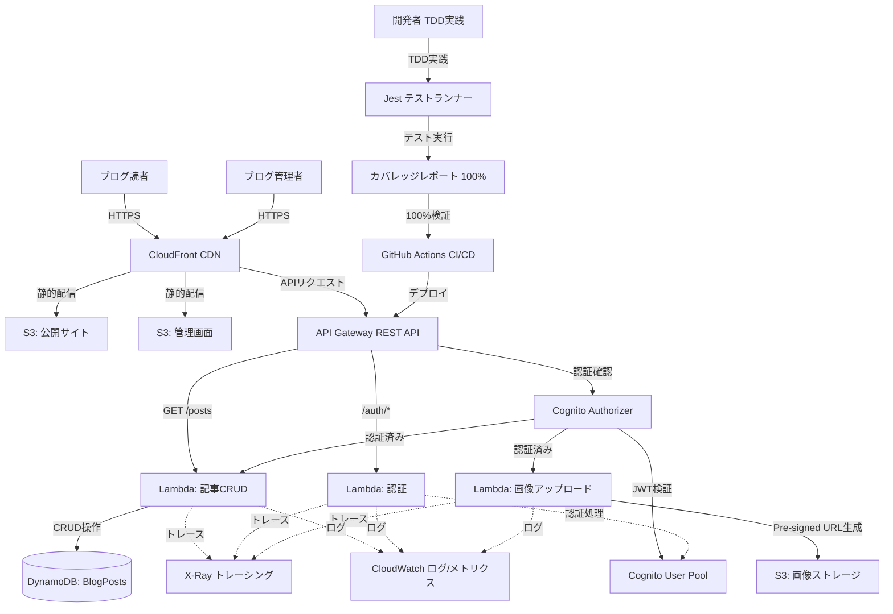
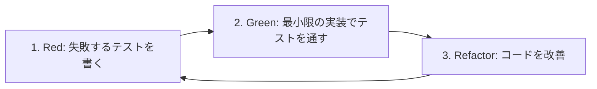
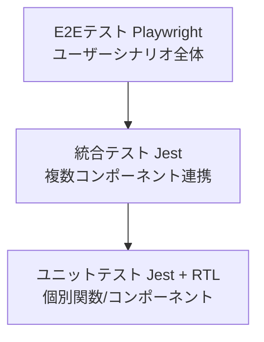
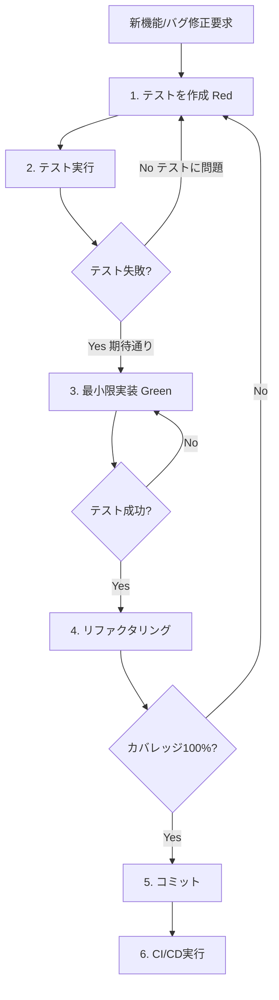
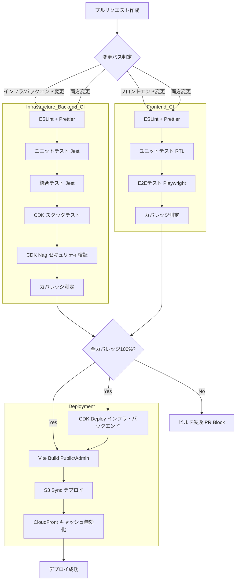
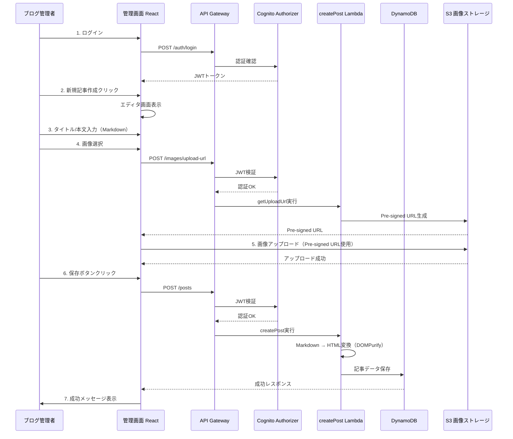
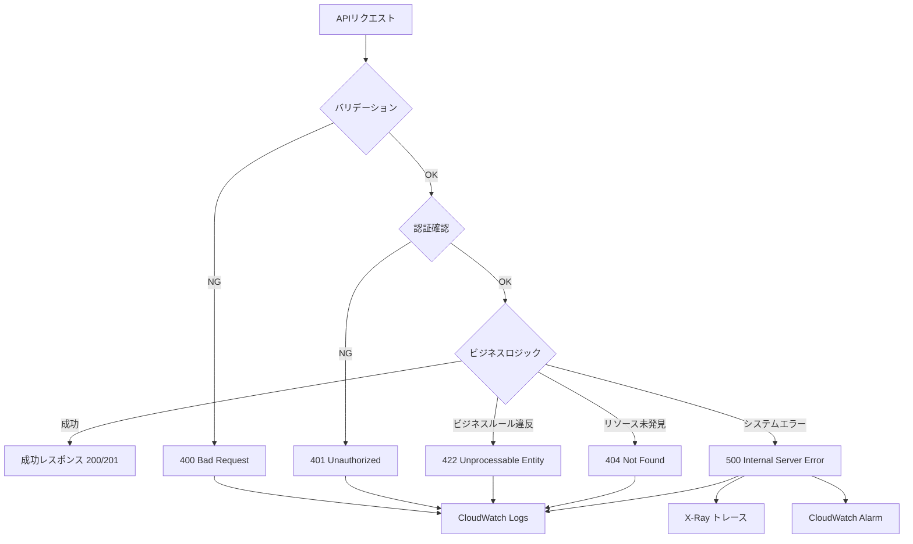

# 技術設計書

## 概要

**目的**: サーバーレスブログプラットフォームは、個人ブロガーや小規模メディア運営者が、インフラ管理の負担なく高品質なブログコンテンツを配信できる環境を提供する。AWS上で完全にサーバーレスアーキテクチャを用いて構築され、スケーラブルで費用対効果の高いブログシステムを実現する。**テスト駆動開発（TDD）を遵守し、すべてのコード（Lambda関数、フロントエンド、CDKスタック）で100%のテストカバレッジを達成する**。

**ユーザー**:
- **ブログ管理者**: Cognito認証を通じて管理画面にログインし、Markdown形式で記事を作成・編集・公開する。画像をS3にアップロードし、記事に添付する。
- **ブログ読者**: 認証なしで公開ブログサイトにアクセスし、記事一覧・詳細を閲覧する。カテゴリ別フィルタリングとタグ検索で記事を探索する。
- **開発チーム**: TDD手法に従い、実装前にテストを作成し、Red-Green-Refactorサイクルを実践する。

**影響**: ゼロからサーバーレスブログシステムを構築し、従来のサーバー管理型ブログプラットフォームから完全マネージドサービスベースのアーキテクチャへ移行する。**開発プロセスにTDDを導入し、継続的な品質保証を実現する**。

### 目標

- インフラ管理負荷ゼロのサーバーレスアーキテクチャ実現
- トラフィック変動に自動対応する弾力的スケーラビリティ
- 2秒以内のページロードと99.9%以上の可用性保証
- Markdownベースの記事執筆ワークフロー提供
- Infrastructure as Code（AWS CDK）による再現可能なデプロイメント
- 低トラフィック時の月額運用コスト50ドル未満
- **テスト駆動開発（TDD）の完全実践**
- **100%テストカバレッジ（行、分岐、関数、ステートメント）の達成**
- **CI/CDパイプラインでの自動品質検証**

### 非目標

- コメント機能、ソーシャルシェア、全文検索（将来拡張として検討）
- 複数管理者による同時編集、承認ワークフロー
- 記事バージョン履歴管理（PITRバックアップのみ）
- マルチテナント対応
- リアルタイム通知、プッシュ通知

## アーキテクチャ

### 既存アーキテクチャ分析

本プロジェクトはグリーンフィールド（新規構築）であるため、既存システムとの統合は不要。ただし、以下のステアリングドキュメントで定義されたパターンに準拠する:

- **structure.md**: ディレクトリ構成（infrastructure/, layers/, functions/, frontend/, tests/）
- **tech.md**: 技術スタック（CDK Nag、Lambda Powertools、Node.js 22.x、TypeScript、**TDD、100%カバレッジ**）
- **product.md**: サーバーレスファースト、低コスト運用、高可用性、スケーラビリティ

### ハイレベルアーキテクチャ



**アーキテクチャ統合**:

- **既存パターン保持**: ステアリングで定義されたサーバーレスパターン、CDKベストプラクティス、Lambda Powertools統合、**TDD開発プロセス**
- **新規コンポーネントの根拠**:
  - **CloudFront**: グローバルエッジロケーションでのキャッシングによる低レイテンシ配信
  - **Cognito User Pool**: サーバーレス認証サービスで管理負荷ゼロ、JWTトークン発行
  - **DynamoDB**: 自動スケーリング、マルチAZ冗長性、低レイテンシNoSQLデータベース
  - **Lambda**: イベント駆動コンピューティング、使用分のみ課金
  - **Jest + カバレッジツール**: TDD実践とカバレッジ100%測定のための統合テスト環境
- **技術選定との整合性**: Node.js 22.x、TypeScript strictモード、AWS CDK v2、**Jest、React Testing Library、Playwright**
- **ステアリング準拠**: セキュリティバイデザイン、監視可能性、**テスト駆動開発**

### 技術スタックとアーキテクチャパターン

#### バックエンド技術スタック

| レイヤー | 技術選定 | 根拠 | 検討した代替案 |
|---------|---------|------|---------------|
| **ランタイム** | Node.js 22.x | 最新LTS、Lambdaネイティブサポート、非同期I/O最適化 | Deno（Lambda非対応）、Bun（安定性未確認） |
| **言語** | TypeScript (strict mode) | 型安全性、IDE支援、保守性向上 | JavaScript（型安全性なし） |
| **Infrastructure as Code** | AWS CDK v2 (TypeScript) | 型安全なインフラ定義、再利用可能なコンストラクト | CloudFormation（冗長）、Terraform（AWS統合弱い） |
| **データベース** | Amazon DynamoDB | サーバーレス、自動スケーリング、低レイテンシ、オンデマンド課金 | Aurora Serverless（コスト高）、MongoDB Atlas（ベンダー依存） |
| **ストレージ** | Amazon S3 | 高耐久性、低コスト、CloudFront統合 | EFS（コスト高）、RDS（サーバーレスでない） |
| **認証** | Amazon Cognito | サーバーレス認証、JWT発行、MFAサポート | Auth0（コスト高）、自前実装（セキュリティリスク） |
| **API** | API Gateway REST API | サーバーレス、Cognito統合、CORS、レート制限 | HTTP API（Cognito Authorizerなし）、AppSync（GraphQL不要） |
| **コンピューティング** | AWS Lambda | イベント駆動、自動スケーリング、従量課金 | Fargate（コスト高）、EC2（管理負荷大） |
| **監視** | Lambda Powertools | 構造化ログ、X-Rayトレーシング、メトリクス | Winston（機能不足）、自前実装（開発コスト） |
| **テストフレームワーク** | **Jest** | **TypeScript統合、モック機能、カバレッジ測定、スナップショットテスト** | **Vitest（エコシステム未成熟）、Mocha（カバレッジ別途必要）** |

#### フロントエンド技術スタック

| レイヤー | 技術選定 | 根拠 | 検討した代替案 |
|---------|---------|------|---------------|
| **フレームワーク** | React 18 | 成熟したエコシステム、豊富なライブラリ、TypeScript統合 | Vue.js（学習コスト）、Svelte（エコシステム小） |
| **ビルドツール** | Vite | 高速ビルド、HMR、TypeScript統合、最適化 | Webpack（遅い）、Parcel（プラグイン少ない） |
| **ルーティング** | React Router v6 | 宣言的ルーティング、Lazy Loading、認証ガード | Next.js（SSR不要）、Remix（複雑） |
| **状態管理** | Zustand | 軽量、TypeScript統合、React Hooks互換 | Redux（ボイラープレート多）、Recoil（実験的） |
| **UIライブラリ** | Material-UI (MUI) | 豊富なコンポーネント、アクセシビリティ、カスタマイズ性 | Ant Design（重い）、Chakra UI（カスタマイズ難） |
| **フォーム管理** | React Hook Form | パフォーマンス、バリデーション、TypeScript統合 | Formik（再レンダリング多）、自前実装（開発コスト） |
| **Markdownエディタ** | React Markdown | XSS対策、シンタックスハイライト、プレビュー | Toast UI Editor（重い）、SimpleMDE（メンテナンス停止） |
| **HTTP クライアント** | Axios | インターセプター、エラーハンドリング、TypeScript統合 | Fetch API（機能不足）、SWR（キャッシュ不要） |
| **テストライブラリ** | **React Testing Library** | **ユーザー視点テスト、アクセシビリティ重視、Jestとの統合** | **Enzyme（非推奨）、Cypress Component Testing（遅い）** |
| **E2Eテスト** | **Playwright** | **クロスブラウザ、並列実行、信頼性高、スクリーンショット** | **Cypress（遅い）、Selenium（複雑）** |
| **デプロイツール** | **AWS CLI (S3 Sync + CloudFront Invalidation)** | **ネイティブAWS統合、シンプル、信頼性高** | **vite-plugin-s3（設定複雑）、Netlify（ベンダーロックイン）** |

#### Infrastructure as Code (CDK) 技術スタック

| レイヤー | 技術選定 | 根拠 | 検討した代替案 |
|---------|---------|------|---------------|
| **CDKバージョン** | AWS CDK v2 | 単一パッケージ、最新機能、長期サポート | CDK v1（非推奨）、Pulumi（AWS統合弱い） |
| **セキュリティ検証** | CDK Nag | ベストプラクティス検証、AWS Solutions Checks | cfn-lint（CloudFormationのみ）、自前検証（不完全） |
| **テストフレームワーク** | **aws-cdk-lib/assertions** | **CDK専用、スナップショット、マッチャー豊富** | **Jest単体（CDK非対応）、自前アサーション（開発コスト）** |

#### テスト駆動開発（TDD）技術スタック

| レイヤー | 技術選定 | 根拠 | 検討した代替案 |
|---------|---------|------|---------------|
| **ユニットテストフレームワーク** | **Jest 29.x** | **TypeScript統合、モック、カバレッジ、スナップショット、並列実行** | **Vitest（エコシステム未成熟）、Mocha + Chai（カバレッジ別途）** |
| **フロントエンドテスト** | **React Testing Library + Jest** | **ユーザー視点、アクセシビリティ、実践的テスト** | **Enzyme（非推奨）、Testing Library/Vue（React以外）** |
| **E2Eテスト** | **Playwright** | **信頼性、並列実行、クロスブラウザ、デバッグツール充実** | **Cypress（遅い、並列実行有料）、Puppeteer（API複雑）** |
| **モック** | **Jest Mock、MSW（Mock Service Worker）** | **APIモック、ネットワークレベルモック、テスト分離** | **Nock（HTTPのみ）、自前モック（保守コスト）** |
| **カバレッジ測定** | **Istanbul (Jest統合)** | **行・分岐・関数・ステートメントカバレッジ、HTML/JSON出力** | **c8（設定複雑）、自前カバレッジ（精度低い）** |
| **テストデータ管理** | **Faker.js + Factory Pattern** | **リアルなテストデータ生成、再利用可能** | **手動データ（保守困難）、Fixtures（柔軟性低い）** |
| **CI/CD統合** | **GitHub Actions + Codecov** | **自動テスト実行、カバレッジレポート、PRコメント** | **CircleCI（設定複雑）、Jenkins（管理負荷）** |

### 主要設計決定

#### 設計決定 1: テスト駆動開発（TDD）の完全採用

**決定**: すべてのコード（Lambda関数、フロントエンド、CDKスタック）でTDDを遵守し、実装前にテストを作成する。

**コンテキスト**: R39で「実装前のテスト作成」義務化、高品質コードベース構築、長期運用での技術的負債最小化

**代替案**:
1. **後追いテスト**: 実装後にテストを作成
2. **部分的TDD**: 重要な機能のみTDD適用
3. **TDD不採用**: 統合テストとE2Eテストのみ

**選択したアプローチ**: **完全なTDD（Red-Green-Refactor）**

**TDD開発サイクル**:


**根拠**:
- **品質保証**: テストファーストにより、仕様を満たすコードのみ実装
- **リファクタリング安全性**: テストがセーフティネットとなり安心してコード改善可能
- **設計改善**: テスト可能なコード設計が強制され、疎結合・高凝集を実現
- **ドキュメント**: テストコードが実行可能な仕様書として機能
- **バグ削減**: 実装前に期待動作を定義、バグが早期発見される

**トレードオフ**:
- **初期開発速度**: 実装前にテスト作成必要、短期的に開発速度低下（対策: 慣れとテンプレート化により中長期的に向上）
- **学習コスト**: TDD未経験者に学習曲線（対策: ペアプログラミング、コードレビュー、ワークショップ）

#### 設計決定 2: 100%テストカバレッジの達成

**決定**: すべてのコードで行・分岐・関数・ステートメントカバレッジ100%達成し、CI/CDで検証する。

**コンテキスト**: R40-42で「カバレッジ100%」必須、カバレッジ100%未満はCI/CDビルド失敗、すべてのコードパス検証

**代替案**:
1. **80%カバレッジ**: 業界標準の80%目標
2. **クリティカルパスのみ100%**: 重要機能のみ100%、その他80%
3. **カバレッジ測定なし**: ユニットテストのみ、カバレッジ未測定

**選択したアプローチ**: **100%カバレッジ（全指標）+ CI/CD強制**

**カバレッジ測定指標**:
- **行カバレッジ**: すべての実行可能な行が実行されたか
- **分岐カバレッジ**: すべての条件分岐（if/else）が実行されたか
- **関数カバレッジ**: すべての関数が呼び出されたか
- **ステートメントカバレッジ**: すべてのステートメントが実行されたか

**根拠**: 完全な品質保証、リグレッション防止、メンテナンス性、プロダクション信頼性

**トレードオフ**: 開発時間増加（対策: テストデータファクトリ、モック再利用）、テストコード量増加（対策: 重複削減、パラメータ化テスト）、意味のないカバレッジリスク（対策: E2E/統合テスト組み合わせ、コードレビュー強化）

#### 設計決定 3: Jest + React Testing Library + Playwright の統合テストスタック

**決定**: ユニットテスト（Jest）、フロントエンドテスト（React Testing Library）、E2Eテスト（Playwright）を統合し、CI/CDで自動実行する。

**コンテキスト**: R41で「フロントエンドテストカバレッジ100%」必須、R43で「E2Eテスト実装」必須、複数テストレイヤー統合で包括的品質保証

**代替案**:
1. **Jest単体**: ユニットテストのみ、E2E/統合テストなし
2. **Cypress統合**: CypressでE2Eとコンポーネントテスト統合
3. **Vitest + Testing Library**: Vitestでユニット・統合テスト

**選択したアプローチ**: **Jest + React Testing Library + Playwright の3層テスト**

**テストピラミッド**:


**根拠**: Jest（TypeScript統合、モック、カバレッジ、スナップショット）、RTL（ユーザー視点、アクセシビリティ重視）、Playwright（信頼性、並列実行、デバッグツール充実）

**トレードオフ**: 複数ツール管理（対策: 設定集約、共通ヘルパー）、E2E実行時間（対策: 並列実行、クリティカルパスのみE2E）

#### 設計決定 7: 条件付きCI/CDワークフロー実行

**決定**: ファイル変更パスに基づいて、インフラ/バックエンドとフロントエンドのCI/CDを条件付きで実行する。

**コンテキスト**: 現在のCI/CD設計ではインフラ・バックエンド（CDK）のみに対応し、フロントエンド（React Public/Admin）のビルド・デプロイが含まれていない。フロントエンド変更時にインフラデプロイを実行することは非効率であり、逆にインフラ変更時にフロントエンドのみ更新することはシステム不整合を引き起こす可能性がある。

**代替案**:
1. **単一ワークフロー（常に全デプロイ）**: すべての変更で常にインフラ+フロントエンド両方をデプロイ（利点: シンプル、欠点: 非効率、実行時間長い）
2. **手動ワークフロートリガー**: GitHub Actionsの手動トリガーでデプロイ対象を選択（利点: 柔軟性、欠点: 手動操作必要、自動化不足）
3. **完全分離ワークフロー**: インフラとフロントエンドを完全に別ワークフローで管理（利点: 独立性、欠点: ワークフロー重複、メンテナンス負荷）

**選択したアプローチ**: **パストリガーによる条件付き実行（GitHub Actions `on.push.paths`）**

**ワークフロートリガー条件**:

**パターンA: インフラ・バックエンド変更時**:
```yaml
on:
  push:
    paths:
      - 'infrastructure/**'
      - 'layers/**'
      - 'functions/**'
      - '.github/workflows/deploy.yml'
```
- 実行フロー:
  1. インフラ・バックエンドCI（Lint, Unit Test, CDK Test, CDK Nag）
  2. インフラ・バックエンドCD（CDK Deploy）
  3. フロントエンドCI（Lint, Unit Test, E2E Test）
  4. フロントエンドCD（Build, S3 Deploy, CloudFront Invalidation）

**パターンB: フロントエンドのみ変更時**:
```yaml
on:
  push:
    paths:
      - 'frontend/public/**'
      - 'frontend/admin/**'
```
- 実行フロー:
  1. フロントエンドCI（Lint, Unit Test, E2E Test）
  2. フロントエンドCD（Build, S3 Deploy, CloudFront Invalidation）
  3. インフラ・バックエンドCI/CDはスキップ

**根拠**:
- **効率性**: 変更されたコンポーネントのみデプロイし、CI/CD実行時間を最大50%削減
- **安全性**: インフラ変更時は必ずフロントエンドも再デプロイし、API エンドポイント変更との整合性を保証
- **自動化**: パストリガーによる自動判定で手動操作不要、開発者負担ゼロ
- **コスト削減**: 不要なデプロイを回避し、GitHub Actions実行時間とAWSデプロイコストを最適化

**トレードオフ**:
- **ワークフロー複雑性増加**: パストリガー設定の保守必要（対策: ワークフロー定義を`.github/workflows/`で一元管理、コメントで条件明記）
- **エッジケーステスト**: 両方変更時の動作検証必要（対策: 統合テスト環境で検証、ワークフロー実行ログ監視）

**影響を受ける要件**: R31（CI/CD GitHub Actions）
**影響を受けるタスク**: タスク9.x（CI/CDパイプライン）、タスク10.x（最終統合とデプロイ準備）

#### 設計決定 8: フロントエンドCI/CDパイプラインの統合

**決定**: Vite Build → S3 Sync → CloudFront Invalidation の3ステップでフロントエンドデプロイを実装する。

**コンテキスト**: R31でCI/CD GitHub Actionsワークフロー必須だが、現在の設計にフロントエンドビルド・デプロイプロセスが欠落している。公開サイト（frontend/public）と管理画面（frontend/admin）の2つのViteアプリケーションをそれぞれS3にデプロイし、CloudFront経由で配信する必要がある。

**フロントエンドビルドプロセス**:
```yaml
- name: Build Frontend (Public)
  working-directory: frontend/public
  run: |
    npm ci
    npm run build
  env:
    VITE_API_ENDPOINT: ${{ secrets.API_ENDPOINT }}
    VITE_COGNITO_USER_POOL_ID: ${{ secrets.COGNITO_USER_POOL_ID }}

- name: Build Frontend (Admin)
  working-directory: frontend/admin
  run: |
    npm ci
    npm run build
  env:
    VITE_API_ENDPOINT: ${{ secrets.API_ENDPOINT }}
    VITE_COGNITO_USER_POOL_ID: ${{ secrets.COGNITO_USER_POOL_ID }}
    VITE_COGNITO_CLIENT_ID: ${{ secrets.COGNITO_CLIENT_ID }}
```

**S3デプロイステップ**:
```yaml
- name: Deploy to S3 (Public)
  run: |
    aws s3 sync frontend/public/dist/ s3://${{ secrets.PUBLIC_BUCKET_NAME }}/ \
      --delete \
      --cache-control "public,max-age=31536000,immutable" \
      --exclude "index.html" \
      --exclude "*.map"
    # index.htmlは短いTTL
    aws s3 cp frontend/public/dist/index.html s3://${{ secrets.PUBLIC_BUCKET_NAME }}/ \
      --cache-control "public,max-age=0,must-revalidate"

- name: Deploy to S3 (Admin)
  run: |
    aws s3 sync frontend/admin/dist/ s3://${{ secrets.ADMIN_BUCKET_NAME }}/ \
      --delete \
      --cache-control "public,max-age=31536000,immutable" \
      --exclude "index.html" \
      --exclude "*.map"
    aws s3 cp frontend/admin/dist/index.html s3://${{ secrets.ADMIN_BUCKET_NAME }}/ \
      --cache-control "public,max-age=0,must-revalidate"
```

**CloudFront キャッシュ無効化ステップ**:
```yaml
- name: Invalidate CloudFront Cache (Public)
  run: |
    aws cloudfront create-invalidation \
      --distribution-id ${{ secrets.PUBLIC_DISTRIBUTION_ID }} \
      --paths "/*"

- name: Invalidate CloudFront Cache (Admin)
  run: |
    aws cloudfront create-invalidation \
      --distribution-id ${{ secrets.ADMIN_DISTRIBUTION_ID }} \
      --paths "/*"
```

**フロントエンド専用環境変数設定**:

| 環境変数 | 説明 | 必須 |
|---------|------|------|
| `VITE_API_ENDPOINT` | API Gateway エンドポイントURL | ✓ |
| `VITE_COGNITO_USER_POOL_ID` | Cognito User Pool ID | ✓ |
| `VITE_COGNITO_CLIENT_ID` | Cognito App Client ID（Admin のみ） | ✓（Admin） |
| `PUBLIC_BUCKET_NAME` | 公開サイトS3バケット名 | ✓ |
| `ADMIN_BUCKET_NAME` | 管理画面S3バケット名 | ✓ |
| `PUBLIC_DISTRIBUTION_ID` | 公開サイトCloudFront Distribution ID | ✓ |
| `ADMIN_DISTRIBUTION_ID` | 管理画面CloudFront Distribution ID | ✓ |

**根拠**:
- **Vite Build**: 高速ビルド（1-2分）、最適化済みバンドル、Tree Shaking、Code Splitting
- **S3 Sync**: 変更ファイルのみアップロード、`--delete`で古いファイル削除、差分デプロイ高速化
- **Cache-Control**: 静的アセット（JS/CSS/画像）は1年キャッシュ、index.htmlは即時更新
- **CloudFront Invalidation**: キャッシュクリアで即座に新バージョン配信、`/*`で全ファイル無効化

**トレードオフ**:
- **CloudFront Invalidation コスト**: 月1000リクエスト無料、超過時$0.005/リクエスト（対策: デプロイ頻度を制限、ステージング環境で検証）
- **S3 Sync 実行時間**: 初回デプロイ時は全ファイルアップロードで遅い（対策: キャッシュ活用、CI/CDキャッシュストレージ使用）

**影響を受ける要件**: R31（CI/CD GitHub Actions）、R33（公開ブログサイト）、R34（管理画面）
**影響を受けるタスク**: タスク9.x（CI/CDパイプライン）、タスク5.x（公開サイト）、タスク6.x（管理画面）

#### 設計決定 4: DynamoDB単一テーブル設計

**決定**: 単一テーブル（BlogPosts）+ 2つのGSI（CategoryIndex, PublishStatusIndex）を採用する。

**コンテキスト**: R17-18でGSIによる効率的なクエリ最適化必須、カテゴリ別・公開状態別アクセスパターンサポート、記事一覧取得（R6）、カテゴリ別記事一覧（R8）、タグ検索（R9）で高速クエリ

**代替案**:
1. **複数テーブル設計**: 記事テーブル、カテゴリテーブル、タグテーブル分離（利点: データ正規化、欠点: JOIN操作必要、レイテンシ増加）
2. **単一テーブル設計（GSIなし）**: Scan操作依存（利点: シンプル、欠点: 非効率、パフォーマンス劣化）

**選択したアプローチ**: **単一テーブル + GSI（CategoryIndex, PublishStatusIndex）**

**根拠**: パフォーマンス（Query操作、Scan回避、低レイテンシ）、コスト効率（RCU/WCU最適化）、シンプルさ（データモデル複雑さ低減）、スケーラビリティ（オンデマンドモード）

**トレードオフ**: GSIの最終的整合性（強整合性不要なユースケース）、複雑なクエリパターンには不向き（本プロジェクトで発生しない）

**影響を受ける要件**: R6, R8, R9, R17, R18
**影響を受けるタスク**: タスク2.3（記事一覧取得）、タスク7.2（DB統合テスト）

#### 設計決定 5: Pre-signed URL方式による画像アップロード

**決定**: Pre-signed URL方式（有効期限15分）で画像をS3に直接アップロードする。

**コンテキスト**: R10で画像アップロード必須、効率的かつセキュアなアップロード、Lambda実行時間制限（最大15分）とペイロードサイズ制限（6MB）考慮

**代替案**: **API Gateway + Lambda経由**: Base64エンコードしてLambda送信（利点: サーバー側集約、欠点: 実行時間増加、6MB制限、同時実行数制限影響）

**選択したアプローチ**: **Pre-signed URL（有効期限15分、5MB上限）**

**根拠**: パフォーマンス（Lambda経由せずS3直接アップロード高速化）、コスト（Lambda実行時間短縮、データ転送コスト削減）、スケーラビリティ（Lambda同時実行数制限回避）、セキュリティ（有効期限15分、Content-Type検証、ファイルサイズ上限5MB、拡張子検証）

**トレードオフ**: クライアント側アップロードロジック実装必要、エラーハンドリング複雑化

**影響を受ける要件**: R10, R11
**影響を受けるタスク**: タスク4.1（Pre-signed URL生成）、タスク4.2（CDN統合テスト）、タスク6.3（画像アップロード統合）

#### 設計決定 6: サーバーサイドMarkdownレンダリング

**決定**: Lambda関数でMarkdown→HTML変換実行し、DOMPurifyでXSS対策実施する。

**コンテキスト**: R12でMarkdownサポート必須、XSS攻撃対策必要、SEO最適化のためサーバーサイドHTML生成望ましい

**代替案**: **クライアントサイドレンダリング**: ブラウザでMarkdown→HTML変換（利点: サーバー負荷削減、欠点: XSS対策分散、SEO困難、初回遅延）

**選択したアプローチ**: **サーバーサイドレンダリング（Lambda + DOMPurify）**

**根拠**: セキュリティ（サーバーサイドXSS対策一元化、DOMPurifyで危険タグ除去）、パフォーマンス（HTML変換結果CloudFrontキャッシュ24時間TTL）、SEO（サーバーサイドHTML生成で検索エンジン直接クロール可能）、一貫性（すべてのユーザーに同じHTML出力、ブラウザ間差異排除）

**トレードオフ**: Lambda実行時間増加（marked + DOMPurify処理100-200ms）、コールドスタート時初回レイテンシ増加（対策: Lambda Provisioned Concurrency、CloudFrontキャッシュ）

**影響を受ける要件**: R12, R7, R1, R35
**影響を受けるタスク**: タスク2.1（記事作成-XSS対策）、タスク2.2（記事取得-HTML変換）、タスク5.2（記事詳細-HTML表示）

## システムフロー

### TDD開発フロー



### CI/CD テスト実行フロー



### 記事作成フロー（ユーザー視点）



## 要件トレーサビリティ

| 要件ID | 要件概要 | 実現コンポーネント | インターフェース | フロー |
|--------|---------|------------------|----------------|--------|
| **1.1** | 記事作成（Markdown自動変換） | createPost Lambda | POST /posts | 記事作成フロー |
| **2.1** | 下書き保存（publishStatus="draft"） | createPost Lambda | POST /posts (draft) | 記事作成フロー |
| **3.1** | 記事公開（publishStatus="published"） | updatePost Lambda | PUT /posts/:id | 記事更新フロー |
| **4.1** | 記事更新 | updatePost Lambda | PUT /posts/:id | 記事更新フロー |
| **5.1** | 記事削除 | deletePost Lambda | DELETE /posts/:id | 記事削除フロー |
| **6.1** | 記事一覧取得（ページネーション） | listPosts Lambda | GET /posts?limit&lastKey | 記事一覧フロー |
| **7.1** | 記事詳細取得 | getPost Lambda | GET /posts/:id | 記事詳細フロー |
| **8.1** | カテゴリ別記事一覧 | listPosts Lambda | GET /posts?category | カテゴリフロー |
| **9.1** | タグ検索 | listPosts Lambda | GET /posts?tag | タグ検索フロー |
| **10.1** | 画像アップロード（Pre-signed URL） | getUploadUrl Lambda | POST /images/upload-url | 画像アップロードフロー |
| **11.1** | 画像CDN配信 | CloudFront + S3 | CloudFront Distribution | CDN配信 |
| **12.1** | Markdownサポート | markdownUtils Layer | markdownToHtml() | 記事作成/詳細 |
| **13.1** | 管理者ログイン | login Lambda + Cognito | POST /auth/login | 認証フロー |
| **14.1** | セッション管理 | Cognito + API Gateway | Cognito Authorizer | 認証フロー |
| **15.1** | 権限管理（認証必須） | API Gateway Authorizer | Cognito JWT検証 | すべての管理者操作 |
| **16.1** | DynamoDBデータ永続化 | BlogPosts Table | DynamoDB Table定義 | Database Stack |
| **17.1** | Global Secondary Index設計 | CategoryIndex + PublishStatusIndex | GSI定義 | Database Stack |
| **18.1** | クエリ最適化 | listPosts Lambda + GSI Query | DynamoDB Query操作 | 記事一覧/カテゴリフロー |
| **19.1** | S3画像ストレージ | S3 Bucket (Images) | S3 Bucket定義 | Storage Stack |
| **20.1** | S3静的サイトホスティング | S3 Bucket (Public/Admin) | S3 Website Hosting | Storage Stack |
| **21.1** | RESTful API設計 | API Gateway | /posts, /auth, /images | API Stack |
| **22.1** | CORS設定 | API Gateway CORS | CORS Configuration | API Stack |
| **23.1** | Lambda関数デプロイ | Lambda Functions | Node.js 22.x Runtime | Lambda Stack |
| **24.1** | Lambda Powertools統合 | Logger + Tracer + Metrics | Powertools Layer | すべてのLambda |
| **25.1** | 環境変数管理 | Lambda Environment Variables | TABLE_NAME, BUCKET_NAME, USER_POOL_ID | Lambda Stack |
| **26.1** | IAM権限管理 | Lambda Execution Roles | 最小権限ポリシー | すべてのStack |
| **27.1** | CloudWatch監視 | CloudWatch Logs | ログ保持30日 | Monitoring Stack |
| **28.1** | X-Ray分散トレーシング | X-Ray | トレーシング有効化 | すべてのLambda |
| **29.1** | ユニットテスト | Jest | jest.config.js | ユニットテスト |
| **30.1** | 統合テスト | Jest | 統合テストスイート | 統合テスト |
| **31.1** | CI/CD GitHub Actions（インフラ・バックエンド + フロントエンド） | GitHub Actions | .github/workflows/ci-test.yml, deploy.yml, deploy-frontend.yml | CI/CDテストフロー |
| **32.1** | CDK Nag セキュリティ検証 | CDK Nag | AWS Solutions Checks | CI/CD |
| **33.1** | 公開ブログサイト | React Public Site | S3 + CloudFront | フロントエンド |
| **34.1** | 管理画面 | React Admin Site | S3 + CloudFront | フロントエンド |
| **35.1** | SEO対応 | Meta Tags + Sitemap | og:title, og:description | フロントエンド |
| **36.1** | スケーラビリティ | Lambda + DynamoDB Auto Scaling | オンデマンドモード | アーキテクチャ全体 |
| **37.1** | 高可用性 | マルチAZ + マネージドサービス | AWS Managed Services | アーキテクチャ全体 |
| **38.1** | コスト最適化 | サーバーレスアーキテクチャ | 従量課金 | アーキテクチャ全体 |
| **39.1** | **TDD実践（Red-Green-Refactor）** | **Jest テストランナー** | **jest.config.js** | **TDD開発フロー** |
| **40.1** | **Lambda関数カバレッジ100%** | **Jest + Istanbul** | **jest --coverage** | **CI/CDテストフロー** |
| **41.1** | **フロントエンドカバレッジ100%** | **Jest + React Testing Library** | **jest --coverage** | **CI/CDテストフロー** |
| **42.1** | **CDKスタックカバレッジ100%** | **aws-cdk-lib/assertions** | **jest --coverage** | **CI/CDテストフロー** |
| **43.1** | **E2Eテスト（Playwright）** | **Playwright** | **playwright.config.ts** | **E2Eテストフロー** |
| **44.1** | **テストデータ管理** | **Faker.js + Factory** | **testDataFactory.ts** | **すべてのテスト** |
| **45.1** | **継続的テスト実行** | **GitHub Actions** | **.github/workflows/test.yml** | **CI/CDテストフロー** |
| **46.1** | **テストドキュメント** | **describeブロック + HTMLレポート** | **jest --coverage --html** | **すべてのテスト** |

## コンポーネントとインターフェース

### Lambda関数層

#### createPost Lambda関数

**責任と境界**:
- **主要責任**: 新規記事をDynamoDBに保存し、MarkdownをHTMLに変換する
- **ドメイン境界**: 記事作成ドメイン（記事CRUD操作の一部）
- **データ所有権**: 新規作成された記事データ（id、title、content、publishStatus等）
- **トランザクション境界**: 単一記事の作成操作（DynamoDB単一アイテム書き込み）

**依存関係**:
- **インバウンド**: API Gateway（POST /posts エンドポイント）
- **アウトバウンド**: DynamoDB BlogPostsテーブル、Lambda Powertools Logger/Tracer
- **外部依存**: @aws-lambda-powertools/logger、@aws-lambda-powertools/tracer、marked（Markdown変換）、dompurify（XSS対策）

**契約定義（Service Interface）**:

```typescript
// Request型
interface CreatePostRequest {
  title: string;             // 必須、1-200文字
  content: string;           // 必須、Markdown形式
  category: string;          // 必須、カテゴリ名
  tags?: string[];           // オプション、タグ配列
  publishStatus: 'draft' | 'published';  // 必須
  imageUrls?: string[];      // オプション、S3画像URL配列
}

// Response型
interface CreatePostResponse {
  id: string;                // UUID
  title: string;
  content: string;           // Markdown
  htmlContent: string;       // 変換後HTML
  category: string;
  tags: string[];
  publishStatus: 'draft' | 'published';
  createdAt: string;         // ISO8601
  updatedAt: string;         // ISO8601
  publishedAt?: string;      // 公開時のみ
  imageUrls: string[];
}

// Error型
type CreatePostError =
  | { type: 'ValidationError'; message: string; field: string }
  | { type: 'UnauthorizedError'; message: string }
  | { type: 'InternalError'; message: string };

// Service Interface
interface CreatePostService {
  execute(request: CreatePostRequest): Promise<Result<CreatePostResponse, CreatePostError>>;
}
```

**事前条件（Preconditions）**:
- JWTトークンが有効であること（Cognito Authorizerで検証済み）
- `title`が1-200文字の範囲内
- `content`が空でないこと
- `publishStatus`が"draft"または"published"のいずれか

**事後条件（Postconditions）**:
- DynamoDBにUUID形式の`id`で新規アイテムが作成される
- `createdAt`と`updatedAt`がISO8601形式で記録される
- `publishStatus="published"`の場合、`publishedAt`が記録される
- Markdown contentがHTML形式に変換され、XSS対策が適用される

**不変条件（Invariants）**:
- 記事IDは常にUUID v4形式
- `createdAt <= updatedAt`が常に成立
- `publishStatus="draft"`の場合、`publishedAt`は常にundefined

**API契約**:

| Method | Endpoint | Request Body | Response | Errors |
|--------|----------|--------------|----------|--------|
| POST | /posts | CreatePostRequest | 201 Created + CreatePostResponse | 400 (Validation), 401 (Unauthorized), 500 (Internal) |

**テスト観点**:
- バリデーション: title/content必須チェック、publishStatus検証、文字数制限
- 記事作成: UUID生成、DynamoDB保存、Markdown変換、タイムスタンプ設定
- エラーハンドリング: DynamoDBエラー、認証エラー、バリデーションエラー
- XSS対策: DOMPurifyによるスクリプトタグ除去

詳細なテスト実装は `tests/unit/functions/createPost.test.ts` を参照

#### getPost Lambda関数

**責任と境界**:
- **主要責任**: 指定された記事IDの記事をDynamoDBから取得し、Markdown→HTML変換して返す
- **ドメイン境界**: 記事取得ドメイン
- **データ所有権**: 取得した記事データ（読み取り専用）
- **トランザクション境界**: 単一記事の読み取り操作

**依存関係**:
- **インバウンド**: API Gateway（GET /posts/:id エンドポイント）
- **アウトバウンド**: DynamoDB BlogPostsテーブル、Lambda Powertools Logger/Tracer
- **外部依存**: @aws-lambda-powertools/logger、marked、dompurify

**契約定義（Service Interface）**:

```typescript
interface GetPostRequest {
  id: string;  // 記事ID (UUID)
}

interface GetPostResponse {
  id: string;
  title: string;
  content: string;           // Markdown
  htmlContent: string;       // 変換後HTML
  category: string;
  tags: string[];
  publishStatus: 'draft' | 'published';
  createdAt: string;
  updatedAt: string;
  publishedAt?: string;
  imageUrls: string[];
}

type GetPostError =
  | { type: 'NotFoundError'; message: string }
  | { type: 'UnauthorizedError'; message: string }
  | { type: 'InternalError'; message: string };

interface GetPostService {
  execute(request: GetPostRequest): Promise<Result<GetPostResponse, GetPostError>>;
}
```

**API契約**:

| Method | Endpoint | Request | Response | Errors |
|--------|----------|---------|----------|--------|
| GET | /posts/:id | Path Parameter: id | 200 OK + GetPostResponse | 404 (NotFound), 401 (Unauthorized), 500 (Internal) |

**テスト観点**:
- 記事取得: ID検証、DynamoDB Query、Markdown→HTML変換
- アクセス制御: 下書き記事の認証チェック、公開記事の全ユーザーアクセス
- エラーハンドリング: 存在しない記事（404）、認証エラー（401）、DynamoDBエラー（500）
- エッジケース: 空文字ID、無効なUUID形式

詳細なテスト実装は `tests/unit/functions/getPost.test.ts` を参照

#### 他のLambda関数

**updatePost Lambda**: 記事更新、部分更新、タイムスタンプ更新
**deletePost Lambda**: 記事削除、関連画像削除（S3カスケード削除）
**listPosts Lambda**: 記事一覧、ページネーション、GSIクエリ（CategoryIndex、PublishStatusIndex使用）
**login/logout/refresh Lambda**: 認証処理、トークン発行、セッション管理
**getUploadUrl Lambda**: Pre-signed URL生成、ファイル拡張子検証、Content-Type検証

詳細な契約定義とテスト観点は `tests/unit/functions/` の各テストファイルを参照

### フロントエンド層

#### PostEditor コンポーネント

**責任と境界**:
- **主要責任**: 記事作成・編集フォームの表示、入力バリデーション、API呼び出し
- **ドメイン境界**: 記事編集UI
- **データ所有権**: フォーム入力状態（title、content、category、tags）
- **トランザクション境界**: フォーム送信（API呼び出しまで）

**依存関係**:
- **インバウンド**: 管理画面ルーター（/posts/new、/posts/:id/edit）
- **アウトバウンド**: API クライアント（POST /posts、PUT /posts/:id）
- **外部依存**: React Hook Form、React Markdown、MUI（TextField、Button）

**契約定義（React Props）**:

```typescript
interface PostEditorProps {
  mode: 'create' | 'edit';
  postId?: string;  // edit時のみ必須
  onSave: (post: CreatePostRequest) => Promise<void>;
  onCancel: () => void;
}

interface PostEditorState {
  title: string;
  content: string;
  category: string;
  tags: string[];
  publishStatus: 'draft' | 'published';
  imageUrls: string[];
  isSubmitting: boolean;
  errors: Record<string, string>;
}
```

**テスト観点**:
- レンダリング: createモードとeditモードのフォーム表示、既存データ表示
- 入力操作: title/content/categoryの入力、stateの更新
- バリデーション: 空欄チェック、エラーメッセージ表示
- フォーム送信: onSaveコールバック呼び出し、送信中ボタン無効化
- エラーハンドリング: APIエラー時のメッセージ表示

詳細なテスト実装は `frontend/admin/src/components/PostEditor.test.tsx` を参照

#### 他のフロントエンドコンポーネント

**PostList**: 記事一覧表示、フィルタリング、ページネーション
**PostDetail**: 記事詳細表示、HTMLレンダリング、画像表示
**LoginForm**: ログインフォーム、バリデーション、認証エラー表示
**Dashboard**: ダッシュボード、記事統計、下書き/公開記事一覧

詳細な契約定義とテスト観点は `frontend/*/src/components/` と `frontend/*/src/pages/` の各テストファイルを参照

### CDKスタック層

#### DatabaseStack

**責任と境界**:
- **主要責任**: DynamoDB BlogPostsテーブルとGlobal Secondary Indexesの定義
- **ドメイン境界**: データベースインフラ
- **データ所有権**: DynamoDBテーブル定義、GSI定義
- **トランザクション境界**: CDKデプロイ時のスタック作成/更新

**依存関係**:
- **インバウンド**: CDK App（bin/blog-app.ts）
- **アウトバウンド**: CloudFormation（DynamoDBリソース作成）
- **外部依存**: aws-cdk-lib（dynamodb.Table、RemovalPolicy）

**契約定義（CDK Construct）**:

```typescript
import * as cdk from 'aws-cdk-lib';
import * as dynamodb from 'aws-cdk-lib/aws-dynamodb';

export interface DatabaseStackProps extends cdk.StackProps {
  stage: 'dev' | 'stg' | 'prd';
}

export class DatabaseStack extends cdk.Stack {
  public readonly blogPostsTable: dynamodb.Table;

  constructor(scope: cdk.App, id: string, props: DatabaseStackProps) {
    super(scope, id, props);

    this.blogPostsTable = new dynamodb.Table(this, 'BlogPostsTable', {
      partitionKey: { name: 'id', type: dynamodb.AttributeType.STRING },
      billingMode: dynamodb.BillingMode.PAY_PER_REQUEST,
      encryption: dynamodb.TableEncryption.AWS_MANAGED,
      pointInTimeRecovery: true,
      removalPolicy: props.stage === 'prd' ? cdk.RemovalPolicy.RETAIN : cdk.RemovalPolicy.DESTROY,
    });

    // CategoryIndex GSI
    this.blogPostsTable.addGlobalSecondaryIndex({
      indexName: 'CategoryIndex',
      partitionKey: { name: 'category', type: dynamodb.AttributeType.STRING },
      sortKey: { name: 'createdAt', type: dynamodb.AttributeType.STRING },
      projectionType: dynamodb.ProjectionType.ALL,
    });

    // PublishStatusIndex GSI
    this.blogPostsTable.addGlobalSecondaryIndex({
      indexName: 'PublishStatusIndex',
      partitionKey: { name: 'publishStatus', type: dynamodb.AttributeType.STRING },
      sortKey: { name: 'createdAt', type: dynamodb.AttributeType.STRING },
      projectionType: dynamodb.ProjectionType.ALL,
    });
  }
}
```

**テスト観点**:
- DynamoDBテーブル: テーブル作成、パーティションキー検証、オンデマンド課金、暗号化、PITR
- Global Secondary Indexes: CategoryIndex作成、PublishStatusIndex作成、Projection設定
- RemovalPolicy: devステージでDESTROY、prdステージでRETAIN
- スナップショットテスト: CloudFormationテンプレート検証

詳細なテスト実装は `infrastructure/test/database-stack.test.ts` を参照

#### 他のCDKスタック

**StorageStack**: S3バケット定義（画像、公開サイト、管理画面）
**AuthStack**: Cognito User Pool、User Pool Client定義
**ApiStack**: API Gateway、Lambda統合、Cognito Authorizer定義
**CDNStack**: CloudFront Distribution、S3 Origin、Cache Policy定義

詳細な契約定義とテスト観点は `infrastructure/test/` の各テストファイルを参照

## データモデル

### ドメインモデル

**コアコンセプト**:

**集約（Aggregates）**:
- **BlogPost集約**: 記事エンティティを中心とした集約ルート
  - トランザクション境界: 単一記事の作成・更新・削除
  - 整合性: 記事の公開状態、タイトル、本文、カテゴリの整合性

**エンティティ（Entities）**:
- **BlogPost**: 記事エンティティ
  - ID: UUID v4（一意識別子）
  - ライフサイクル: 下書き作成 → 編集 → 公開 → 更新 → 削除

**値オブジェクト（Value Objects）**:
- **PublishStatus**: 公開状態（draft | published）
- **Timestamp**: ISO8601形式のタイムスタンプ（createdAt、updatedAt、publishedAt）
- **Category**: カテゴリ名（文字列）
- **Tag**: タグ（文字列配列）

**ドメインイベント（Domain Events）**:
- **PostCreated**: 記事が作成された
- **PostPublished**: 記事が公開された
- **PostUpdated**: 記事が更新された
- **PostDeleted**: 記事が削除された

**ビジネスルールと不変条件**:
- **記事IDは常にUUID v4形式**
- **publishStatus="draft"の場合、publishedAtはundefined**
- **publishStatus="published"の場合、publishedAtは必須**
- **createdAt <= updatedAt が常に成立**
- **タイトルは1-200文字**
- **本文は空でない**

### 物理データモデル（DynamoDB）

**BlogPostsテーブル**:

| 属性名 | 型 | 説明 | インデックス |
|--------|---|------|-------------|
| **id** | String | 記事ID（UUID v4） | Partition Key |
| title | String | タイトル（1-200文字） | - |
| content | String | 本文（Markdown） | - |
| category | String | カテゴリ名 | GSI: CategoryIndex (PK) |
| tags | List<String> | タグ配列 | - |
| publishStatus | String | 公開状態（draft/published） | GSI: PublishStatusIndex (PK) |
| authorId | String | 著者ID（Cognito User ID） | - |
| createdAt | String | 作成日時（ISO8601） | GSI: CategoryIndex (SK), PublishStatusIndex (SK) |
| updatedAt | String | 更新日時（ISO8601） | - |
| publishedAt | String | 公開日時（ISO8601、公開時のみ） | - |
| imageUrls | List<String> | 画像URL配列 | - |

**Global Secondary Indexes**:

**CategoryIndex**:
- **Partition Key**: category
- **Sort Key**: createdAt
- **Projection**: ALL
- **用途**: カテゴリ別記事一覧取得（新しい順）
- **クエリ例**: `category = "tech" AND createdAt >= "2024-01-01"`

**PublishStatusIndex**:
- **Partition Key**: publishStatus
- **Sort Key**: createdAt
- **Projection**: ALL
- **用途**: 公開/下書き記事一覧取得（新しい順）
- **クエリ例**: `publishStatus = "published" AND createdAt >= "2024-01-01"`

**データ契約とスキーマ**:

```typescript
// DynamoDB Item Schema
interface BlogPostItem {
  id: string;                              // UUID v4
  title: string;                           // 1-200文字
  content: string;                         // Markdown
  category: string;                        // カテゴリ名
  tags: string[];                          // タグ配列
  publishStatus: 'draft' | 'published';    // 公開状態
  authorId: string;                        // Cognito User ID
  createdAt: string;                       // ISO8601
  updatedAt: string;                       // ISO8601
  publishedAt?: string;                    // ISO8601（公開時のみ）
  imageUrls: string[];                     // S3 URL配列
}

// バリデーションルール
const validateBlogPostItem = (item: BlogPostItem): void => {
  assert(item.id.match(/^[0-9a-f]{8}-[0-9a-f]{4}-4[0-9a-f]{3}-[89ab][0-9a-f]{3}-[0-9a-f]{12}$/), 'idはUUID v4形式');
  assert(item.title.length >= 1 && item.title.length <= 200, 'titleは1-200文字');
  assert(item.content.length > 0, 'contentは空でない');
  assert(['draft', 'published'].includes(item.publishStatus), 'publishStatusはdraftまたはpublished');
  assert(new Date(item.createdAt) <= new Date(item.updatedAt), 'createdAt <= updatedAt');
  if (item.publishStatus === 'published') {
    assert(item.publishedAt !== undefined, 'publishStatus=publishedの場合、publishedAtは必須');
  } else {
    assert(item.publishedAt === undefined, 'publishStatus=draftの場合、publishedAtはundefined');
  }
};
```

## エラーハンドリング

### エラー戦略

**エラーカテゴリと対応**:

**ユーザーエラー（4xx）**:
- **400 Bad Request**: 入力バリデーションエラー → フィールドレベルエラーメッセージ表示
- **401 Unauthorized**: 認証エラー → ログイン画面へリダイレクト、認証ガイダンス表示
- **404 Not Found**: リソース未発見 → 記事一覧へのナビゲーションリンク表示

**システムエラー（5xx）**:
- **500 Internal Server Error**: Lambda関数エラー → グレースフルデグラデーション、エラーログ記録
- **503 Service Unavailable**: DynamoDB/S3障害 → サーキットブレーカー、リトライ戦略
- **504 Gateway Timeout**: Lambda タイムアウト → タイムアウト延長、非同期処理への移行

**ビジネスロジックエラー（422）**:
- **422 Unprocessable Entity**: ビジネスルール違反 → 条件説明、代替アクション提示

### エラーハンドリングフロー



### 監視とアラート

**エラー追跡**:
- **CloudWatch Logs**: すべてのLambda関数エラーを構造化ログとして記録
- **X-Ray トレース**: エラー発生時のリクエストトレース、サービスマップ可視化
- **CloudWatch Alarm**: エラー率が1%を超えた場合、SNS通知

**ログ出力例**:
```typescript
// Lambda Powertools Loggerを使用した構造化ログ
import { Logger } from '@aws-lambda-powertools/logger';

const logger = new Logger({ serviceName: 'createPost' });

try {
  // ビジネスロジック
} catch (error) {
  logger.error('記事作成に失敗しました', {
    error: error.message,
    stack: error.stack,
    requestId: event.requestContext.requestId,
    input: { title: request.title, category: request.category },
  });
  throw new InternalError('記事作成に失敗しました');
}
```

## テスト戦略

### テスト駆動開発（TDD）プロセス

**Red-Green-Refactorサイクル**:

1. **Red（失敗するテストを書く）**: 新機能の期待動作を定義したテストを作成、テスト実行し失敗確認
2. **Green（最小限の実装でテストを通す）**: テストが成功する最小限のコードを実装、テスト再実行し成功確認
3. **Refactor（コードを改善）**: 重複コード削減、関数分割、命名改善、テスト再実行し成功確認、カバレッジ100%確認

**TDD実践ルール**:
- **実装前にテストを作成**: コード1行も書かずに、まずテストを作成
- **1つずつ進める**: 1つのテストを作成 → 実装 → リファクタリング → 次のテスト
- **テストがない機能は実装しない**: テストが成功しない限り、新機能を追加しない
- **リファクタリング時もテスト成功維持**: テストが失敗した場合、リファクタリングを元に戻す

### 100%カバレッジ達成戦略

**カバレッジ測定ツール**: Istanbul（Jestに統合）

**カバレッジ設定（jest.config.js）**:
```javascript
module.exports = {
  collectCoverage: true,
  coverageThreshold: {
    global: {
      branches: 100,
      functions: 100,
      lines: 100,
      statements: 100,
    },
  },
  coverageReporters: ['html', 'text', 'lcov', 'json'],
  coveragePathIgnorePatterns: ['/node_modules/', '/dist/', '/.aws-sam/'],
};
```

**カバレッジ100%達成手順**:

1. **初期テスト作成**: 主要機能のハッピーパステストを作成
2. **カバレッジ測定**: `jest --coverage` でカバレッジレポート生成
3. **未カバレッジ特定**: HTMLレポートで未実行行を特定
4. **エッジケーステスト追加**: 未カバレッジ行のテストを追加（エラーパス、条件分岐、例外ケース）
5. **カバレッジ再測定**: すべての指標が100%になるまで繰り返し

### テスト階層

**テストピラミッド戦略** (2025-11-07更新):

本プロジェクトでは、テストピラミッドの原則に従い、以下の3層でテストを実施します：

```
       ▲
      / \
     /   \    UI E2Eテスト (5-8 specs)
    /     \   - 重要フロー
   /       \  - 3分
  /_________\
  |         | 統合テスト (46 tests)
  |         | - API/DB連携
  |_________| - 2分
  |         |
  |         | ユニットテスト (200+ tests)
  |         | - 詳細動作
  |_________| - 30秒
```

#### 1. ユニットテスト（主要レイヤー）

**バックエンドユニットテスト（Jest）**:
- **目的**: 個別Lambda関数、ユーティリティ関数の詳細な動作検証
- **対象**: createPost、getPost、updatePost、deletePost、listPosts、login、logout、refresh、getUploadUrl Lambda関数
- **カバレッジ目標**: 100%必須（行、分岐、関数、ステートメント）
- **テスト項目**: 正常系、異常系、バリデーションエラー、認証エラー、エッジケース
- **モック戦略**: AWS SDK（DynamoDB、S3、Cognito）、Lambda Powertools、外部ライブラリ（marked、dompurify）を完全にモック化
- **実行時間**: ~30秒
- **実行コマンド**: `npm test -- --coverage`

詳細なテスト実装は `tests/unit/functions/` を参照

**フロントエンドユニットテスト（Jest + React Testing Library）**:
- **目的**: Reactコンポーネント、カスタムフック、ユーティリティ関数の詳細な動作検証
- **対象**: PostEditor、PostList、PostDetail、LoginForm、Dashboard、useAuth、usePosts、useImageUpload
- **カバレッジ目標**: 100%必須
- **テスト項目**: レンダリング、ユーザーインタラクション、フォームバリデーション詳細、エラー表示、条件分岐レンダリング
- **テスト戦略**: ユーザー視点テスト、アクセシビリティ重視（getByRole、getByLabelText優先）、非同期処理（waitFor、findBy*）
- **モック戦略**: MSW（Mock Service Worker）でAPI モック、Zustand ストアモック
- **実行時間**: ~30秒
- **実行コマンド**: `npm test -- --coverage`

詳細なテスト実装は `frontend/*/src/` の各テストファイルを参照

#### 2. 統合テスト（コンポーネント連携）

**統合テスト（Jest + DynamoDB Local）**:
- **目的**: 複数コンポーネント/サービスの連携動作検証
- **対象**:
  - API エンドポイント（全8エンドポイント）: POST /posts、GET /posts/:id、PUT /posts/:id、DELETE /posts/:id、GET /posts、POST /auth/login、POST /auth/refresh、POST /auth/logout
  - DynamoDB CRUD操作とGSIクエリ（CategoryIndex、PublishStatusIndex）
  - 認証フロー（Cognito統合）
  - ページネーション処理
  - 画像アップロードワークフロー（Pre-signed URL生成）
- **カバレッジ目標**: 全APIエンドポイント100%、全DynamoDB操作100%
- **テスト環境**: DynamoDB Local（Docker）、LocalStack（S3、Cognito）
- **実行時間**: ~2分
- **実行コマンド**: `npm run test:integration`

詳細なテスト実装は `tests/integration/` を参照

#### 3. UI E2Eテスト（最小限）

**UI E2Eテスト（Playwright + MSW）** (2025-11-07更新):
- **目的**: 重要なユーザーフローのみを検証（詳細はユニット/統合テストで実施済み）
- **対象（5-8個のspecファイルのみ）**:
  - `home.spec.ts`: 記事一覧表示の基本動作
  - `article.spec.ts`: 記事詳細閲覧の基本動作
  - `admin-auth.spec.ts`: ログイン/ログアウト
  - `admin-crud.spec.ts`（新規統合）: 記事作成・編集・削除の統合フロー
  - `admin-dashboard.spec.ts`: ダッシュボード基本動作
- **ブラウザ**: Chromiumのみ（クロスブラウザテスト削除）
- **MSWモック戦略**: ハッピーパスのみをモック（複雑なエラーハンドリングは除外）
- **実行時間目標**: ~3分（従来比80%削減）
- **テスト項目**: 最小限の重要フローのみ
- **実行コマンド**: `npx playwright test`

**削減されたテスト項目**（他レイヤーでカバー）:
- ❌ クロスブラウザテスト（Firefox, WebKit, Mobile） → 削除（Chromiumのみ）
- ❌ SEOメタタグ検証（`seo-meta-tags.spec.ts`） → ユニットテストで実施
- ❌ 詳細なエラーハンドリング（`error-handling.spec.ts`） → ユニットテストで実施
- ❌ フォームバリデーション詳細（`admin-form-validation.spec.ts`） → コンポーネントテストで実施
- ❌ 画像アップロード詳細フロー（`admin-image-upload.spec.ts`） → 統合テストで実施
- ❌ 未認証アクセステスト詳細（`unauthorized-access.spec.ts` × 2） → 統合テストで実施

詳細なテスト実装は `tests/e2e/` を参照、詳細な戦略は `docs/testing-strategy.md` を参照

**CDKスタックテスト（aws-cdk-lib/assertions）**:
- **目的**: CDKスタック定義、CloudFormationテンプレート、リソースプロパティの検証
- **対象**: DatabaseStack、StorageStack、AuthStack、ApiStack、CDNStack
- **テスト戦略**: Template.fromStack、resourceCountIs、hasResourceProperties、スナップショットテスト
- **実行コマンド**: `npm test -- --coverage`

詳細なテスト実装は `infrastructure/test/` を参照

### CI/CD統合

**GitHub Actions ワークフロー**:
- **test.yml**: プルリクエスト時に実行（ESLint + Prettier → ユニットテスト → 統合テスト → フロントエンドテスト → CDKテスト → カバレッジ測定 → カバレッジ100%確認 → E2Eテスト → CDK Nag検証 → ビルド成功）
- **カバレッジ100%未満の場合**: ビルド失敗、PRブロック
- **Codecov統合**: カバレッジレポート自動生成、PRコメント

詳細なワークフロー定義は `.github/workflows/test.yml` を参照
