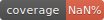
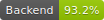
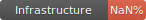

# Serverless Blog Platform

AWSサーバーレスアーキテクチャを活用した、スケーラブルで費用対効果の高いブログプラットフォーム。

## テストカバレッジ



| コンポーネント | カバレッジ |
|--------------|----------|
| Backend (Lambda) |  |
| Infrastructure (CDK) |  |
| Frontend (Public) |  |
| Frontend (Admin) |  |

詳細は [カバレッジガイド](./docs/coverage.md) を参照してください。

## アーキテクチャ

```
┌─────────────────────────────────────────────────────────────┐
│                       CloudFront CDN                        │
│          (静的コンテンツ配信・画像配信・キャッシング)         │
└─────────────────────────────────────────────────────────────┘
                              │
                              ▼
        ┌─────────────────────────────────────────┐
        │          API Gateway (REST API)         │
        │         (Cognito Authorizer)            │
        └─────────────────────────────────────────┘
                              │
                ┌─────────────┼─────────────┐
                ▼             ▼             ▼
        ┌──────────┐   ┌──────────┐   ┌──────────┐
        │ Lambda   │   │ Lambda   │   │ Lambda   │
        │ (記事)   │   │ (認証)   │   │ (画像)   │
        └──────────┘   └──────────┘   └──────────┘
                │             │             │
        ┌───────┼─────────────┼─────────────┘
        ▼       ▼             ▼
    ┌─────────────┐   ┌──────────────┐
    │  DynamoDB   │   │   Cognito    │
    │ (記事DB)    │   │ (認証・認可)  │
    └─────────────┘   └──────────────┘
                              │
                              ▼
                        ┌──────────┐
                        │    S3    │
                        │ (画像)   │
                        └──────────┘
```

## 主要機能

### 1. 記事管理
- **記事CRUD操作**: 作成、取得、更新、削除
- **下書き・公開管理**: 公開ステータス管理
- **Markdownサポート**: Markdownで記事執筆、HTML変換
- **XSS対策**: DOMPurifyによるHTML浄化

### 2. 認証・認可
- **Cognito認証**: AWS Cognitoによる安全な認証
- **JWT トークン**: アクセストークン・リフレッシュトークン管理
- **セッション管理**: ログイン・ログアウト・トークン更新

### 3. 画像管理
- **Pre-signed URL**: S3 Pre-signed URLによる安全な画像アップロード
- **CloudFront CDN**: グローバルな低レイテンシ画像配信
- **画像最適化**: 圧縮・キャッシング戦略

### 4. カテゴリ・タグ
- **カテゴリ別表示**: カテゴリによる記事フィルタリング
- **タグ検索**: タグによる記事検索
- **GSI活用**: DynamoDB Global Secondary Indexesによる高速クエリ

### 5. SEO最適化
- **メタタグ**: title、description、keywords
- **OGP対応**: Open Graph Protocolタグ
- **構造化データ**: JSON-LD形式のArticle schema
- **Twitter Card**: Twitter Card対応

## 技術スタック

### Infrastructure as Code
- **AWS CDK v2**: TypeScriptによるインフラ定義
- **CDK Nag**: セキュリティ・ベストプラクティス検証

### ランタイム
- **Go 1.25.x**: Lambda関数実装（provided.al2023）
- **TypeScript**: CDK・フロントエンド型安全な開発

### バックエンド
- **AWS Lambda (Go)**: サーバーレスコンピューティング（ARM64/Graviton2）
  - シングルバイナリデプロイ（Layer不要）
  - 高速コールドスタート（~30ms P95）
  - 小さいバイナリサイズ（~9-10MB）
- **Amazon DynamoDB**: NoSQLデータベース
- **Amazon S3**: オブジェクトストレージ
- **Amazon API Gateway**: REST API
- **Amazon Cognito**: 認証・認可

### CDN・配信
- **Amazon CloudFront**: グローバルCDN

### 監視・ログ
- **Go internal/middleware**: 構造化ログ（log/slog）、トレーシング（aws-xray-sdk-go）、メトリクス（CloudWatch EMF）
- **CloudWatch**: ログ集約・メトリクス
- **X-Ray**: 分散トレーシング

### フロントエンド
- **React 18**: UIライブラリ
- **Vite**: ビルドツール
- **Tailwind CSS**: CSSフレームワーク
- **Axios**: HTTPクライアント

### テスト
- **Jest**: ユニットテスト・統合テスト
- **Playwright**: E2Eテスト
- **MSW**: APIモック
- **DynamoDB Local**: ローカルテスト環境

### CI/CD
- **GitHub Actions**: 自動テスト・デプロイ
- **OIDC認証**: AWS認証情報の安全な管理

## セットアップ

### 前提条件

- **Go 1.25.x**: Lambda関数ビルド用
- **Node.js 22.x**: CDK・フロントエンド用
- **Bun**: パッケージマネージャー
- **AWS CLI**: 設定済み
- **AWS CDK**: グローバルインストール (`npm install -g aws-cdk`)
- **Docker**: 統合テスト用

### インストール

```bash
# リポジトリのクローン
git clone https://github.com/yourusername/serverless_blog.git
cd serverless_blog

# 依存関係のインストール
bun install

# Infrastructureディレクトリ
cd infrastructure
bun install
cd ..

# Go Lambda関数のビルド
cd go-functions
make build
cd ..

# Frontendディレクトリ
cd frontend/public
bun install
cd ../admin
bun install
cd ../..
```

## 開発

### ローカルテスト

```bash
# Go Lambda関数テスト
cd go-functions
go test -race -coverprofile=coverage.out ./...
cd ..

# ユニットテスト（Infrastructure）
cd infrastructure
bun run test
cd ..

# ユニットテスト（Frontend Public）
cd frontend/public
bun run test
cd ../..

# ユニットテスト（Frontend Admin）
cd frontend/admin
bun run test
cd ../..

# 統合テスト（Docker必須）
bun run test:integration:setup
bun run test:integration
bun run test:integration:cleanup

# E2Eテスト
bun run test:e2e
bun run test:e2e:admin

# カバレッジ確認
bun run test:coverage
bun run coverage:badges
```

### ローカル開発サーバー

```bash
# 公開サイト
cd frontend/public
bun run dev

# 管理画面
cd frontend/admin
bun run dev
```

### Lint・フォーマット

```bash
# Go Lint (golangci-lint)
cd go-functions
golangci-lint run
cd ..

# ESLint
bun run lint

# Prettier
bun run format
```

## デプロイ

### ローカルデプロイ

```bash
# Go Lambda関数のビルド
cd go-functions
make build
cd ..

# CDK Bootstrap（初回のみ）
cd infrastructure
npx cdk bootstrap aws://ACCOUNT_ID/REGION --context stage=dev

# CDK Diff（変更確認）
npx cdk diff --all --context stage=dev

# CDK Deploy
npx cdk deploy --all --context stage=dev
```

### CI/CDデプロイ

```bash
# developブランチにプッシュ → dev環境へ自動デプロイ
git checkout develop
git push origin develop

# mainブランチにマージ → prd環境へ手動承認後デプロイ
git checkout main
git merge develop
git push origin main
```

詳細は [デプロイメントガイド](./docs/deployment.md) を参照してください。

## AWS環境統合テスト

AWS環境へのデプロイ完了後、GitHub Actionsから手動で統合テストとE2Eテストを実行できます。

### フロントエンド統合テスト

実際のAWS環境（dev/prd）に対してフロントエンドの統合テストを実行します。

**GitHub Actions経由（推奨）**:
1. GitHubリポジトリの「Actions」タブを開く
2. 「Frontend Integration Tests (AWS Environment)」ワークフローを選択
3. 「Run workflow」をクリック
4. AWS環境（dev/prd）を選択して実行

**ローカル実行**:
```bash
# 環境変数を設定
export VITE_API_ENDPOINT=https://your-api-endpoint.amazonaws.com
export VITE_CLOUDFRONT_URL=https://your-cloudfront-url.cloudfront.net
export TEST_ENVIRONMENT=dev

# 公開サイト統合テスト
npm run test:integration:frontend:public

# 管理画面統合テスト
npm run test:integration:frontend:admin

# 認証・認可統合テスト
npm run test:integration:frontend:auth

# すべての統合テスト
npm run test:integration:frontend:all
```

**必要な環境変数**:
- `VITE_API_ENDPOINT`: API Gateway エンドポイントURL
- `VITE_CLOUDFRONT_URL`: CloudFront ディストリビューションURL
- `VITE_COGNITO_USER_POOL_ID`: Cognito User Pool ID（管理画面のみ）
- `VITE_COGNITO_CLIENT_ID`: Cognito Client ID（管理画面のみ）
- `TEST_ADMIN_EMAIL`: テスト用管理者メールアドレス
- `TEST_ADMIN_PASSWORD`: テスト用管理者パスワード

### E2E統合テスト

実際のAWS環境（dev/prd）に対してPlaywright E2Eテストを実行します。

**GitHub Actions経由（推奨）**:
1. GitHubリポジトリの「Actions」タブを開く
2. 「E2E Integration Tests (AWS Environment)」ワークフローを選択
3. 「Run workflow」をクリック
4. AWS環境（dev/prd）とクリーンアップオプションを選択して実行

**ローカル実行**:
```bash
# 環境変数を設定
export BASE_URL=https://your-public-site.com
export API_ENDPOINT=https://your-api-endpoint.amazonaws.com
export TEST_ENVIRONMENT=dev
export VITE_ENABLE_MSW_MOCK=false

# 公開サイトE2Eテスト
npm run test:e2e:aws:public

# 管理画面E2Eテスト
npm run test:e2e:aws:admin

# すべてのE2Eテスト
npm run test:e2e:aws
```

**テストデータクリーンアップ**:
```bash
# テスト後のデータクリーンアップ
export TABLE_NAME=BlogPosts-dev
export BUCKET_NAME=blog-images-dev
npm run cleanup:test-data
```

**注意事項**:
- これらのテストは実際のAWS環境に対して実行されるため、AWS認証情報が必要です
- テストデータは自動的にクリーンアップされますが、手動確認も推奨します
- 本番環境（prd）でのテスト実行は慎重に行ってください

## ドキュメント

- [ドキュメント索引](./docs/README.md)
- [アーキテクチャ設計](./docs/architecture.md)
- [デプロイメントガイド](./docs/deployment.md)
- [カバレッジガイド](./docs/coverage.md)
- [テスト戦略](./docs/testing-strategy.md)
- [API仕様](./.kiro/specs/serverless-blog-aws/requirements.md)
- [Go Lambda 関数のREADME](./go-functions/README.md)
- [スクリプト一覧](./scripts/README.md)

## 要件と設計

- [要件定義](./.kiro/specs/serverless-blog-aws/requirements.md)
- [設計書](./.kiro/specs/serverless-blog-aws/design.md)
- [タスク管理](./.kiro/specs/serverless-blog-aws/tasks.md)

## ライセンス

MIT License

## 貢献

プルリクエストを歓迎します。大きな変更の場合は、まずissueを開いて変更内容を議論してください。

## 作者

[Your Name]

## 謝辞

このプロジェクトは、AWS Serverless Application Model (SAM)とAWS CDKの素晴らしいドキュメントと、オープンソースコミュニティの貢献に基づいています。
